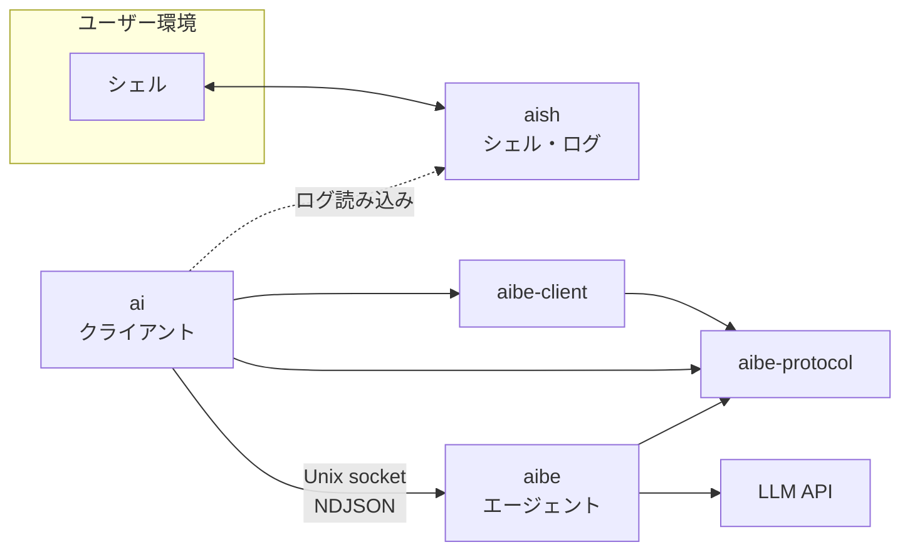

# aish

シェル操作に LLM を組み込む、**Unix 向け** Rust ワークスペースです。シェル I/O の記録（**aish**）、エージェント基盤（**aibe**）、クライアント（**ai**）を分離し、API キーと LLM 呼び出しを aibe に集約します。

> **ステータス**: 個人開発中。API とプロトコルは進化中です。将来 OSS 公開を想定していますが、現時点では破壊的変更があり得ます。

**プラットフォーム**: Linux 等の Unix のみ（Windows 非対応）

## 目次

- [Overview](#overview)
- [Motivation](#motivation)
- [Architecture](#architecture)
- [Components](#components)
- [Requirements](#requirements)
- [Quick start](#quick-start)
- [Configuration](#configuration)
- [Usage](#usage)
- [Supported LLM providers](#supported-llm-providers)
- [Security](#security)
- [Development](#development)
- [Documentation](#documentation)
- [Contributing](#contributing)
- [License](#license)

## Overview

aish ワークスペースは **5 つのクレート**で構成されます。

| クレート | 種別 | 役割 |
|---------|------|------|
| **aibe-protocol** | ライブラリ | wire DTO（NDJSON / serde）、`ToolName`、契約定数 |
| **aibe-client** | ライブラリ | Unix socket の `ping` / `ensure_running` / `agent_turn` transport（承認往復含む）、既定 socket パス |
| **aibe** | ライブラリ + バイナリ | LLM プロバイダ呼び出し、ツール付きエージェントループ、Unix domain socket サーバ |
| **aish** | バイナリ | シェル起動・コマンド実行、入出力を JSONL ログに記録（**ネットワークなし**） |
| **ai** | バイナリ | `aibe-client` + `aibe-protocol` 経由で aibe に接続し応答を表示。aish ログを任意でコンテキストに利用（**LLM を直接呼ばない**） |

設計の正本は [docs/architecture.md](docs/architecture.md) です。

## Motivation

ターミナルで動く作業（コマンド、出力、作業ディレクトリ）と、LLM による推論・ツール実行は性質が異なります。aish では次を分けます。

- **aish** — シェル体験とログ（秘密や LLM 設定を持たない）
- **aibe** — エージェントとプロバイダ（API キーはここだけ）
- **aibe-protocol** / **aibe-client** — クライアント向け wire 型と socket ヘルパ（`ai` が利用）
- **ai** — ユーザー向けクライアント（aibe 経由のみ）

これにより、ログのコンテキスト連携と、監査可能な LLM 接続点を両立します。

## Architecture



**依存の向き**（厳守）:

```text
ai            →  aibe-protocol, aibe-client のみ
aibe-client   →  aibe-protocol のみ
aibe          →  aibe-protocol, aibe-client
aish          →  aibe へ依存しない（シェル + ログのみ）
```

機械チェック: `./scripts/check-architecture.sh`

## Components

| コンポーネント | ネットワーク | 主な責務 |
|----------------|-------------|----------|
| **aish** | なし | `exec` / `shell` でコマンド実行、JSONL ログ追記 |
| **aibe** | LLM API（設定に従う） | デーモン、stdio 風 NDJSON プロトコル、ツール実行 |
| **ai** | aibe のみ | smart entry（`ai "…"`）、`ai ask` / `ai chat`、プロファイル・ツール指定 |

## Requirements

- **Rust**（edition 2021、`cargo` でワークスペースをビルド）
- **Unix**（Linux 等）
- **LLM API キー** — `~/.config/aibe/config.toml` にのみ配置（リポジトリにコミットしない）

## Quick start

### 1. ビルド

```bash
git clone https://github.com/lambda-code-gk/aish.git
cd aish
cargo build --workspace
```

### 2. aibe の設定

```bash
mkdir -p ~/.config/aibe
cp docs/aibe.config.example.toml ~/.config/aibe/config.toml
# YOUR_API_KEY を実キーに置き換える（git に載せない）
```

### 3. 作業シェルで質問する（推奨導線）

`aish shell` で作業ログを記録しながら、子シェル内で `ai "…"` を使います。必要なら aibe を自動起動します。

```bash
cargo run -p aish -- shell

# 子シェル内
ai "hello"
cargo test
ai "直前の失敗を見て、原因と次の一手を短く"
```

`ai "…"` は smart entry（`route_turn` 経由）です。詳細: [docs/manual/ai-smart-entry.md](docs/manual/ai-smart-entry.md)。

### 4. 従来 CLI（任意）

明示サブコマンドも利用できます。

```bash
cargo run -p ai -- ask "hello"
cargo run -p ai -- ask "hello" --profile fast
```

デバッグ時は aibe をフォアグラウンドで起動できます。

```bash
cargo run -p aibe -- --foreground
# または: cargo run -p aibe -- -f
```

## Configuration

| ファイル | 用途 |
|----------|------|
| `~/.config/aibe/config.toml` | LLM 接続（`[llm.<name>]`）、プロファイル（`[profiles.<name>]`）、ツール許可 |
| `~/.config/ai/config.toml` | クライアント既定（例: `ask.default_profile`） |

- 例: [docs/aibe.config.example.toml](docs/aibe.config.example.toml)
- プロファイル詳細: [docs/manual/llm-profiles.md](docs/manual/llm-profiles.md)

**2 段設定**: 接続（認証・エンドポイント）と利用プリセット（モデル・温度など）を分離します。`ai ask --profile <name>` または smart entry 経由でプリセットを選択します。

## Usage

### Build & test

```bash
cargo build --workspace
cargo test --workspace
```

個別クレート:

```bash
cargo build -p aibe
cargo run -p aibe              # デフォルト: バックグラウンド（デーモン）
cargo run -p aibe -- -f        # フォアグラウンド（デバッグ）
cargo run -p aish
cargo run -p ai
```

### Ask the agent (`ai`)

日常の入口は **`ai "…"`**（smart entry）です。明示サブコマンド `ai ask` も利用できます。

```text
ai "message"                    # smart entry（推奨）
ai ask [OPTIONS] <message>      # 従来 CLI
                 [--log PATH] [--session ID] [--no-log]
                 [--socket PATH] [--no-start]
                 [--tools LIST] [--profile NAME] [--verbose-tools]
```

- **引数順**: オプションはすべてメッセージより前。`ai ask hello --log x` はエラー。

- `--log` — 指定 JSONL をコンテキストに含める（`--session` より優先）
- `--session ID` — `AISH_SESSION_DIR/current_log` 経由でログを読む（下記「環境変数」参照）
- `--no-log` — ログを載せない（最優先）
- `AI_ASK_LOG=session` — 上と同じく `AISH_SESSION_DIR` からログを読む（`aish shell` 内では自動 export。外で同じ挙動にしたい場合のみ手動 export）

#### 環境変数（`ai` のシェルログ）

| 変数 | 誰が設定 | 意味 |
|------|----------|------|
| **`AISH_SESSION_DIR`** | `aish shell` が子シェルへ export（**絶対パス**） | セッション dir（`<log_dir>/<12桁hex>/`）。`ai` が参照する唯一のセッション環境変数 |
| **`AI_ASK_LOG=session`** | `aish shell` が子シェルへ自動 export | `AISH_SESSION_DIR/current_log` を tail して送る。`aish shell` 外で同じ挙動にしたい場合のみ手動 export |
| **`AI_SESSION_ID`** | `aish shell` が子シェルへ export（smart entry 用） | aibe の conversation store 共有単位 |

- **`--session ID`**: `ID` は **`basename "$AISH_SESSION_DIR"` と一致** すること（例: `002f15d02b54`）
- 別ペインでは `export AISH_SESSION_DIR=/abs/path/to/sessions/<12桁hex>` してから `--session` または `AI_ASK_LOG=session` を使う
- `current_log` は symlink。`ai` は **symlink 先が `AISH_SESSION_DIR` 内の通常ファイルとして開けること** を検証してから読む
- `--tools` — 有効化するツールカテゴリ（詳細: [docs/manual/ai-ask-tools.md](docs/manual/ai-ask-tools.md)）
- `--profile` — aibe 設定のプロファイル名
- `--no-start` — 既に起動済みの aibe のみ利用

### Shell logging (`aish`)

```bash
# 単発コマンド実行 + ログ
cargo run -p aish -- exec --log /tmp/session.jsonl -- ls -la

# 対話シェル（セッション dir + AISH_SESSION_DIR を子シェルへ export）
cargo run -p aish -- shell

# 現在のセッション情報（aish shell 内。`AISH_SESSION_DIR` 必須）
cargo run -p aish -- session
cargo run -p aish -- session --format json
cargo run -p aish -- session --format env   # eval 向け
```

**共通 `--format`**（`tsv` | `json` | `env`、既定 `tsv`）は、**情報を stdout に出すサブコマンド**向けの共通オプション。全サブコマンドで指定可能だが、現状 stdout に反映するのは `session` のみ。`exec` / `shell` 等の実行系は将来のサブコマンド追加時に CLI を揃えるため受理のみ（挙動は変わらない）。詳細: [docs/architecture.md](docs/architecture.md)（aish CLI 節）。

手順: [docs/manual/aish-shell-log.md](docs/manual/aish-shell-log.md)

`aish shell` 内でログ付き質問する例:

```bash
# AI_ASK_LOG=session は aish shell が自動 export する
ai "直前のエラーを要約して"
# または明示サブコマンド
ai ask "直前のエラーを要約して"
```

別ペインから指定セッションへ:

```bash
export AISH_SESSION_DIR=~/.local/share/aish/sessions/<12桁hex>
ai ask --session <12桁hex> "…"
```

### Tab 補完（bash / zsh）

```bash
eval "$(aish complete bash)"
eval "$(ai complete bash)"
eval "$(aibe complete bash)"
```

`cargo run` 委譲と `aish shell` 内の検証: [docs/manual/tab-completion.md](docs/manual/tab-completion.md)。

## Supported LLM providers

aibe 内でサポート（設定の `provider`）:

| プロバイダ | 説明 |
|-----------|------|
| `openai_compatible` | OpenAI 公式 API および OpenAI 互換エンドポイント（LM Studio、vLLM 等） |
| `gemini` | Google AI Studio（`generateContent` v1beta） |
| `mock` | テスト・開発用 |

OpenAI 公式 API も `provider = "openai_compatible"` を使う。`api_key` を設定し、`base_url` を省略すれば既定 `https://api.openai.com/v1` が使われる（`aibe` の `toml_config` と同じ）。

手動検証:

- [docs/manual/gemini-provider.md](docs/manual/gemini-provider.md)
- [docs/manual/aibe-openai-compatible.md](docs/manual/aibe-openai-compatible.md)

## Security

- API キーは **aibe 設定のみ**。`ai` / `aish` は LLM エンドポイントへ直接接続しません。
- 実キーを Git・ログ・例示ファイルに含めない（プレースホルダのみ）。
- aish ログはマスク処理あり（`sk-...`、`Bearer` 等）。

詳細: [docs/security.md](docs/security.md)

## Development

品質ゲート（ローカル・CI 共通）:

```bash
./scripts/verify.sh
```

（`fmt` / `clippy` / `test` / クレート境界・subprocess 方針 / docs 整合）

mock aibe への導通スモーク（実 API キー不要）:

```bash
./scripts/smoke-mock.sh
```

GitHub Actions は [`.github/workflows/ci.yml`](.github/workflows/ci.yml) で `verify` と `smoke-mock` の 2 job を実行する。詳細は [docs/testing.md](docs/testing.md)。

AI エージェント向けの開発規約: [AGENTS.md](AGENTS.md)

## Documentation

| ドキュメント | 内容 |
|-------------|------|
| [docs/architecture.md](docs/architecture.md) | レイヤー、プロトコル、設定 |
| [docs/testing.md](docs/testing.md) | テスト方針 |
| [docs/security.md](docs/security.md) | 秘密情報・ログ |
| [docs/manual/](docs/manual/) | 手動検証手順 |
| [docs/0000_spec-index.md](docs/0000_spec-index.md) | 設計書・指示書一覧（設計: [docs/spec/](docs/spec/)、実装済み: [docs/done/](docs/done/)） |

## Contributing

Issue や PR は歓迎します。大きな変更の前に [docs/architecture.md](docs/architecture.md) の境界ルールを確認してください。

- 機能ブランチでの開発を推奨
- 挙動変更時は `docs/` を同じ変更で更新
- 深い実装・AI 向け規約: [AGENTS.md](AGENTS.md)、[.cursor/rules/](.cursor/rules/)

## License

[MIT](LICENSE) — ワークスペースのクレートも `Cargo.toml` の `workspace.package.license` で MIT とします。
