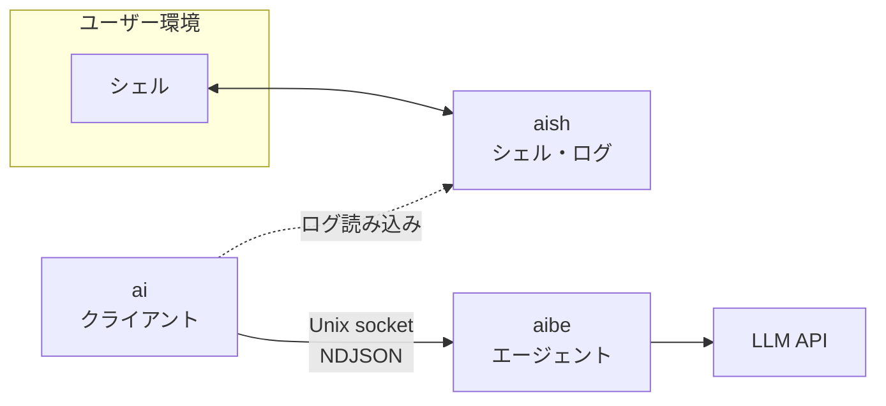

# aish

シェル操作に LLM を組み込む、**Unix 向け** Rust ワークスペースです。シェル I/O の記録（**aish**）、エージェント基盤（**aibe**）、クライアント（**ai**）を分離し、API キーと LLM 呼び出しを aibe に集約します。

> **ステータス**: 個人開発中。API とプロトコルは進化中です。将来 OSS 公開を想定していますが、現時点では破壊的変更があり得ます。

**プラットフォーム**: Linux 等の Unix のみ（Windows 非対応）

## 目次

- [Overview](#overview)
- [Motivation](#motivation)
- [Architecture](#architecture)
- [Components](#components)
- [Requirements](#requirements)
- [Quick start](#quick-start)
- [Configuration](#configuration)
- [Usage](#usage)
- [Supported LLM providers](#supported-llm-providers)
- [Security](#security)
- [Development](#development)
- [Documentation](#documentation)
- [Contributing](#contributing)
- [License](#license)

## Overview

aish は 3 つのクレートで構成されます。

| クレート | 種別 | 役割 |
|---------|------|------|
| **aibe** | ライブラリ + バイナリ | LLM プロバイダ呼び出し、ツール付きエージェントループ、Unix domain socket サーバ |
| **aish** | バイナリ | シェル起動・コマンド実行、入出力を JSONL ログに記録（**ネットワークなし**） |
| **ai** | バイナリ | aibe へリクエストし応答を表示。aish ログを任意でコンテキストに利用（**LLM を直接呼ばない**） |

設計の正本は [docs/architecture.md](docs/architecture.md) です。

## Motivation

ターミナルで動く作業（コマンド、出力、作業ディレクトリ）と、LLM による推論・ツール実行は性質が異なります。aish では次を分けます。

- **aish** — シェル体験とログ（秘密や LLM 設定を持たない）
- **aibe** — エージェントとプロバイダ（API キーはここだけ）
- **ai** — ユーザー向けクライアント（aibe 経由のみ）

これにより、ログのコンテキスト連携と、監査可能な LLM 接続点を両立します。

## Architecture



**依存の向き**（厳守）:

```text
ai   →  aibe のみ
aish →  aibe へ依存しない（シェル + ログのみ）
```

機械チェック: `./scripts/check-architecture.sh`

## Components

| コンポーネント | ネットワーク | 主な責務 |
|----------------|-------------|----------|
| **aish** | なし | `exec` / `shell` でコマンド実行、JSONL ログ追記 |
| **aibe** | LLM API（設定に従う） | デーモン、stdio 風 NDJSON プロトコル、ツール実行 |
| **ai** | aibe のみ | `ai ask`、プロファイル選択、ツールカテゴリ指定 |

## Requirements

- **Rust**（edition 2021、`cargo` でワークスペースをビルド）
- **Unix**（Linux 等）
- **LLM API キー** — `~/.config/aibe/config.toml` にのみ配置（リポジトリにコミットしない）

## Quick start

### 1. ビルド

```bash
git clone https://github.com/lambda-code-gk/aish.git
cd aish
cargo build --workspace
```

### 2. aibe の設定

```bash
mkdir -p ~/.config/aibe
cp docs/aibe.config.example.toml ~/.config/aibe/config.toml
# YOUR_API_KEY を実キーに置き換える（git に載せない）
```

### 3. エージェントに質問

`ai ask` は必要なら aibe を自動起動します。

```bash
cargo run -p ai -- ask "hello"
```

プロファイルを指定する例:

```bash
cargo run -p ai -- ask "hello" --profile fast
```

デバッグ時は aibe をフォアグラウンドで起動できます。

```bash
cargo run -p aibe -- --foreground
# または: cargo run -p aibe -- -f
```

## Configuration

| ファイル | 用途 |
|----------|------|
| `~/.config/aibe/config.toml` | LLM 接続（`[llm.<name>]`）、プロファイル（`[profiles.<name>]`）、ツール許可 |
| `~/.config/ai/config.toml` | クライアント既定（例: `ask.default_profile`） |

- 例: [docs/aibe.config.example.toml](docs/aibe.config.example.toml)
- プロファイル詳細: [docs/manual/llm-profiles.md](docs/manual/llm-profiles.md)

**2 段設定**: 接続（認証・エンドポイント）と利用プリセット（モデル・温度など）を分離します。`ai ask --profile <name>` でプリセットを選択します。

## Usage

### Build & test

```bash
cargo build --workspace
cargo test --workspace
```

個別クレート:

```bash
cargo build -p aibe
cargo run -p aibe              # デフォルト: バックグラウンド（デーモン）
cargo run -p aibe -- -f        # フォアグラウンド（デバッグ）
cargo run -p aish
cargo run -p ai
```

### Ask the agent (`ai`)

```text
ai ask <message> [--log PATH] [--socket PATH] [--no-start]
                 [--tools LIST] [--profile NAME] [--verbose-tools]
```

- `--log` — aish の JSONL ログをコンテキストに含める
- `--tools` — 有効化するツールカテゴリ（詳細: [docs/manual/ai-ask-tools.md](docs/manual/ai-ask-tools.md)）
- `--profile` — aibe 設定のプロファイル名
- `--no-start` — 既に起動済みの aibe のみ利用

### Shell logging (`aish`)

```bash
# 単発コマンド実行 + ログ
cargo run -p aish -- exec --log /tmp/session.jsonl -- ls -la

# 対話シェル + ログ
cargo run -p aish -- shell --log /tmp/session.jsonl
```

手順: [docs/manual/aish-shell-log.md](docs/manual/aish-shell-log.md)

ログを渡して質問する例:

```bash
cargo run -p ai -- ask "直前のコマンド結果を要約して" --log /tmp/session.jsonl
```

## Supported LLM providers

aibe 内でサポート（設定の `provider`）:

| プロバイダ | 説明 |
|-----------|------|
| `openai` | OpenAI API |
| `openai_compatible` | OpenAI 互換（LM Studio 等） |
| `gemini` | Google AI Studio（`generateContent` v1beta） |
| `mock` | テスト・開発用 |

手動検証:

- [docs/manual/gemini-provider.md](docs/manual/gemini-provider.md)
- [docs/manual/aibe-openai-compatible.md](docs/manual/aibe-openai-compatible.md)

## Security

- API キーは **aibe 設定のみ**。`ai` / `aish` は LLM エンドポイントへ直接接続しません。
- 実キーを Git・ログ・例示ファイルに含めない（プレースホルダのみ）。
- aish ログはマスク処理あり（`sk-...`、`Bearer` 等）。

詳細: [docs/security.md](docs/security.md)

## Development

```bash
cargo fmt --all -- --check
cargo clippy --workspace -- -D warnings
cargo test --workspace
./scripts/check-architecture.sh   # クレート境界 + ヘキサゴナルレイヤー
```

AI エージェント向けの開発規約: [AGENTS.md](AGENTS.md)

## Documentation

| ドキュメント | 内容 |
|-------------|------|
| [docs/architecture.md](docs/architecture.md) | レイヤー、プロトコル、設定 |
| [docs/testing.md](docs/testing.md) | テスト方針 |
| [docs/security.md](docs/security.md) | 秘密情報・ログ |
| [docs/manual/](docs/manual/) | 手動検証手順 |
| [docs/0000_spec-index.md](docs/0000_spec-index.md) | 機能仕様書一覧（実装済みは [docs/done/](docs/done/)） |

## Contributing

Issue や PR は歓迎します。大きな変更の前に [docs/architecture.md](docs/architecture.md) の境界ルールを確認してください。

- 機能ブランチでの開発を推奨
- 挙動変更時は `docs/` を同じ変更で更新
- 深い実装・AI 向け規約: [AGENTS.md](AGENTS.md)、[.cursor/rules/](.cursor/rules/)

## License

ワークスペースのクレートは **MIT OR Apache-2.0**（`Cargo.toml` の `workspace.package.license`）を想定しています。リポジトリ直下の `LICENSE` ファイルは追って整備する場合があります。
