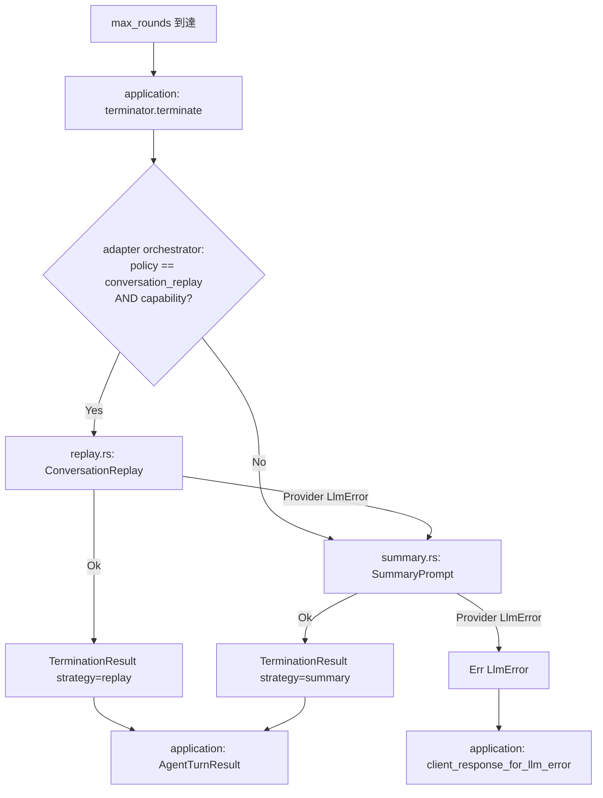

# 0006 — max_tool_rounds 終端戦略の改善 — 指示書

> **出典**: Codex `review`（2026-05-24）中優先度指摘。0003 で `ToolExecutionSummary` + `tool_round_terminator.rs` に分離済み。  
> **状態**: **実装済み**
> **レビュー**: Codex `review`（2026-05-24）初回・再・第3回指摘を反映済み。

## 目的

ツールラウンド上限到達時の終端処理を、**プロバイダ差** と **回答品質** に耐えるよう拡張可能にする。

0003 現状の課題（レビュー指摘）:

- 会話履歴中の `role: tool` を捨て、要約テキストだけを再送している
- 一部プロバイダは tool メッセージを無視するため要約は必要だが、**要約の癖** に最終回答が引きずられる
- 終端戦略が 1 実装に固定で、OpenAI / Gemini / OpenAI 互換の差を吸収できない

## スコープ

### 対象

- `ToolRoundTerminator` **port**（application が依存、adapter が具象実装を提供）
- 戦略の最低 2 種（いずれも **adapter 内** の private モジュール）:
  1. **SummaryPrompt**（現行相当 — `ToolExecutionSummary` を user メッセージに埋め込み）
  2. **ConversationReplay**（tool role を plain `complete()` で扱えるプロバイダ向け — 要約せず会話履歴を渡す）
- 戦略選択に使う **capability**（provider metadata）と **policy**（設定）
- port 返り値 `TerminationResult`（テスト・ログ観測用。**wire protocol 非公開**）

### 対象外

- `max_rounds` 値自体の動的変更
- 並列ツール実行
- streaming イベント
- Replay 会話の **トークン切り詰め**（本番で入力上限超過した場合はフォールバックのみ。切り詰めロジックは将来別指示）
- 0007 のループ 1 ラウンド分割（0007 は terminator 呼び出し境界を変えない）

## 確定した設計判断

| 項目 | 決定 |
|------|------|
| port 置き場 | `ports/outbound/tool_round_terminator.rs` に `ToolRoundTerminator` trait と `TerminationResult` |
| application の責務 | `tool_round_terminator.rs` は port 呼び出し + `TerminationResult` → `ClientResponse` 変換 + ログのみ。**戦略ロジックは持たない** |
| 具象実装の置き場 | **`adapters/outbound/terminator/` のみ**（`orchestrator.rs`, `summary.rs`, `replay.rs`）。application 内に SummaryPrompt / Replay 実装を置かない |
| composition | `application/server.rs` で policy + capability を読み、`ToolRoundTerminator` 実装（adapter）を `AgentTurnService` に注入 |
| 既定戦略 | **SummaryPrompt**（0003 互換。設定未指定・capability 不明時も SummaryPrompt） |
| capability の置き場 | **`LlmProvider` trait にはメソッドを増やさない**。各 LLM adapter が `TerminationCapability` を返す metadata（composition root が terminator 構築時に渡す） |
| policy の置き場 | aibe 設定 `[tools] termination_strategy`（省略時 `summary_prompt`）。Replay を試すかは policy + capability の AND |
| `TerminationResult` | **port 返り値**（`ports/outbound` に定義）。NDJSON / クライアント protocol には載せない |
| 終端入力 | `terminate` の `conversation` はループ会話を **そのまま** 受け取る。Replay は無加工、SummaryPrompt は 0003 整形（上記「終端入力」） |
| 0007 との境界 | 0007 は `agent_turn` ループ本体の抽出。0006 は **terminator 戦略** のみ。0007 実装後も max-round 分岐は terminator 委譲のまま |

## Capability と policy

### `TerminationCapability`（provider metadata）

LLM adapter / composition root が提供する **読み取り専用** の能力表現。`ports/outbound` に置く。

```rust
pub struct TerminationCapability {
    /// plain complete()（tools なし）で role: tool を送っても provider が解釈する
    pub plain_complete_accepts_tool_role: bool,
}
```

| プロバイダ（初期値・実装時に adapter で固定） | `plain_complete_accepts_tool_role` |
|---------------------------------------------|-------------------------------------|
| OpenAI（本家） | `true`（**推測**: 実測で false なら adapter を修正） |
| Gemini | `false`（**推測**: tool role 無視が多い。実測で更新） |
| OpenAI 互換 | `false`（安全側。設定で Replay policy を選んでも capability が false なら SummaryPrompt） |

実測結果は adapter の unit test または `docs/manual/` に追記する。0001 プロバイダテスト拡張は別途可。

### `TerminationStrategy`（policy / 設定）

```toml
[tools]
# 省略時: "summary_prompt"
termination_strategy = "summary_prompt"  # または "conversation_replay"
```

| 値 | 意味 |
|----|------|
| `summary_prompt` | 常に SummaryPrompt（0003 同等） |
| `conversation_replay` | capability が許すとき ConversationReplay を **先に試す** |

## 終端入力（正規化ルール）

`terminate(..., conversation, ...)` の `conversation` は、**max-round 到達直後のループ会話** — 現行 `agent_turn.rs` が `finish_after_max_tool_rounds` に渡しているスライスと同一。application は **加工せず** adapter に渡す。

ループ会話の典型構成（先頭から）:

1. `[shell log tail]` 前置 user（`context.shell_log_tail` があるときのみ。0005 正規化で空なら **含めない**）
2. クライアント由来の user メッセージ（元依頼）
3. 各ラウンドの assistant + `role: tool`（実行結果。拒否時は `[tool error]` 付き）

### 戦略ごとの LLM 入力

| メッセージ種別 | ConversationReplay | SummaryPrompt |
|-------------|-------------------|---------------|
| `[shell log tail]` user | **含める**（ループ中 LLM が見た入力を再現） | **含めない**（0003 現行 `initial_user_request` と同じ） |
| 元 user 依頼 | 含める | `initial_user_request` で **1 件だけ** 含める |
| ループ中の assistant | 含める | **捨てる** |
| ループ中の `role: tool` | 含める | **捨てる**（代わりに要約 user を追加） |
| `## Tool execution results` user | **含めない**（終端で新規生成するのは SummaryPrompt のみ） | 新規生成して **末尾に 1 件** 追加 |

**ConversationReplay**: 上表のとおり、ループ会話を **変更・追加なし** で `complete()` に渡す。メッセージの削除・並べ替え・要約 user の追加は行わない。

**SummaryPrompt**: 0003 現行と同一の整形。

```rust
// summary.rs — 0003 tool_round_terminator.rs と同等
let mut final_conversation = Vec::new();
if let Some(user) = initial_user_request(conversation) {
    final_conversation.push(user);
}
final_conversation.push(ChatMessage::user(summary.into_prompt_section(max_rounds)));
llm.complete(&final_conversation).await
```

`initial_user_request` の除外プレフィックス（0003 維持）: `[shell log tail]` / `[system]` / `## Tool execution results`。

### `conversation_had_tool_messages`

| 戦略 | 値 |
|------|-----|
| ConversationReplay | ループ会話に `role: tool` が **1 件以上** あれば `true` |
| SummaryPrompt | ループ会話を捨てるため **常に `false`** |

Replay → Summary フォールバック後は SummaryPrompt 側の値（`false`）で上書きする。

### 意図的な差分

Replay はループ中 LLM が受け取った文脈（shell log 含む）をそのまま活かす。SummaryPrompt は tool/assistant 履歴を捨て、実行記録を `ToolExecutionSummary` に圧縮する。**0003 既定（SummaryPrompt）のユーザー可視出力は不変**。

## フォールバック（確定フロー）

終端処理の **戦略選択とフォールバック連鎖** は adapter の `ToolRoundTerminator` 実装（`adapters/outbound/terminator/orchestrator.rs`）が担う。application は `terminate(...)` を 1 回呼び、返った `TerminationResult` を `ClientResponse` に写す。



### 失敗の分類

| 種別 | 例 | 扱い |
|------|-----|------|
| **事前判定（Replay スキップ）** | policy が `summary_prompt`、capability が false | adapter が LLM を呼ばず SummaryPrompt へ（Replay は試さない） |
| **Replay 実行時失敗** | `complete()` が `LlmError::Provider`（入力長超過・role 拒否・HTTP 4xx/5xx 等） | adapter が SummaryPrompt にフォールバックして **1 回** 再試行 |
| **SummaryPrompt 失敗** | 要約 user 付き `complete()` が `LlmError` | `terminate` が `Err(LlmError)` を返す。application が `client_response_for_llm_error` で `ClientResponse::Error` に変換。**Replay へは戻らない** |
| **UnknownTool** | 終端 `complete()` は tools なしのため通常発生しない | 0003 同様 provider error 経路（フォールバック対象外） |

**トークン上限**: 0006 では会話長の事前見積もりは **行わない**。Replay の `complete()` が provider error を返したら SummaryPrompt に落とす。切り詰め・要約圧縮は **未対応**（将来別指示）。

## Port API

`TerminationResult` は **port 契約の一部** として `ports/outbound/tool_round_terminator.rs` に定義する。

```rust
pub enum TerminationStrategyUsed {
    SummaryPrompt,
    ConversationReplay,
}

/// port 返り値。NDJSON には載せない。
pub struct TerminationResult {
    pub strategy: TerminationStrategyUsed,
    /// Replay 経路で LLM に渡した会話に tool メッセージが含まれていたか
    pub conversation_had_tool_messages: bool,
    pub assistant: ChatMessage,
}

#[async_trait]
pub trait ToolRoundTerminator: Send + Sync {
    async fn terminate(
        &self,
        llm: &dyn LlmProvider,
        conversation: &[ChatMessage],
        executed: &[ExecutedToolCall],
        max_rounds: u32,
        capability: &TerminationCapability,
    ) -> Result<TerminationResult, LlmError>;
}
```

### 責務の分離

| 層 | 責務 |
|----|------|
| `adapters/outbound/terminator/orchestrator.rs` | policy + capability 判定、Replay → Summary フォールバック、`TerminationResult` 生成 |
| `adapters/outbound/terminator/replay.rs` | ConversationReplay: ループ会話を **無加工** で `complete()`（「終端入力」参照） |
| `adapters/outbound/terminator/summary.rs` | SummaryPrompt: `initial_user_request` + 要約 user（0003 同等。「終端入力」参照） |
| `application/tool_round_terminator.rs` | `terminator.terminate(...)` 呼び出し、`TerminationResult` → `ClientResponse::AgentTurnResult`、`strategy` の tracing 1 行 |
| `application/server.rs` | policy・capability・terminator 実装の組み立て（composition root） |

- hexagonal: `application` → `adapters` 直接参照禁止。`AgentTurnService` は `Arc<dyn ToolRoundTerminator>`（port）のみ保持。
- `ToolExecutionSummary` の **生成ロジック** は domain のまま。SummaryPrompt adapter は domain API を **呼ぶ**（domain ロジックを application に複製しない）。

### 観測（ログ・テスト）

- **ログ**: application が `TerminationResult.strategy` を `tracing` で 1 行出力（例: `termination strategy=conversation_replay`）。秘密・全文 conversation は出さない（`docs/security.md` 準拠）。
- **wire protocol**: 変更なし。クライアントは従来どおり `status: max_tool_rounds` と `assistant_message` のみ受け取る。
- **テスト**: adapter 単体（summary / replay / orchestrator）と統合（ScriptedMockLlm）で `TerminationResult.strategy` を断言する。

## 受け入れ条件

1. `tool_round_terminator.rs` が **port 経由** で終端処理を委譲する（戦略ロジックは adapter のみ）。`application/server.rs` で adapter 実装を注入。
2. 既定（未設定）挙動は **0003 と同一**（SummaryPrompt）。既存 `aibe/tests/agent_turn_loop.rs` の max-round テストが **無変更** で通る。
3. `termination_strategy = "conversation_replay"` かつ capability `plain_complete_accepts_tool_role = true` の統合テストが **1 本以上**（ScriptedMockLlm で Replay 経路を検証）。
4. SummaryPrompt へのフォールバック: Replay が `LlmError::Provider` を返す Mock で SummaryPrompt が呼ばれ、最終 `AgentTurnResult` が返るテストが **1 本以上**。
5. `TerminationResult.strategy` が **ログまたはテスト** で観測可能（wire protocol 変更は不要）。
6. 終端入力正規化: Replay が shell log ありループ会話を **無加工** で渡す単体テスト、SummaryPrompt が shell log を **除外** する単体テスト（0003 互換）。
7. 実装と同 PR で **`docs/architecture.md`** に終端戦略・capability・設定キーを追記する。
8. **`docs/manual/ai-ask-tools.md`** に max-round 到達時の確認手順（Replay 設定は任意・実 LLM）を追記する。

## 実装マップ

```
aibe/src/ports/outbound/tool_round_terminator.rs   # trait + TerminationResult + TerminationStrategyUsed
aibe/src/ports/outbound/termination_capability.rs  # TerminationCapability
aibe/src/application/tool_round_terminator.rs      # port 委譲・ClientResponse 組み立て・ログ（initial_user_request は移す）
aibe/src/adapters/outbound/terminator/
  orchestrator.rs                                  # ToolRoundTerminator 実装（フォールバック連鎖）
  summary.rs                                       # SummaryPrompt + initial_user_request（0003 から移動）
  replay.rs                                        # ConversationReplay
aibe/src/adapters/outbound/openai.rs 等             # TerminationCapability を返す
aibe/src/application/server.rs                     # terminator + capability の composition
aibe/src/adapters/outbound/toml_config.rs           # termination_strategy 読み込み
aibe/src/domain/tool_execution_summary.rs           # 要約生成（既存・変更最小）
```

## テスト

| 種別 | 配置 | テスト名（例） | 内容 |
|------|------|---------------|------|
| 単体 | `summary.rs` | `summary_prompt_builds_execution_results_user_message` | `ToolExecutionSummary` を含む user メッセージを生成 |
| 単体 | `summary.rs` | `summary_prompt_excludes_shell_log_tail` | shell log 前置ありループ会話から `[shell log tail]` を **含めず** 元 user + 要約のみ |
| 単体 | `replay.rs` | `replay_passes_loop_conversation_unchanged` | assistant + tool 付きループ会話をそのまま `complete()` に渡す |
| 単体 | `replay.rs` | `replay_includes_shell_log_tail_when_present` | shell log 前置を **削除せず** Replay 入力に含める |
| 単体 | `orchestrator.rs` | `replay_skipped_when_capability_false` | capability false / policy `summary_prompt` で Replay を呼ばない |
| 単体 | `orchestrator.rs` | `replay_provider_error_falls_back_to_summary_once` | Replay `Provider` エラー後に SummaryPrompt が 1 回呼ばれる |
| 統合 | `agent_turn_loop.rs` 等 | `max_tool_rounds_conversation_replay_strategy` | ScriptedMockLlm + `conversation_replay` で `strategy == Replay` |
| 統合 | 同上 | `max_tool_rounds_replay_fallback_to_summary` | Replay 失敗 Mock → SummaryPrompt 成功 → `status: max_tool_rounds` |
| 手動 | `docs/manual/ai-ask-tools.md` | — | max-round 到達例（実 LLM・任意） |

## 0003 / 0007 との関係

| ドキュメント | 担当 |
|-------------|------|
| 0003 | `ToolExecutionSummary` + 第一版 terminator（SummaryPrompt 固定） |
| **0006** | terminator **戦略の差し替え** とフォールバック |
| 0007 | agent_turn **ループ 1 ラウンド** 抽出（terminator 呼び出しは維持） |

0003 の `ToolExecutionSummary` / `tool_round_terminator` は **第一実装**。0006 はその **差し替え可能化**。

## 未確定・残リスク

- 各プロバイダ adapter の `plain_complete_accepts_tool_role` 初期値は **実測で調整** が必要（上表は推測含む）
- Replay が入力上限で落ちる頻度・品質は本番負荷依存。0006 は切り詰め未対応のため、長会話では SummaryPrompt フォールバックが増える想定
- 手動検証（実 LLM・各プロバイダ）は `docs/manual/ai-ask-tools.md` 手順追加後に実施推奨
