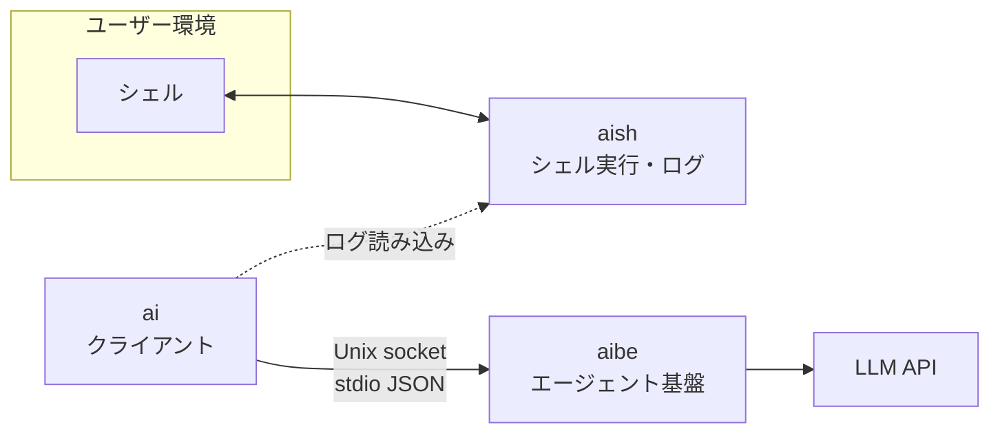

# アーキテクチャ

aish ワークスペースのレイヤー、依存、プロトコル、設定の正本。実装と **同じ PR / コミットで更新** する。

## 概要



| コンポーネント | 役割 | ネットワーク |
|----------------|------|--------------|
| **aish** | PTY/子プロセスでシェルを動かし、I/O をログに追記 | なし（LLM・aibe へ接続しない） |
| **aibe** | エージェントループ、ツール、プロバイダ呼び出し、Unix socket サーバ | LLM API へ（設定に従う） |
| **ai** | aibe にリクエストし応答を表示。aish ログをコンテキストに使う | aibe のみ（LLM 直叩き禁止） |

## 依存ルール

```
ai   →  aibe（クライアント用 API / クレート）のみ
aish →  （aibe への path 依存禁止）
aibe →  aish 禁止
```

機械チェック: `./scripts/check-architecture.sh`

### クレート別の依存方針

| クレート | 許容例 | 禁止例 |
|---------|--------|--------|
| aish | `libc`, PTY/プロセス系 | `aibe`, `reqwest`, `hyper`, LLM SDK |
| aibe | `tokio`, HTTP クライアント、serde、プロバイダ SDK | `aish` |
| ai | aibe クライアント、`serde` | `reqwest` 等の LLM 直叩き、API キー設定クレート |

## aibe デーモン

- **トランスポート**: Unix domain socket（パスは設定で指定。例: `~/.local/share/aibe/run.sock`）
- **ライフサイクル**:
  - 既にソケットが存在し応答すれば **接続のみ**
  - なければ `aibe` がサーバを起動（シングルトン想定）
  - フォアグラウンド: `cargo run -p aibe -- -f`（デバッグ用）
- **メッセージ形式**: 接続後、**1 行 1 JSON**（newline-delimited JSON）でリクエスト/レスポンスをやりとりする（stdio JSON スタイル）

## プロトコル（設計・詳細）

破壊的変更時はこの文書と `aibe` / `ai` のテストを同時に更新する。

### リクエスト（クライアント → aibe）

```json
{
  "type": "agent_turn",
  "id": "550e8400-e29b-41d4-a716-446655440000",
  "messages": [
    { "role": "user", "content": "..." }
  ],
  "tools": ["shell_exec", "read_file"],
  "context": {
    "shell_log_tail": "..."
  }
}
```

| フィールド | 説明 |
|-----------|------|
| `type` | 今後 `ping`, `cancel` 等を追加可能 |
| `id` | 相関 ID |
| `messages` | チャット履歴（プロバイダへ渡す前に aibe で正規化） |
| `tools` | 有効にするツール名のリスト |
| `context` | aish ログ由来など、クライアントが渡す付加コンテキスト |

### レスポンス（aibe → クライアント）

```json
{
  "type": "agent_turn_result",
  "id": "550e8400-e29b-41d4-a716-446655440000",
  "status": "ok",
  "assistant_message": { "role": "assistant", "content": "..." },
  "tool_calls": []
}
```

エラー時:

```json
{
  "type": "error",
  "id": "550e8400-e29b-41d4-a716-446655440000",
  "code": "provider_error",
  "message": "..."
}
```

## LLM プロバイダ（aibe 内）

| プロバイダ | 用途 |
|-----------|------|
| OpenAI | 公式 API |
| OpenAI 互換 | ローカル（LM Studio、vLLM 等） |
| Gemini | Google API |

- 選択とエンドポイントは **aibe 設定ファイル** で指定
- アダプタは aibe 内に閉じる。`ai` / `aish` にプロバイダ分岐を書かない

## aish ログ

- **用途（当面）**: `ai` が読み込み、aibe リクエストの `context` に載せる
- **形式（実装）**: JSONL。1 行に 1 イベント。`event` フィールドで種別を区別する:

| `event` | 内容 |
|---------|------|
| `command_start` | `command`, `args` |
| `stdout` | `data` |
| `stderr` | `data` |
| `exit` | `code`（任意） |

- **CLI**: `aish exec [--log PATH] -- <program> [args...]`（未指定時は `~/.local/share/aish/sessions/session-<pid>.jsonl`）
- **保存場所（設計）**: 設定または環境変数。例: `~/.local/share/aish/sessions/<session-id>.jsonl`
- 詳細スキーマは aish 実装時にこの節を拡張する

## 設定ファイル

| 対象 | 例のパス | 内容 |
|------|----------|------|
| aibe | `~/.config/aibe/config.toml` | プロバイダ、API キー、socket パス、モデル名 |
| aish | `~/.config/aish/config.toml` | ログディレクトリ、シェル起動オプション |
| ai | `~/.config/ai/config.toml` | aibe socket パス、ログ参照パス |

- リポジトリに **実キーをコミットしない**
- 例示用は `docs/` または `*.example.toml` のみ

## Hexagonal（Ports & Adapters）

各クレートは **独立した六角形**。クレート間は path 依存ではなく **プロトコル（aibe）** と **ログファイル（aish）** で接続する。

共通のソース配置:

```text
<crate>/src/
  domain/           # エンティティ・ルール（I/O なし）
  application/      # ユースケース（port の trait のみ参照）
  ports/outbound/   # アプリが外に頼る trait
  adapters/         # port の具象（OS / HTTP / ファイル / socket）
```

| クレート | 主なユースケース | Outbound ports（例） | Inbound adapters（例） |
|---------|------------------|----------------------|-------------------------|
| **aibe** | `AgentTurn`, リクエストディスパッチ | `LlmProvider`, `ConfigLoader` | Unix NDJSON リスナ（`application::server`） |
| **aish** | `ExecuteAndRecord` | `ShellExecutor`, `SessionLog` | CLI `aish exec` |
| **ai** | `Ask` | `AgentClient`, `ShellLogSource`, `Presenter` | CLI `ai ask` |

`ai` は `aibe::protocol` のみをクレート依存し、`aish` には依存しない（ログはファイルパスで読む）。

## プロトコル（実装済み）

### `ping`

リクエスト:

```json
{ "type": "ping", "id": "..." }
```

レスポンス:

```json
{ "type": "pong", "id": "..." }
```

### `agent_turn`

`architecture.md` 先頭の JSON スキーマどおり。`context.shell_log_tail` は `ai` が aish JSONL の末尾を載せる。

## 実装フェーズ（参考）

1. **aibe**（済）: socket + `ping` + 1 ターン `agent_turn` + `MockLlm`
2. **aish**（済）: `aish exec -- <cmd>` と JSONL 追記
3. **ai**（済）: `ai ask` と aibe 接続 + 任意で `--log`
4. **済（本ラウンド）**: OpenAI 互換 LLM、`config.toml`、aibe シングルトン（ping）、PTY `aish shell`、ログマスク
5. **次**: ツールループ、Gemini プロバイダ、ログマスクの拡張テスト、手動検証ドキュメント
