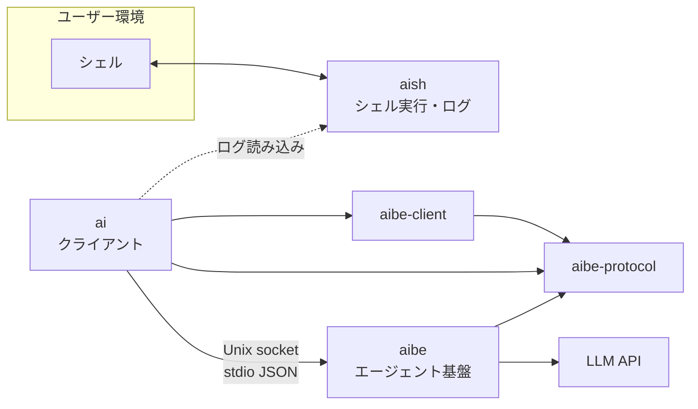

# アーキテクチャ

aish ワークスペースのレイヤー、依存、プロトコル、設定の正本。実装と **同じ PR / コミットで更新** する。

## 概要



| コンポーネント | 役割 | ネットワーク |
|----------------|------|--------------|
| **aish** | PTY/子プロセスでシェルを動かし、I/O をログに追記。`openpty` 後に親 stdin の winsize を PTY master へ `TIOCSWINSZ` で同期し、セッション中の `SIGWINCH` も `signalfd` 経由で同様に伝播。PTY stdin は `dup(master)` + shutdown pipe + 親 TTY raw。fork 後セットアップ失敗時は `master` を閉じ子を kill/reap | なし（LLM・aibe へ接続しない） |
| **aibe-protocol** | wire DTO（NDJSON / serde）、`ToolName`、契約定数。leaf クレート | なし |
| **aibe-client** | Unix socket transport（`ping` / `ensure_running` / `route_turn` / `agent_turn` + 承認往復）/ 既定 socket パス | なし（`aibe` バイナリ起動のみ） |
| **aibe** | `route_turn`、会話継続、ツール、プロバイダ呼び出し、conversation store、**contextual memory store**、Unix socket サーバ | LLM API へ（設定に従う） |
| **ai** | `aibe-client` + `aibe-protocol` 経由で aibe に接続し応答を表示。`shell_exec` 承認 UX（`y/n/a/c`、tier 分類、session cache、`--yes-exec`、`[tools.shell_exec.auto_approve_patterns]`）は **ai** の責務。wire 上は `ShellExecApproval.approval_origin` で provenance を aibe に渡す（0036）。transport は `aibe-client` | aibe デーモンのみ（LLM 直叩き禁止） |

## 依存ルール

```
ai            →  aibe-protocol, aibe-client のみ（aibe / aish 禁止）
aibe-client   →  aibe-protocol のみ
aibe          →  aibe-protocol, aibe-client（aish 禁止）
aibe-protocol →  （他ワークスペースクレート禁止。serde のみ）
aish          →  （aibe への path 依存禁止）
```

機械チェック:

- `./scripts/check-architecture.sh` — クレート間依存・禁止 HTTP/LLM・キー直書き
- 同スクリプト内で `./scripts/check-hexagonal.sh` を呼び出し、**クレート内レイヤー** を検査

### クレート別の依存方針

| クレート | 許容例 | 禁止例 |
|---------|--------|--------|
| aish | `libc`, PTY/プロセス系 | `aibe`, `reqwest`, `hyper`, LLM SDK |
| aibe-protocol | `serde` | `aibe`, `aibe-client`, `aish`, `ai`, `tokio`, HTTP |
| aibe-client | `aibe-protocol` | `aibe`, `aish`, `ai` |
| aibe | `tokio`, HTTP クライアント、serde、プロバイダ SDK、`aibe-protocol`, `aibe-client` | `aish` |
| ai | `aibe-protocol`, `aibe-client`, `serde` | `aibe`, `aish`, `reqwest` 等の LLM 直叩き |

`ai` は LLM API を直接叩かず、`chat` も `ai` の transcript と local history を経由して `aibe` に渡す。`ai` の history payload は `conversation_id` と `ai_session_id` を保持し、再実行時の再接続に使う。

## aibe デーモン

- **トランスポート**: Unix domain socket（パスは設定で指定。例: `~/.local/share/aibe/run.sock`）
- **ライフサイクル**:
  - 既にソケットが存在し応答すれば **接続のみ**
  - なければ `aibe` がサーバを起動（シングルトン想定）
  - フォアグラウンド: `cargo run -p aibe -- -f`（デバッグ用）
- **メッセージ形式**: 接続後、**1 行 1 JSON**（newline-delimited JSON）でリクエスト/レスポンスをやりとりする（stdio JSON スタイル）

## プロトコル（設計・詳細）

破壊的変更時はこの文書と `aibe` / `ai` のテストを同時に更新する。

### リクエスト（クライアント → aibe）

```json
{
  "type": "agent_turn",
  "id": "550e8400-e29b-41d4-a716-446655440000",
  "messages": [
    { "role": "user", "content": "..." }
  ],
  "tools": ["shell_exec", "read_file"],
  "llm_profile": "fast",
  "context": {
    "shell_log_tail": "...",
    "cwd": "/abs/path/to/ai/cwd",
    "system_instruction": "..."
  }
}
```

| フィールド | 説明 |
|-----------|------|
| `type` | 今後 `ping`, `cancel` 等を追加可能 |
| `id` | 相関 ID |
| `messages` | チャット履歴（プロバイダへ渡す前に aibe で正規化）。wire 上の `role` は `"user"` 等の **JSON 文字列のまま**（0008 以降も不変）。aibe 内部では `MessageRole` enum に変換して保持（未知 role は `invalid_request`）。詳細: `docs/done/0008_chat-message-and-protocol-typing-spec.md` |
| `tools` | 有効にするツール名のリスト |
| `llm_profile` | 任意。使用する LLM プロファイル名（`docs/done/0011_llm-profiles-spec.md`）。省略時は aibe 設定の `default_profile` |
| `context` | aish ログ由来など、クライアントが渡す付加コンテキスト |
| `context.cwd` | クライアントのカレントディレクトリ（絶対パス）。`ai` は起動時の `std::env::current_dir()` を送る。`read_file` の相対パスと `allowed_roots` の `.` は **aibe プロセスの cwd ではなくこの値** を基準にする |
| `context.system_instruction` | 任意。この turn のみ LLM に前置する system 本文。クライアント（`ai`）が turn 解決後に組み立て、aibe は解釈せず注入する。console hint（端末サイズに応じた整形指示）は `ai` の `resolve_console_hints` で on/off を決め、有効時のみ TTY サイズから生成する。CLI `--console-hint` / `-H` / `--no-console-hint` / `-N`、設定 `[ask].console_hints`、preset `[presets.*].console_hints` で制御（優先順位: CLI > preset > config > 既定 `true`）。非 TTY または `--format`（tsv / json / env）指定時は付与しない。`aibe_client` は policy を持たず、解決済み context を serialize するのみ。長すぎる場合は `aibe_protocol::SYSTEM_INSTRUCTION_MAX_BYTES` で切り詰める |
| turn 進行表示 | `ai` の `resolve_progress` で on/off（優先順位: CLI `--progress` / `--no-progress` > preset > `[ask].progress` > 既定 **TTY stderr なら `true`**）。有効時は aibe の progress event を受け、TTY stderr では単行スピナー（`\r` 上書き）で表示し assistant streaming 開始時に行を消す。非 TTY では `ai: progress: …` 行（`--progress` 明示時のみ有効）。`--quiet` で抑制。**`--format`（tsv / json / env）は stdout 契約のみを決め、stderr progress の有効/無効には使わない**（0033）。turn スコープの spinner は `ProgressGuard`（RAII）で必ず停止する |

### レスポンス（aibe → クライアント）

```json
{
  "type": "agent_turn_result",
  "id": "550e8400-e29b-41d4-a716-446655440000",
  "status": "ok",
  "assistant_message": { "role": "assistant", "content": "..." },
  "tool_calls": [],
  "artifacts": null
}
```

`artifacts`: 0024 / 0025 の非採用案で検討した拡張。0026 の外部コマンド経路では付与しない。HTTP ツールループでは `null` のままでよい。

`assistant_streaming`: 任意のデルタ通知。aibe の LLM プロバイダが streaming を返せる場合はそのデルタをそのまま流し、非対応プロバイダは synthetic 1 回のデルタを返す。`ai` は human 向け（`--format` 未指定）のときだけ delta を stdout に逐次表示する。`--format json|tsv|env` 時は delta を stdout に出さず、最終 `AgentTurnResult` を structured 形式で 1 回だけ出す（0033）。

### smart entry と `route_turn`

`ai` は tty の `ask` 入口で `route_turn` を 1 回実行し、失敗時のみ 1 回だけ再試行する。non-TTY では `route_turn` を飛ばし、従来の 1 shot ask に倒す。

`route_turn` の request には次を含める。

- `session.ai_session_id`: `aish` 由来の共有キー、または `ai` が生成した一意 ID
- `session.aish_session_dir`: `aish shell` 由来の session dir
- `conversation.conversation_id`: 既存会話の継続 ID
- `conversation.recent_summary`: aibe 側が保持する直近 1 turn の要約
- `conversation.new_conversation`: `--new` の強制新規フラグ
- `cli_overrides`: `--preset` / `--tools` / `--log-tail` / `--yes-exec`

`route_turn` の応答 `RoutePlan` は advisory であり、`ai` の CLI 明示値があれば上書きされる。`route_reason` は stderr / history に残す前に redaction する。

`aibe` は `AI_SESSION_ID` ごとに conversation store を切り、`index.jsonl` には redacted metadata、`conversations/<conversation_id>.json` には full transcript と summary を保存する。

### contextual memory（0034 + 0035 identity split）

- **正本**: `memory_space_id` 単位の JSONL（`memory/spaces/<memory_space_id>/events.jsonl`）。`AI_SESSION_ID` は memory の owner ではない（runtime provenance のみ）。`ai` / `aish` は保存しない。
- **identity**: `AI_SESSION_ID` = shell log / conversation / runtime session。`memory_space_id` = contextual memory の owner。user-facing 名は `AIBE_CONTEXT_ID`（CLI: `ai context`）。
- **解決順**（**クライアント `ai` のみ**。RPC / turn 送信時に解決済み `memory_space_id` を載せる）: `AIBE_CONTEXT_ID` > `~/.config/ai/config.toml` の `[context] current` > cwd から導出した `project_<hash>` > `legacy_session_<session_id>`（非推奨）。**`aibe` デーモンはサーバ環境変数 `AIBE_CONTEXT_ID` を読まない**（複数クライアント接続時にサーバ env で全員の context が変わるのを防ぐ）。サーバ側フォールバックは request 明示 `memory_space_id` > cwd project > legacy session のみ。
- **ID 検証**: `memory_space_id` と `session_id` は path-safe（ASCII 英数と `_` `.` `-`、128 byte 以下、`/` `\` `..` dot-only 拒否）。legacy path 読み取り前に `session_id` を検証する。
- **RPC**: `memory_apply`（write）、`memory_query`（read）、`memory_kind_list`（registry 一覧）、`memory_recipe_run`（LLM 提案 / 任意 apply）、`memory_subscribe`（変更通知購読。**専用接続** — `memory_subscribe_result` 後に `memory_changed` を push。他 RPC 混在不可）。`MemoryContext.cwd` は `Option`。**project scope** の apply/query のみ cwd 必須。session / global scope は cwd なし可。`project_key` はサーバが cwd から導出する（wire に載せない）。
- **Subscribe（0037 Phase 5）**: in-process broker が `memory_apply` / recipe apply 成功時に `memory_changed` を publish。`memory_space_id` と optional `kind` filter で絞る。接続切断で subscriber 解放。reconnect / replay は v1 非対象。
- **Add defaulting（0037 Phase 2）**: `MemoryOperationAdd` の `scope` / `inject` / `status` / `make_active` は optional。AIBE `resolve_memory_operation_add` が補完する。registered kind は registry default、unregistered kind は server 既定（`project` / `manual` / `open` / `make_active=false`）。`ai mem add` は `kind + text` のみ送り、policy は AIBE 正本。
- **Kind registry（0037 §6.5）**: built-in 6 kind に加え、`<AIBE_ROOT>/memory/kinds.toml` と `<AIBE_ROOT>/memory/spaces/<memory_space_id>/kinds.toml` で user-defined kind / builtin override を merge する（後勝ち。builtin の危険な override は拒否）。`memory_kind_list` / resolver / add defaulting / clear transition は **effective registry**（context の `memory_space_id` 基準）を使う。設定 parse 失敗時: explicit memory RPC は error、AgentTurn 注入は built-in へ best-effort fallback。サンプル: [manual/contextual-memory-kinds-toml.md](manual/contextual-memory-kinds-toml.md)。
- **注入**: `route_turn` は memory を見ない。`agent_turn` のみ `resolve_for_prompt` で user-maintained context block を synthetic user message として前置する（system instruction ではない）。通常 query では **goal / now / rule**（active）が pinned 注入される（Phase 1 registry + Phase 2 継続）。`ai` は turn の `context.memory_space_id` に解決済み ID を載せるため、`ai context use` で選んだ context が注入にも反映される。cwd の無い turn は legacy session space に解決する（注入は best-effort）。`now` は別 session から見たとき stale 表示できる。
- **legacy 互換**: 0034 の `conversations/<AI_SESSION_ID>/memory/events.jsonl` は read-through。`legacy_session_*` 以外の space を初回アクセスした際は legacy events を new layout へ lazy copy する（project-backed space を含む）。legacy space 自身への書き込み時も new layout へ seed してから append し、元の legacy store は変更しない。
- **標準 kind（built-in registry）**: `goal` / `now` / `idea`（dedicated CLI あり）、`rule` / `decision` / `note`（`ai mem add` 可）。`goal`（project, pinned, `active`）、`now`（session, pinned, `active`）、`rule`（project, pinned, `active`, multiple）、`idea`（project, on-demand, `open` — **通常クエリへ常時注入しない**）、`decision`（on-demand）、`note`（manual）。clear 操作は wire 上 `ClearKind`（`op: "clear_kind"`）。MVP 詳細は [spec/0034](spec/0034_aibe-contextual-memory-spec.md)、[spec/0035](spec/0035_aibe-memory-identity-split-spec.md)。正式版 v1 は [spec/0037](spec/0037_aibe-contextual-memory-runtime-v1-spec.md)。
- **Capability boundary（0037 Phase 6）**: `Capability` / `CapabilityPolicy` は **AIBE application service boundary** のみ。memory read/write/archive/recipe/subscribe と `AgentAsk` / `ShellPropose` / `ShellExecute` を分離。既定 `local_full` は現行 `ai` CLI 互換。`memory_only` は shell execute 拒否、`memory_read_only` は write/archive 拒否。capability は **wire 交渉なし**（composition root の静的 policy）。詳細: [manual/contextual-memory-multi-client.md](manual/contextual-memory-multi-client.md)。
- **Multi-client（0037 Phase 7）**: 複数 `AI_SESSION_ID` が同一 `memory_space_id` を共有可能。`AIBE_CONTEXT_ID` は **クライアント側 selection**（サーバ env ではない）。v1 は **local runtime**（remote authentication 非対象）。将来 VSCode / TUI / mobile は同じ stdio JSON RPC + 任意で subscribe 専用接続。

リクエスト例（`memory_apply`）:

```json
{
  "type": "memory_apply",
  "id": "550e8400-e29b-41d4-a716-446655440000",
  "session_id": "AI_SESSION_ID",
  "context": {
    "cwd": "/abs/path/to/project",
    "memory_space_id": "ctx_a"
  },
  "operation": {
    "op": "add",
    "kind": "rule",
    "text": "idea は通常クエリへ常時注入しない"
  }
}
```

registered kind は `scope` / `inject` / `status` / `make_active` を省略可能（server が registry default で補完）。explicit DTO も引き続き有効。

リクエスト例（`memory_kind_list`）:

```json
{
  "type": "memory_kind_list",
  "id": "550e8400-e29b-41d4-a716-446655440002",
  "session_id": "AI_SESSION_ID",
  "context": {
    "cwd": "/abs/path/to/project",
    "memory_space_id": "ctx_a"
  }
}
```

リクエスト例（`memory_recipe_run` / `clarify-goal`）:

```json
{
  "type": "memory_recipe_run",
  "id": "550e8400-e29b-41d4-a716-446655440003",
  "session_id": "AI_SESSION_ID",
  "context": {
    "cwd": "/abs/path/to/project",
    "memory_space_id": "ctx_a"
  },
  "recipe": "clarify-goal",
  "apply": false,
  "user_instruction": "focus on MVP"
}
```

応答は `summary` / `proposals[]`（`operation` + 表示専用 `rationale`）/ `applied_entries`。LLM profile は AgentTurn と同じ default。`apply=true` は validation 済み operation のみ store へ反映し、subscribe には `recipe_applied` を publish する。CLI `--apply` は `MemoryRecipeRun(apply=false)` で提案取得後、対話確認して各 proposal を **`MemoryApply` として個別送信**する（非対話 stdin は fail-closed）。この CLI 経路の subscription は `added` / `status_changed` 等であり `recipe_applied` とは異なるが、最終 state は同等。shell execute とは無関係。

リクエスト例（`memory_apply`、explicit DTO。互換経路）:

```json
{
  "type": "memory_apply",
  "id": "550e8400-e29b-41d4-a716-446655440000",
  "session_id": "AI_SESSION_ID",
  "context": {
    "cwd": "/abs/path/to/project",
    "memory_space_id": "ctx_a"
  },
  "operation": {
    "op": "add",
    "kind": "goal",
    "scope": "project",
    "inject": "pinned",
    "status": "active",
    "text": "ship contextual memory",
    "make_active": true
  }
}
```

リクエスト例（`memory_query`。`include_prompt_block` で `ai mem show` 相当の block を取得）:

```json
{
  "type": "memory_query",
  "id": "550e8400-e29b-41d4-a716-446655440001",
  "session_id": "AI_SESSION_ID",
  "context": {
    "cwd": "/abs/path/to/project",
    "memory_space_id": "ctx_a"
  },
  "query": {
    "include_prompt_block": true,
    "user_query": ""
  }
}
```

応答例（`memory_query_result`）:

```json
{
  "type": "memory_query_result",
  "id": "550e8400-e29b-41d4-a716-446655440001",
  "status": "ok",
  "entries": [],
  "prompt_block": "[aibe contextual memory]\n..."
}
```

エラー時:

```json
{
  "type": "error",
  "id": "550e8400-e29b-41d4-a716-446655440000",
  "code": "provider_error",
  "message": "..."
}
```

## LLM プロバイダ（aibe 内）

設定 `[llm.<name>]` の `provider`（`parse_provider_kind` の受け入れ値）:

| `provider` | 用途 |
|-----------|------|
| `openai_compatible` | OpenAI 公式 API および OpenAI 互換（LM Studio、vLLM 等）。`base_url` 省略時の既定は `https://api.openai.com/v1` |
| `gemini` | Google AI Studio `generateContent`（`v1beta`）— `adapters/outbound/gemini.rs` |
| `mock` | テスト・開発 |
| `codex_cli` | 0024 / 0025 の旧案（非採用）。first-class `LlmProvider` にはしない |
| `claude_code_cli` | 0024 / 0025 の旧案（非採用）。first-class `LlmProvider` にはしない |

**CLI サブエージェント（0024 / 0025, 非採用）**

- 0024 / 0025 は歴史的な比較資料。`codex_cli` / `claude_code_cli` を first-class `LlmProvider` にする案は採用しない。
- `artifacts` / `invoke_*` / `RequestContext.cli_resume` / `cli-thread.json` / `max_concurrent_cli` は 0024 / 0025 の設計要素であり、0026 の外部コマンド経路では使わない。
- `docs/manual/cli-subagent-products.md` は CLI コマンドの挙動調査として残すが、aibe のプロトコル正本ではない。

**外部コマンド（0026）**

- `[[external_commands]]` は `shell_exec` のプリセットであり、`provider` ではない。
- HTTP 親プロファイルが外部コマンドを使う場合も、実際の経路は `shell_exec` + `@exec` / literal 指定である。
- `aibe` は `shell_exec` の allowlist、承認、timeout、監査だけを担い、CLI の thread / session は保存しない。
- `invoke_*` や専用 runner は導入しない。

- `provider = "openai"` は **未対応**（別名ではない）。公式 OpenAI も `openai_compatible` を使う
- 選択とエンドポイントは **aibe 設定ファイル** の LLM 接続 + プロファイルで指定（`docs/done/0011_llm-profiles-spec.md`）
- Gemini の `thoughtSignature` 等は `ToolCall.provider_extras` に **part 単位**で保持し、次ラウンドの `functionCall` part に復元する（クライアント wire には載せない — `docs/done/0010_gemini-provider-spec.md`）
- アダプタは aibe 内に閉じる。`ai` / `aish` にプロバイダ分岐を書かない

## aish ログ

- **用途（当面）**: `ai` が読み込み、aibe リクエストの `context` に載せる
- **形式（実装）**: JSONL。1 行に 1 イベント。`event` フィールドで種別を区別する:

| `event` | 内容 |
|---------|------|
| `command_start` | `command`, `args`（追記前に `sanitize_log_text`） |
| `stdout` | `data`（追記前に `sanitize_log_text`） |
| `stderr` | `data`（追記前に `sanitize_log_text`） |
| `exit` | `code`（任意） |

- **CLI**（`clap` + `clap_complete`。各バイナリに `complete bash|zsh`）:
  - `aish exec [--format tsv|json|env] [--log PATH] -- <program> [args...]`（未指定時は `log_dir/session-<pid>.jsonl`）
  - `aish shell [--format tsv|json|env]` — セッション dir 方式（`docs/done/0019_aish-session-log-integration-spec.md`）。bash / zsh 子シェルでは一時 rcfile で Tab 補完を有効化し、child shell へ `AI_ASK_LOG=session` を自動 export する
  - `aish session [--format tsv|json|env]` — 現在セッション（`AISH_SESSION_DIR` 必須）
  - `ai <message>` — default ask。`ai ask [OPTIONS] <message>` も互換のため残す。`ai status` / `ai doctor` / `ai ping` は local 診断導線
  - `aibe [--foreground|-f]` — デーモン起動
  - 動的補完: `ai ask --profile`（`AIBE_CONFIG` の `[profiles.*]`）、`--session`（`AISH_CONFIG` の `log_dir` 内 session id）。詳細: [manual/tab-completion.md](manual/tab-completion.md)
- **共通 `--format`**（情報表示系サブコマンド向け）:
  - 値: **`tsv`（既定）** | **`json`** | **`env`**
  - **全サブコマンド**で指定可能。composition root が `clap` で解析し、未知の値はエラーにする
  - **情報表示系**サブコマンドのみ stdout の形式に反映する。現状は **`session` のみ**が該当
  - **実行系**（`exec`, `shell` 等）は現状 `--format` を出力に使わないが、将来追加する情報表示系と CLI を揃えるため **受理のみ** 行う（指定しても挙動は変わらない）
  - 形式の意味（情報表示系で共通）:
    - `tsv` — `key\tvalue` 行（人間閲覧・簡易スクリプト向け）
    - `json` — 構造化 JSON オブジェクト（パイプ・ツール連携向け）
    - `env` — `KEY='value'` 行（`eval "$(aish … --format env)"` 向け。値は shell 単一引用符でエスケープ）
  - 新しい情報表示系サブコマンドを追加するときは、同じ `--format` と上記3形式を実装する（domain の `OutputFormat` / `SessionInfo::render` パターンを参照）
- **対話シェル（`aish shell`）の layout**（`0019`）:

```text
<config log_dir>/<session-id>/
  log.jsonl
  current_log -> log.jsonl
```

- **session-id**: `2020-01-01T00:00:00Z` 起点の経過ミリ秒を **12 桁小文字 hex**（ゼロ埋め）
- **起動時**: `stderr` に session id を表示。子シェルへ `AISH_SESSION_DIR`（セッション dir 絶対パス）を export
- **掃除**: `aish shell` 起動時、`create_shell_session` **の後**に `max_sessions`（config、既定 50）超過分をディレクトリ名の辞書順で削除（新規セッションは残す）
- **`ai ask` 連携**（`ai` は `aish` クレート非依存）:
  - 既定はログを載せない
  - `AI_ASK_LOG=session` は `aish shell` の child shell に自動 export され、`AISH_SESSION_DIR` と組み合わせて `current_log` を解決し、symlink 先が session dir 内の通常ファイルとして **open 可能**なことを検証してから tail
  - `--session <id>` → 同上（`id` は `basename(AISH_SESSION_DIR)` と一致）
  - `--log PATH` / `--no-log` の優先順は `0019` 参照
  - `--log-tail` は bytes 指定で `aibe_protocol::SHELL_LOG_TAIL_MAX_BYTES` を超えない。`0` で tail 無効、既定は `~/.config/ai/config.toml` の `log_tail_bytes`、未設定時は 16 KiB
  - `shell_exec_approval` の最終解決は CLI > preset > `AIBE_CONFIG`（`[tools.shell_exec].shell_exec_approval`）の順。`--yes-exec` は実効 mode が `ask` のときだけ有効で、`never` は越えない
- **local history**:
  - 既定 root は `~/.local/share/ai/history/`
  - `index.jsonl` は redacted な一覧・検索用メタデータのみを持つ。`conversation_id` と `shell_exec_approval` は index / payload の双方に保存し、chat session 単位の追跡に使う
  - `payloads/<history_id>.json` は replay 用 payload vault で、0600 相当の権限で保存する
- **`ai ask` の output filter**（`0022`）:
  - 対象は `AgentTurnResult.assistant_message.content` のみ（`stdout`）。tools 起動行・warning・`--verbose-tools`・エラーは `stderr` のまま
  - 優先順: 非空 `AI_FILTER` > 非空 `[ask].filter` > なし（CLI フラグなし）
  - 実行: `/bin/sh -c` に stdin pipe。filter stdout は `write_all`（改行は filter 任せ）。filter stderr は透過
  - 空 assistant は filter 未起動・stdout 不出力。filter 非ゼロ終了でも `ai` は 0 終了（warning のみ）。spawn 失敗時は未加工本文をフォールバック
  - `dry-run` / `status` / `doctor` は raw filter 文字列を出さず、`enabled` / `source` / `masked` のメタデータだけを出力する
  - 将来の対話モード等でも同 env/config を再利用する想定。`aish` からの export は今回なし

## 設定ファイル

| 対象 | 例のパス | 内容 |
|------|----------|------|
| aibe | `~/.config/aibe/config.toml` | LLM 接続 `[llm.<name>]`、プロファイル `[profiles.<name>]`、`default_profile`、socket、tools |
| aish | `~/.config/aish/config.toml` | `log_dir`、`max_sessions`（既定 50）、シェル起動 |
| ai | `~/.config/ai/config.toml` | aibe socket、`history_dir`、`log_tail_bytes`、`[ask].default_profile`、`[ask].tools`、`[ask].filter`（assistant 本文の output filter。`AI_FILTER` が非空なら上書き）、`[presets.*]` |

- リポジトリに **実キーをコミットしない**
- 例示用は `docs/` または `*.example.toml` のみ

## Hexagonal（Ports & Adapters）

各クレートは **独立した六角形**。クレート間は path 依存ではなく **プロトコル（aibe）** と **ログファイル（aish）** で接続する。

共通のソース配置:

```text
<crate>/src/
  domain/           # エンティティ・ルール（I/O なし）
  application/      # ユースケース（domain + ports のみ。adapters 禁止）
  ports/outbound/   # アプリが外に頼る trait
  adapters/         # port の具象（OS / HTTP / ファイル / socket）
```

### レイヤー依存（機械検査: `scripts/check-hexagonal.sh`）

| 層 | 許可する `use` | 禁止 |
|----|----------------|------|
| **domain** | domain 内 | `adapters`, `application` |
| **ports** | domain, ports | `adapters`, `application` |
| **application** | domain, ports, protocol 等 | `adapters`（**例外**は composition root のみ） |
| **adapters** | domain, ports, adapters 内 | `application` |

**composition root**（adapters を組み立てて `Arc<dyn Port>` を注入してよい application ファイル）:

| クレート | ファイル |
|---------|----------|
| aibe | `application/server.rs` のみ（socket I/O は `adapters/inbound/unix_socket_server.rs`） |
| aish | （なし — `main.rs` / `lib.rs` で配線） |
| ai | （なし — `main.rs` で配線） |

ユースケースの単体テストで adapters が必要なときは `tests/*.rs` に置く（`src/application` 内の `#[cfg(test)]` で adapters を `use` しない）。

### effect boundary（副作用 API）

`scripts/check-hexagonal.sh` は **レイヤー依存** に加え、`scripts/check-hexagonal-effects.py` で副作用 API の混入を検査する（2 層）。

| 項目 | 正本 |
|------|------|
| ルール | `scripts/hexagonal-rules.toml` |
| 一時例外 | `scripts/hexagonal-allowlist.toml`（`rule` + `path` + `line` + `remove_by`） |
| checker | `scripts/check-hexagonal-effects.py` |

`application` / `domain` / `ports` に `std::fs`、`std::env`、`tokio::net`、`libc`、HTTP クライアント等が直接あってはならない（adapter または composition root へ）。severity は `warn`（報告のみ）または `fail`（CI 失敗）。新規ルールは TOML に追記し、checker 本体は極力触らない。

**aibe composition root**（adapters 組み立て可）: `application/server.rs` のみ。Unix socket I/O は `adapters/inbound/unix_socket_server.rs`。

ルール追加手順の詳細: [0031_hexagonal-effect-boundary-spec.md](spec/0031_hexagonal-effect-boundary-spec.md)「AI 向け運用ルール」。

| クレート | 主なユースケース | Outbound ports（例） | Inbound adapters（例） |
|---------|------------------|----------------------|-------------------------|
| **aibe** | `AgentTurn`, リクエストディスパッチ | `LlmProvider`, `ToolRoundTerminator`, `ToolExecutor`, `CommandPolicy`, `ConfigLoader` | Unix NDJSON リスナ、ツール（`read_file`, `list_dir`, `grep`, `git_diff`, `git_status`, `shell_exec`）、終端戦略（`terminator/`） |
| **aish** | `ExecuteAndRecord` | `ShellExecutor`, `SessionLog` | CLI `aish exec` |
| **ai** | `Ask`, `history` | `AgentClient`, `ShellLogSource`, `HistoryStore`, `Presenter` | CLI `ai ask` / `ai retry` / `ai rerun`。`[ask].tools` / `--tools` / `[presets.*].tools` を展開して aibe の `tools` allowlist を構築。assistant 本文は `StdoutPresenter` + 任意の output filter（`AI_FILTER` / `[ask].filter` / preset） |

`ai` は **`aibe-protocol` と `aibe-client` のみ**を path 依存し、`aibe` 本体・`aish` には依存しない（ログはファイルパスで読む）。wire 型の正本は `aibe-protocol` クレート。

## プロトコル（実装済み）

### `ping`

リクエスト:

```json
{ "type": "ping", "id": "..." }
```

レスポンス:

```json
{ "type": "pong", "id": "..." }
```

### `agent_turn`

`architecture.md` 先頭の JSON スキーマどおり。`context.shell_log_tail` は `ai` が aish JSONL の末尾を載せる。`context.cwd` は `ai` が自身のカレントディレクトリを載せる。

- `tools: []` のときは **1 回の LLM 呼び出し**のみ（従来互換）。
- `tools` に名前があるとき、aibe は **エージェントループ**（LLM → ツール実行 → LLM …）を `[tools] max_rounds` まで繰り返す。**このとき `context.cwd`（絶対パス）は必須**。未送信・相対パスは `invalid_request` で拒否する。
- `[tools] max_rounds` は **1 以上**。`config.toml` で `0` は設定読み込みエラー。プログラム上 `ToolsConfig { max_rounds: 0 }` のみ `effective_max_rounds()` で 1 に補正（`docs/done/0007_agent-turn-loop-modularization-spec.md`）。
- 組み込みツール: safe tools は `read_file` / `list_dir` / `grep` / `git_diff` / `git_status`。`shell_exec` は危険操作として `@exec` か literal 指定でのみ許可する（`@full` には含めない）。`shell_exec` は設定 `allowed_commands` のみ実行し、subprocess cwd は `context.cwd`。`[tools.shell_exec] shell_exec_approval = "never" | "ask" | "always"`（既定 `ask`）で実行前の承認を制御する。`ask` では `ai` が `y / n / a / c` の UI を出し、`read_only` / `mutating` / `destructive` の tier と session 許可、`[tools.shell_exec.auto_approve_patterns]` を見て自動承認する。`never` は最上位拒否で `--yes-exec` でも越えない。外部コマンド（`shell_exec` / `git_*`）は timeout 時に子プロセスを kill して明示 reap（共通 `run_subprocess`）。
- `approval_origin` を `ClientRequest::ShellExecApproval` に追加し、`aibe` 側は `approval_source` を再構成して監査に残す。
- `list_dir` / `grep` は `[tools.explore]` の件数・走査上限で timeout 前のメモリ・I/O を抑制する（`docs/aibe.config.example.toml`）。
- ツール出力は `[tools] max_tool_output_bytes` で切り詰め、`tool_calls.output` と LLM 向け tool result の両方に同じ制限をかける（`docs/security.md`）。
- ツール失敗は turn 全体を止めず **tool result として LLM に返し**、同一 turn 内で再推論する。詳細は `docs/done/0001_aibe-tool-agent-loop-spec.md`。
- cwd 必須化・ドメイン型・レイヤー分割は `docs/done/0003_architecture-review-refactor-spec.md`。
- ループ 1 ラウンド（LLM step + tool 実行 + conversation 更新）は `application/tool_round/ToolRoundExecutor`（0007）。`AgentTurnService` は前処理・for-loop・max-round 時の `ToolRoundTerminator` 委譲。composition root は `application/server.rs`。

`tool_calls`（レスポンス）は aibe が **実際に実行した**呼び出しの記録。各要素は `id`, `name`, `arguments`, `status`（`ok` / `error`）と、成功時 `output`、失敗時 `error` / `message` を含む。

#### ツールとカレントディレクトリ（必須方針）

| 項目 | 方針 |
|------|------|
| **基準 cwd** | **クライアント**（`ai ask` 等）のカレントディレクトリ。`agent_turn.context.cwd`（絶対パス）で渡す。ツール有効時は **必須** |
| **aibe の cwd** | 相対パス解決に **使わない**（フォールバックなし） |
| **新規ツール** | [`ToolExecutor::execute`](aibe/src/ports/outbound/tools.rs) の `ToolExecutionContext` を受け取り、相対パスは `base_dir` / `resolve_path` を使う。aibe 内で `std::env::current_dir` を直接参照しない |
| **`ai` の責務** | ツール有効時は起動時の `std::env::current_dir()`（絶対パス）を `context.cwd` に載せる。`AskInput` → `AskRequest` 変換で検証する |
| **既存** | `read_file` / `list_dir` / `grep` / `git_diff` / `git_status` / `shell_exec` は上記に準拠 |

実装の正本: **wire** — `aibe-protocol`（`ClientRequest` / `ClientResponse` / `ToolName` / `ExecutedToolCall` / `KNOWN_TOOLS` / 契約定数）。**server 内部** — `aibe::domain::{ClientCwd, AgentTurnContext, ShellLogTail, ChatMessage, ToolCall}`、`aibe::ports::outbound::ToolExecutionContext`（`tool_context.rs`）。wire JSON の `context` 形は従来どおり。`RequestService` は `aibe_protocol::RequestContext` を `application/protocol_convert` の `TryFrom` で `AgentTurnContext` に変換してから `AgentTurnService` へ渡す。会話メッセージは wire 上 `messages[].role` 文字列のまま受け取り、内部は `MessageRole` enum（0008）。`ai` の allowlist は `aibe_protocol::ToolName` を使用する。

#### エラーコード（`type: error`）

| `code` | 意味 |
|--------|------|
| `invalid_request` | リクエスト不正 |
| `provider_error` | LLM API 失敗 |
| `tool_not_allowed` | クライアントがリクエスト `tools` に未実装名を指定した場合（turn `error`）。モデルが allowlist 外の**既知**ツールを呼んだ場合は tool result でループ継続 |
| `internal_error` | 内部エラー |

`agent_turn_result.status` には `"ok"` のほか、ツール上限到達時は `"max_tool_rounds"`（`type: error` ではない。`tool_calls` と最終 assistant 本文を返す）。

（`tool_error` / `tool_timeout` / `max_tool_rounds` の turn `error` コードは予約または非使用。MVP では個別ツール失敗は `tool_calls` + LLM 向け tool result、上限到達は `status: max_tool_rounds` の `agent_turn_result`。）

#### max-round 終端戦略（0006）

ツールラウンド上限到達時の最終 LLM 呼び出しは `ToolRoundTerminator` port（`ports/outbound/tool_round_terminator.rs`）に委譲する。戦略の具象は `adapters/outbound/terminator/` のみが保持する。

| 項目 | 内容 |
|------|------|
| **既定戦略** | `summary_prompt`（0003 互換 — 実行記録を `ToolExecutionSummary` で要約 user に圧縮） |
| **設定** | `[tools] termination_strategy = "summary_prompt"` または `"conversation_replay"` |
| **Replay 条件** | policy が `conversation_replay` **かつ** `TerminationCapability.plain_complete_accepts_tool_role == true` |
| **capability** | LLM adapter / `llm_factory::termination_capability` が提供（`LlmProvider` trait には載せない） |
| **フォールバック** | Replay の `complete()` が `LlmError::Provider` を返したら SummaryPrompt を 1 回再試行 |
| **wire protocol** | 変更なし（クライアントは `status` + `assistant_message` のみ） |

| プロバイダ（初期値） | `plain_complete_accepts_tool_role` |
|---------------------|-------------------------------------|
| mock / openai_compatible / gemini | `false`（安全側） |

実装の正本: `ToolRoundTerminatorOrchestrator`、`TerminationCapability`、`TerminationStrategy`（`ports/outbound/config.rs`）。

## 実装フェーズ（参考）

1. **aibe**（済）: socket + `ping` + `agent_turn` + ツールループ + `MockLlm` / OpenAI 互換 / Gemini
2. **aish**（済）: `aish exec -- <cmd>` と JSONL 追記
3. **ai**（済）: `ai ask` と aibe 接続 + 任意で `--log`
4. **済**: OpenAI 互換 LLM、Gemini LLM、`config.toml`、aibe シングルトン（ping）、PTY `aish shell`、ログマスク、`shell_exec` / `read_file`、`shell_exec` 実行前承認（0020）
5. **次**: ログ context の構造化（P4-4）、ログマスクの拡張
