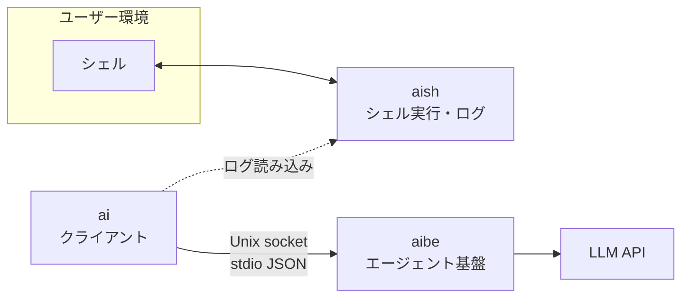

# アーキテクチャ

aish ワークスペースのレイヤー、依存、プロトコル、設定の正本。実装と **同じ PR / コミットで更新** する。

## 概要



| コンポーネント | 役割 | ネットワーク |
|----------------|------|--------------|
| **aish** | PTY/子プロセスでシェルを動かし、I/O をログに追記 | なし（LLM・aibe へ接続しない） |
| **aibe** | エージェントループ、ツール、プロバイダ呼び出し、Unix socket サーバ | LLM API へ（設定に従う） |
| **ai** | aibe にリクエストし応答を表示。aish ログをコンテキストに使う | aibe のみ（LLM 直叩き禁止） |

## 依存ルール

```
ai   →  aibe（クライアント用 API / クレート）のみ
aish →  （aibe への path 依存禁止）
aibe →  aish 禁止
```

機械チェック:

- `./scripts/check-architecture.sh` — クレート間依存・禁止 HTTP/LLM・キー直書き
- 同スクリプト内で `./scripts/check-hexagonal.sh` を呼び出し、**クレート内レイヤー** を検査

### クレート別の依存方針

| クレート | 許容例 | 禁止例 |
|---------|--------|--------|
| aish | `libc`, PTY/プロセス系 | `aibe`, `reqwest`, `hyper`, LLM SDK |
| aibe | `tokio`, HTTP クライアント、serde、プロバイダ SDK | `aish` |
| ai | aibe クライアント、`serde` | `reqwest` 等の LLM 直叩き、API キー設定クレート |

## aibe デーモン

- **トランスポート**: Unix domain socket（パスは設定で指定。例: `~/.local/share/aibe/run.sock`）
- **ライフサイクル**:
  - 既にソケットが存在し応答すれば **接続のみ**
  - なければ `aibe` がサーバを起動（シングルトン想定）
  - フォアグラウンド: `cargo run -p aibe -- -f`（デバッグ用）
- **メッセージ形式**: 接続後、**1 行 1 JSON**（newline-delimited JSON）でリクエスト/レスポンスをやりとりする（stdio JSON スタイル）

## プロトコル（設計・詳細）

破壊的変更時はこの文書と `aibe` / `ai` のテストを同時に更新する。

### リクエスト（クライアント → aibe）

```json
{
  "type": "agent_turn",
  "id": "550e8400-e29b-41d4-a716-446655440000",
  "messages": [
    { "role": "user", "content": "..." }
  ],
  "tools": ["shell_exec", "read_file"],
  "context": {
    "shell_log_tail": "...",
    "cwd": "/abs/path/to/ai/cwd"
  }
}
```

| フィールド | 説明 |
|-----------|------|
| `type` | 今後 `ping`, `cancel` 等を追加可能 |
| `id` | 相関 ID |
| `messages` | チャット履歴（プロバイダへ渡す前に aibe で正規化） |
| `tools` | 有効にするツール名のリスト |
| `context` | aish ログ由来など、クライアントが渡す付加コンテキスト |
| `context.cwd` | クライアントのカレントディレクトリ（絶対パス）。`ai` は起動時の `std::env::current_dir()` を送る。`read_file` の相対パスと `allowed_roots` の `.` は **aibe プロセスの cwd ではなくこの値** を基準にする |

### レスポンス（aibe → クライアント）

```json
{
  "type": "agent_turn_result",
  "id": "550e8400-e29b-41d4-a716-446655440000",
  "status": "ok",
  "assistant_message": { "role": "assistant", "content": "..." },
  "tool_calls": []
}
```

エラー時:

```json
{
  "type": "error",
  "id": "550e8400-e29b-41d4-a716-446655440000",
  "code": "provider_error",
  "message": "..."
}
```

## LLM プロバイダ（aibe 内）

| プロバイダ | 用途 |
|-----------|------|
| OpenAI | 公式 API |
| OpenAI 互換 | ローカル（LM Studio、vLLM 等） |
| Gemini | Google API |

- 選択とエンドポイントは **aibe 設定ファイル** で指定
- アダプタは aibe 内に閉じる。`ai` / `aish` にプロバイダ分岐を書かない

## aish ログ

- **用途（当面）**: `ai` が読み込み、aibe リクエストの `context` に載せる
- **形式（実装）**: JSONL。1 行に 1 イベント。`event` フィールドで種別を区別する:

| `event` | 内容 |
|---------|------|
| `command_start` | `command`, `args` |
| `stdout` | `data` |
| `stderr` | `data` |
| `exit` | `code`（任意） |

- **CLI**: `aish exec [--log PATH] -- <program> [args...]`（未指定時は `~/.local/share/aish/sessions/session-<pid>.jsonl`）
- **保存場所（設計）**: 設定または環境変数。例: `~/.local/share/aish/sessions/<session-id>.jsonl`
- 詳細スキーマは aish 実装時にこの節を拡張する

## 設定ファイル

| 対象 | 例のパス | 内容 |
|------|----------|------|
| aibe | `~/.config/aibe/config.toml` | プロバイダ、API キー、socket パス、モデル名 |
| aish | `~/.config/aish/config.toml` | ログディレクトリ、シェル起動オプション |
| ai | `~/.config/ai/config.toml` | aibe socket パス、ログ参照パス |

- リポジトリに **実キーをコミットしない**
- 例示用は `docs/` または `*.example.toml` のみ

## Hexagonal（Ports & Adapters）

各クレートは **独立した六角形**。クレート間は path 依存ではなく **プロトコル（aibe）** と **ログファイル（aish）** で接続する。

共通のソース配置:

```text
<crate>/src/
  domain/           # エンティティ・ルール（I/O なし）
  application/      # ユースケース（domain + ports のみ。adapters 禁止）
  ports/outbound/   # アプリが外に頼る trait
  adapters/         # port の具象（OS / HTTP / ファイル / socket）
```

### レイヤー依存（機械検査: `scripts/check-hexagonal.sh`）

| 層 | 許可する `use` | 禁止 |
|----|----------------|------|
| **domain** | domain 内 | `adapters`, `application` |
| **ports** | domain, ports | `adapters`, `application` |
| **application** | domain, ports, protocol 等 | `adapters`（**例外**は composition root のみ） |
| **adapters** | domain, ports, adapters 内 | `application` |

**composition root**（adapters を組み立てて `Arc<dyn Port>` を注入してよい application ファイル）:

| クレート | ファイル |
|---------|----------|
| aibe | `application/server.rs` のみ |
| aish | （なし — `main.rs` / `lib.rs` で配線） |
| ai | （なし — `main.rs` で配線） |

ユースケースの単体テストで adapters が必要なときは `tests/*.rs` に置く（`src/application` 内の `#[cfg(test)]` で adapters を `use` しない）。

| クレート | 主なユースケース | Outbound ports（例） | Inbound adapters（例） |
|---------|------------------|----------------------|-------------------------|
| **aibe** | `AgentTurn`, リクエストディスパッチ | `LlmProvider`, `ToolExecutor`, `CommandPolicy`, `ConfigLoader` | Unix NDJSON リスナ、ツール（`shell_exec`, `read_file`） |
| **aish** | `ExecuteAndRecord` | `ShellExecutor`, `SessionLog` | CLI `aish exec` |
| **ai** | `Ask` | `AgentClient`, `ShellLogSource`, `Presenter` | CLI `ai ask`。`[ask].tools` / `--tools` を展開して aibe の `tools` allowlist を構築 |

`ai` は `aibe::protocol` のみをクレート依存し、`aish` には依存しない（ログはファイルパスで読む）。

## プロトコル（実装済み）

### `ping`

リクエスト:

```json
{ "type": "ping", "id": "..." }
```

レスポンス:

```json
{ "type": "pong", "id": "..." }
```

### `agent_turn`

`architecture.md` 先頭の JSON スキーマどおり。`context.shell_log_tail` は `ai` が aish JSONL の末尾を載せる。`context.cwd` は `ai` が自身のカレントディレクトリを載せる。

- `tools: []` のときは **1 回の LLM 呼び出し**のみ（従来互換）。
- `tools` に名前があるとき、aibe は **エージェントループ**（LLM → ツール実行 → LLM …）を `[tools] max_rounds` まで繰り返す。**このとき `context.cwd`（絶対パス）は必須**。未送信・相対パスは `invalid_request` で拒否する。
- 組み込みツール: `shell_exec`（設定 `allowed_commands` のみ。subprocess cwd は `context.cwd`）、`read_file`（`allowed_roots` 配下のみ。相対パスは `context.cwd` 基準）。
- ツール出力は `[tools] max_tool_output_bytes` で切り詰め、`tool_calls.output` と LLM 向け tool result の両方に同じ制限をかける（`docs/security.md`）。
- ツール失敗は turn 全体を止めず **tool result として LLM に返し**、同一 turn 内で再推論する。詳細は `docs/0001_aibe-tool-agent-loop-spec.md`。
- cwd 必須化・ドメイン型・レイヤー分割は `docs/0003_architecture-review-refactor-spec.md`。

`tool_calls`（レスポンス）は aibe が **実際に実行した**呼び出しの記録。各要素は `id`, `name`, `arguments`, `status`（`ok` / `error`）と、成功時 `output`、失敗時 `error` / `message` を含む。

#### ツールとカレントディレクトリ（必須方針）

| 項目 | 方針 |
|------|------|
| **基準 cwd** | **クライアント**（`ai ask` 等）のカレントディレクトリ。`agent_turn.context.cwd`（絶対パス）で渡す。ツール有効時は **必須** |
| **aibe の cwd** | 相対パス解決に **使わない**（フォールバックなし） |
| **新規ツール** | [`ToolExecutor::execute`](aibe/src/ports/outbound/tools.rs) の `ToolExecutionContext` を受け取り、相対パスは `base_dir` / `resolve_path` を使う。aibe 内で `std::env::current_dir` を直接参照しない |
| **`ai` の責務** | ツール有効時は起動時の `std::env::current_dir()`（絶対パス）を `context.cwd` に載せる。`AskInput` → `AskRequest` 変換で検証する |
| **既存** | `read_file` / `shell_exec` は上記に準拠 |

実装の正本: `aibe::domain::ClientCwd`、`aibe::ports::outbound::ToolExecutionContext`（`tool_context.rs`）。ツール名の正本は `aibe::domain::tool_name`（`READ_FILE` / `SHELL_EXEC`）。

#### エラーコード（`type: error`）

| `code` | 意味 |
|--------|------|
| `invalid_request` | リクエスト不正 |
| `provider_error` | LLM API 失敗 |
| `tool_not_allowed` | 未知ツール名、またはリクエスト外のツール呼び出し |
| `internal_error` | 内部エラー |

`agent_turn_result.status` には `"ok"` のほか、ツール上限到達時は `"max_tool_rounds"`（`type: error` ではない。`tool_calls` と最終 assistant 本文を返す）。

（`tool_error` / `tool_timeout` / `max_tool_rounds` の turn `error` コードは予約または非使用。MVP では個別ツール失敗は `tool_calls` + LLM 向け tool result、上限到達は `status: max_tool_rounds` の `agent_turn_result`。）

## 実装フェーズ（参考）

1. **aibe**（済）: socket + `ping` + `agent_turn` + ツールループ + `MockLlm` / OpenAI 互換
2. **aish**（済）: `aish exec -- <cmd>` と JSONL 追記
3. **ai**（済）: `ai ask` と aibe 接続 + 任意で `--log`
4. **済**: OpenAI 互換 LLM、`config.toml`、aibe シングルトン（ping）、PTY `aish shell`、ログマスク、`shell_exec` / `read_file`
5. **次**: Gemini プロバイダ、インタラクティブ `shell_exec` 許可、ログマスクの拡張（ai ツール連携は `docs/0002_ai-tools-client-spec.md` 参照・実装済み）
