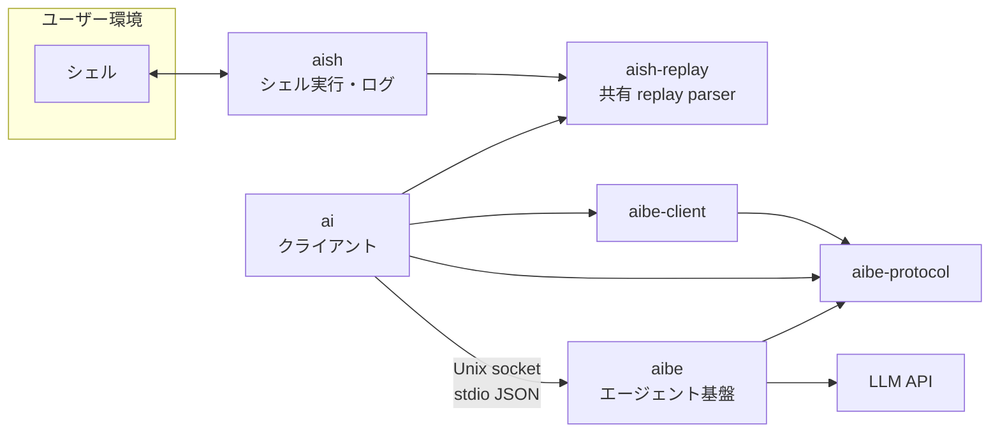

# アーキテクチャ

aish ワークスペースのレイヤー、依存、プロトコル、設定の正本。実装と **同じ PR / コミットで更新** する。

## 概要



| コンポーネント | 役割 | ネットワーク |
|----------------|------|--------------|
| **aish** | PTY/子プロセスでシェルを動かし、I/O をログに追記。親 stdin が TTY ならそれを、redirect 済みでも controlling TTY があれば `/dev/tty` を選び、同じ fd を raw 化・stdin relay・winsize 同期に使う。raw 化失敗は fail-closed とし、`stty sane` は使わない。`openpty` 後に `TIOCSWINSZ` で同期し、セッション中の `SIGWINCH` も `signalfd` 経由で同様に伝播。PTY stdin は `dup(master)` + shutdown pipe。fork 後セットアップ失敗時は `master` を閉じ子を kill/reap | なし（LLM・aibe へ接続しない） |
| **aish-replay** | `aish replay` と `ai` が共有する replay parser / span 復元ロジック | なし |
| **aibe-protocol** | wire DTO（NDJSON / serde）、`ToolName`、契約定数。leaf クレート | なし |
| **aibe-client** | Unix socket transport（`ping` / `ensure_running` / `route_turn` / `agent_turn` + 承認往復）/ 既定 socket パス | なし（`aibe` バイナリ起動のみ） |
| **aibe** | `route_turn`、会話継続、ツール、プロバイダ呼び出し、conversation store、**contextual memory store**、Unix socket サーバ | LLM API へ（設定に従う） |
| **ai** | `aibe-client` + `aibe-protocol` + `aish-replay` 経由で aibe に接続し応答を表示。`shell_exec` 承認 UX（`y/n/a/c`、tier 分類、session cache、`--yes-exec`、`[tools.shell_exec.auto_approve_patterns]`）と `aish.replay_show` の client-side 実行は **ai** の責務。wire 上は `ShellExecApproval.approval_origin` で provenance を aibe に渡す（0036）。transport は `aibe-client` | aibe デーモンのみ（LLM 直叩き禁止） |

## 依存ルール

```
ai            →  aibe-protocol, aibe-client, aish-replay のみ（aibe / aish 禁止）
aibe-client   →  aibe-protocol のみ
aibe          →  aibe-protocol, aibe-client（aish 禁止）
aibe-protocol →  （他ワークスペースクレート禁止。serde のみ）
aish          →  aish-replay のみ（aibe への path 依存禁止）
```

機械チェック:

- `./scripts/check-architecture.sh` — クレート間依存・禁止 HTTP/LLM・キー直書き
- 同スクリプト内で `./scripts/check-hexagonal.sh` を呼び出し、**クレート内レイヤー** を検査

### クレート別の依存方針

| クレート | 許容例 | 禁止例 |
|---------|--------|--------|
| aish | `libc`, PTY/プロセス系 | `aibe`, `reqwest`, `hyper`, LLM SDK |
| aibe-protocol | `serde` | `aibe`, `aibe-client`, `aish`, `ai`, `tokio`, HTTP |
| aibe-client | `aibe-protocol` | `aibe`, `aish`, `ai` |
| aibe | `tokio`, HTTP クライアント、serde、プロバイダ SDK、`aibe-protocol`, `aibe-client` | `aish` |
| ai | `aibe-protocol`, `aibe-client`, `aish-replay`, `serde` | `aibe`, `aish`, `reqwest` 等の LLM 直叩き |

`ai` は LLM API を直接叩かず、`chat` も `ai` の transcript と local history を経由して `aibe` に渡す。`ai` の history payload は `conversation_id` と `ai_session_id` を保持し、再実行時の再接続に使う。

## aibe デーモン

- **トランスポート**: Unix domain socket（パスは設定で指定。例: `~/.local/share/aibe/run.sock`）
- **ライフサイクル**:
  - 既にソケットが存在し応答すれば **接続のみ**
  - なければ `aibe` がサーバを起動（シングルトン想定）
  - フォアグラウンド: `cargo run -p aibe -- -f`（デバッグ用）
  - **graceful restart（0046）**: 設定反映は hot reload ではなく `aibe restart`（旧 daemon の SIGTERM shutdown → 新 daemon 起動）。`aibe stop` / `aibe status --format json` で control plane を操作する
  - **PID file**: `~/.local/share/aibe/run.pid`（`pid` / `config_path` / `socket_path` / `process_start_jiffies`）。stale 判定後にのみ signal を送る
  - **shutdown**: SIGTERM / SIGINT で accept 停止 → active turn cancel → connection drain（timeout 5s）→ socket / PID file 削除
- **メッセージ形式**: 接続後、**1 行 1 JSON**（newline-delimited JSON）でリクエスト/レスポンスをやりとりする（stdio JSON スタイル）

## プロトコル（設計・詳細）

破壊的変更時はこの文書と `aibe` / `ai` のテストを同時に更新する。

### リクエスト（クライアント → aibe）

```json
{
  "type": "agent_turn",
  "id": "550e8400-e29b-41d4-a716-446655440000",
  "messages": [
    { "role": "user", "content": "..." }
  ],
  "tools": ["shell_exec", "read_file"],
  "llm_profile": "fast",
  "context": {
    "shell_log_tail": "...",
    "cwd": "/abs/path/to/ai/cwd",
    "system_instruction": "...",
    "task_completion": false
  }
}
```

| フィールド | 説明 |
|-----------|------|
| `type` | 今後 `ping`, `cancel` 等を追加可能 |
| `id` | 相関 ID |
| `messages` | チャット履歴（プロバイダへ渡す前に aibe で正規化）。wire 上の `role` は `"user"` 等の **JSON 文字列のまま**（0008 以降も不変）。aibe 内部では `MessageRole` enum に変換して保持（未知 role は `invalid_request`）。詳細: `docs/done/0008_chat-message-and-protocol-typing-spec.md` |
| `tools` | 有効にするツール名のリスト |
| `llm_profile` | 任意。使用する LLM プロファイル名（`docs/done/0011_llm-profiles-spec.md`）。省略時は aibe 設定の `default_profile` |
| `context` | aish ログ由来など、クライアントが渡す付加コンテキスト |
| `context.cwd` | クライアントのカレントディレクトリ（絶対パス）。`ai` は起動時の `std::env::current_dir()` を送る。`read_file` の相対パスと `allowed_roots` の `.` は **aibe プロセスの cwd ではなくこの値** を基準にする |
| `context.task_completion` | Task Completion Contract の request 単位 opt-in。省略時 / `false` は通常 turn。CLI では `ai ask --task-completion` で明示有効化。tool allowlist は権限であり task intent ではないため、effect tool が利用可能でもこの signal なしでは Active にしない |
| `context.system_instruction` | 任意。この turn のみ LLM に前置する system 本文。クライアント（`ai`）が turn 解決後に組み立て、aibe は解釈せず注入する。console hint（端末サイズに応じた整形指示）は `ai` の `resolve_console_hints` で on/off を決め、有効時のみ TTY サイズから生成する。CLI `--console-hint` / `-H` / `--no-console-hint` / `-N`、設定 `[ask].console_hints`、preset `[presets.*].console_hints` で制御（優先順位: CLI > preset > config > 既定 `true`）。非 TTY または `--format`（tsv / json / env）指定時は付与しない。`aibe_client` は policy を持たず、解決済み context を serialize するのみ。長すぎる場合は `aibe_protocol::SYSTEM_INSTRUCTION_MAX_BYTES` で切り詰める |
| turn 進行表示 | `ai` の `resolve_progress` で on/off（優先順位: CLI `--progress` / `--no-progress` > preset > `[ask].progress` > 既定 **TTY stderr なら `true`**）。有効時は aibe の progress event を受け、TTY stderr では単行スピナー（`\r` 上書き）で表示し assistant streaming 開始時に行を消す。非 TTY では `ai: progress: …` 行（`--progress` 明示時のみ有効）。`--quiet` で抑制。**`--format`（tsv / json / env）は stdout 契約のみを決め、stderr progress の有効/無効には使わない**（0033）。turn スコープの spinner は `ProgressGuard`（RAII）で必ず停止する |

### レスポンス（aibe → クライアント）

```json
{
  "type": "agent_turn_result",
  "id": "550e8400-e29b-41d4-a716-446655440000",
  "status": "ok",
  "assistant_message": { "role": "assistant", "content": "..." },
  "tool_calls": [],
  "completion_report": {
    "outcome": "done",
    "terminal_reason": null,
    "criteria": [{
      "criterion_id": "c1",
      "satisfied": true,
      "evidence": [{
        "evidence_id": "e2",
        "source": "observation",
        "summary": "read_file status=Ok",
        "verified": true
      }]
    }],
    "unsatisfied_criteria": [],
    "unverified_items": ["e1: shell_exec status=Ok"],
    "queries_used": 2
  }
}
```

`completion_report` は optional additive DTO で、Task Completion envelope を返さない旧 provider 応答では省略する。`outcome` は `done` / `needs_user` / `blocked` / `budget_exhausted`。`terminal_reason` は NeedsUser / Blocked の具体的理由を保持する。各 criterion の Evidence、未達 ID、未検証事項（不足している required Evidence を含む）、使用 query 数を同じ DTO から human / structured 表示する。新 RPC は追加しない。

`assistant_streaming`: 任意のデルタ通知。aibe の LLM プロバイダが streaming を返せる場合はそのデルタをそのまま流し、非対応プロバイダは synthetic 1 回のデルタを返す。`ai` は human 向け（`--format` 未指定かつ filter 無効）のときだけ delta を stdout に逐次表示する。`--format json|tsv|env` 時は delta を stdout に出さず、最終 `AgentTurnResult` を structured 形式で 1 回だけ出す（0033）。`AI_FILTER` / `[ask].filter` 有効時も同様に delta を stdout に出さず、turn 終了時に全文へ 1 回だけ filter を適用する（0048）。`streamed` は「chunk を stdout に実際に表示したか」の内部フラグであり、`progress` / `timeout` とは独立する。

Task Completion Active request の provider delta だけを request-local buffer に保持し、control envelope の decode と検査が終わるまで client へ流さない。Completion 成功時は `deliverable` だけを streaming / final 表示へ渡し、fail-closed error 時は buffered assistant content を破棄する。Inactive request は buffer を介さず従来どおり逐次 delta を直接渡す。

### smart entry と `route_turn`

### client-provided replay tool（0050）

`ai` は turn-local の client tool として `aish.replay_show` を広告できる。`aibe` は `client_tools` に広告された namespace 付き read-only tool のみを受理し、`ClientToolCallRequested` / `ClientToolResult` を同一 turn の socket 往復で扱う。

- `ClientProvidedToolSpec` は additive DTO で、`name` は namespace 必須、Phase 1 は `aish.replay_show` のみ
- `ClientToolCallRequested` は `shell_exec` 承認と同型の turn-local 往復で使う
- `ClientToolResult` の `status=Ok` は `[untrusted terminal output]` wrapper を必須とする
- `aibe` は `AISH_SESSION_DIR` を直接読まない。replay source 解決は `ai` 側の責務
- `aish.replay_show` の span 復元は `aish-replay` の shared parser を `aish` と `ai` が共通利用する

`ai` は tty の `ask` 入口で `route_turn` を 1 回実行し、失敗時のみ 1 回だけ再試行する。non-TTY では `route_turn` を飛ばし、従来の 1 shot ask に倒す。

0044 の Smart Preprocessor / Local Intent Router は `ai` 側の前段補助としてこの `route_turn` 呼び出しの直前に入る。`route_turn` と `feature_executor` の正本は変えず、`route_turn` を省略できる場合でも安全条件を満たすときだけに限る。

`route_turn` の request には次を含める。

- `session.ai_session_id`: `aish` 由来の共有キー、または `ai` が生成した一意 ID
- `session.aish_session_dir`: `aish shell` 由来の session dir
- `conversation.conversation_id`: 既存会話の継続 ID
- `conversation.recent_summary`: aibe 側が保持する直近 1 turn の要約
- `conversation.new_conversation`: `--new` の強制新規フラグ
- `cli_overrides`: `--preset` / `--tools` / `--log-tail` / `--yes-exec`

`route_turn` の応答 `RoutePlan` は advisory であり、`ai` の CLI 明示値があれば上書きされる。`route_reason` は stderr / history に残す前に redaction する。

`aibe` は `AI_SESSION_ID` ごとに conversation store を切り、`index.jsonl` には redacted metadata、`conversations/<conversation_id>.json` には full transcript と summary を保存する。

### Smart Feature Plan（0041 + 0042）

`RoutePlan.feature_actions` は構造化された機能提案の配列である。`ai` は `ai ...` 文字列を再帰実行せず、`feature_executor` が action を解釈する。

- **定義**: AISH 固有 feature は `aibe/memory/packs/aish-memory/features.toml`（`[memory] feature_files`、未指定時は baseline pack 互換）。trigger 部分一致で action を展開し、LLM が返した `feature_actions` にマージする。
- **Phase 3 方針**: feature pack は memory pack から独立した設定面として扱うが、TOML の `[features]` 節はまだ導入しない。現行の `[memory].feature_files` は互換入力として受け、`FeaturePackConfig` 側に正規化してから registry を構築する。
- **route_turn プロンプト**: 許可 action type・JSON 形状・使用タイミングを明示する。
- **自動適用（MVP）**: `memory_query`、`memory_recipe_run { apply: false }`、`set_log_tail_bytes`、`set_recommended_tools`（read-only tool のみ）。
- **log tail**: `set_log_tail_bytes` と `RoutePlan.log_tail_bytes` は `SHELL_LOG_TAIL_MAX_BYTES` で clamp。超過で turn 全体を失敗させない。
- **tools 経路の整理**:
  - `RoutePlan.recommended_tools` — 0030 互換 advisory。**read-only tool のみ**（`aibe-protocol::sanitize_readonly_advisory_tools`）。`shell_exec` は route_turn advisory として通さない。
  - `FeatureAction::SetRecommendedTools` — smart feature 自動適用。同じ read-only 境界。
- **pack 3 状態（0043 Phase 2）**: `kind_files=[]` かつ `recipe_files=[]` かつ `feature_files=None` のとき baseline feature を読まない（generic memory）。feature 定義は `priority` / `requires_memory` / `requires_recipe` で eligibility を判定し、不整合 feature は `route_turn` に出さない。
- **pack 分離（0043 Phase 3）**: `kind_files` / `recipe_files` は memory pack、`feature_files` は feature pack に分けて解釈する。`feature_files=None` の互換解釈は維持するが、設定モデルは分離済みであるべき。
- **履歴**: feature executor の memory 本文は `agent_turn` のみへ。local history の `request_messages` は **replay 用 transcript を保持**し、redacted summary は `feature_summaries` に分離する。
- **retry / rerun**: TTY かつ元 turn が `ask` のとき `route_turn` + feature executor を再実行。non-TTY / `chat` は `request_messages` replay。
  - **`ai rerun`**: 履歴 payload の `tools` / `execution_mode` / `collaborative_handoff` を復元する。`human_task` は Mode policy 経由でのみ再付与するため、復元 CLI トークンからは除外する。`execution_mode` と旧 `collaborative_handoff`（`--collaborative` の shell_exec interception）は独立であり、`ai collab` 由来の Collaborative Mode だけから interception を導出しない。CLI `--collaborative` 指定時のみ両フラグを Collaborative / true へ昇格できる。旧 payload で欠落時は Normal / false。
  - **`ai retry`**: 履歴の mode / tools / handoff フラグは復元せず、**現在の CLI TurnOptions**（`--collaborative` 含む）だけを正とする。

### Smart Preprocessor（0044）

`ai` の smart entry 前段に、LLM を使わない局所 intent 判定層を置く。`route_turn` の置き換えではなく前段補助である。

- **配置**: `ai` クレート（`domain/smart_preprocessor`、`application/smart_preprocessor`）。`aish` / `aibe` には入れない。
- **パイプライン**: Hard Rules → Signal/Feature Extraction → Local Classifier → Confidence Gate →（必要なら）`route_turn` fallback。
- **mode**（`[smart_preprocessor]`）:
  - `off` — 無効（現行互換）
  - `shadow` — 観測ログのみ。`route_turn` は従来どおり
  - `assist` — bounded `recent_summary` を `route_turn` へ補強
  - `gate` — 高信頼かつ安全な `simple_chat` のみ `route_turn` 短絡候補（`retry` / `rerun` / `memory_lookup` は transcript または memory 経路が必要なため短絡対象外）
- **安全**: classifier / gate は shell approval・memory policy・CLI 明示値を bypass しない。raw shell log / LLM 出力全文は分類器入力に入れない。
- **観測**: append-only NDJSON（`~/.local/share/ai/smart_preprocessor/observation.jsonl` 既定）。学習機構は持たない。
- **観測レポート（0051）**: ai smart stats/recent/report は末尾の bounded な非空行だけを read-only で読む。不正行は invalid_lines に数え、既知 DTO フィールドだけを集計・表示するため raw user text と未知フィールドは出力しない。path の ~/ は既存 config と同じ HOME 規則で展開する。
- **memory.enabled=false**（0043）: composition root は `FeatureRegistry::empty()` を渡す。`route_turn` は feature catalog / trigger マージ / `feature_actions` を返さない（LLM が返しても strip）。

詳細: [spec/0041](spec/0041_ai-smart-feature-plan-spec.md)、[spec/0042](spec/0042_configurable-smart-features-spec.md)、[spec/0043](spec/0043_feature-pack-boundary-hardening-spec.md)。

### contextual memory（0034 + 0035 identity split）

- **正本**: `memory_space_id` 単位の JSONL（`memory/spaces/<memory_space_id>/events.jsonl`）。`AI_SESSION_ID` は memory の owner ではない（runtime provenance のみ）。`ai` / `aish` は保存しない。
- **identity**: `AI_SESSION_ID` = shell log / conversation / runtime session。`memory_space_id` = contextual memory の owner。user-facing 名は `AIBE_CONTEXT_ID`（CLI: `ai context`）。
- **解決順**（**クライアント `ai` のみ**。RPC / turn 送信時に解決済み `memory_space_id` を載せる）: `AIBE_CONTEXT_ID` > `~/.config/ai/config.toml` の `[context] current` > cwd から導出した `project_<hash>` > `legacy_session_<session_id>`（非推奨）。**`aibe` デーモンはサーバ環境変数 `AIBE_CONTEXT_ID` を読まない**（複数クライアント接続時にサーバ env で全員の context が変わるのを防ぐ）。サーバ側フォールバックは request 明示 `memory_space_id` > cwd project > legacy session のみ。
- **ID 検証**: `memory_space_id` と `session_id` は path-safe（ASCII 英数と `_` `.` `-`、128 byte 以下、`/` `\` `..` dot-only 拒否）。legacy path 読み取り前に `session_id` を検証する。
- **RPC**: `memory_apply`（write）、`memory_query`（read）、`memory_kind_list`（registry 一覧）、`memory_recipe_run`（LLM 提案 / 任意 apply）、`memory_subscribe`（変更通知購読。**専用接続** — `memory_subscribe_result` 後に `memory_changed` を push。他 RPC 混在不可）。`MemoryContext.cwd` は `Option`。**project scope** の apply/query のみ cwd 必須。session / global scope は cwd なし可。`project_key` はサーバが cwd から導出する（wire に載せない）。
- **Work RPC（0052 Phase 3）**: `work_query` は `memory_space_id` 単位の Work snapshot を返し、`work_apply` は型付き `WorkOperationDto` を受ける。Phase 1 の `start / focus / idea / note / decide / defer`、Phase 2 の `switch / finish` に加え、Phase 3 では `push / pop` を本番化し、各操作を単一の store mutation として適用する。`push` は現在 active を stack に積み child work を作る。`pop` は child を `Done` にして parent へ戻り、child entries は親へ自動 merge しない。`switch` は `Paused / Deferred` のみ受け付け、`Done / Abandoned / missing` は state 非変更で拒否する。`finish` は stack が空のときだけ active を `Done` にして unset する。Work operation は空文字・NUL・8 KiB 超過の text と `0` の Work ID を拒否し、Work response body は未知フィールドを拒否する。Work の正本は `aibe` で、`ai` は CLI / Unix socket client / 表示だけを担当する。通常 turn では `ContextualMemoryPack` が active work の goal / focus / recent decisions を synthetic user context として bounded に注入する。
- **Work store（0052 Phase 3）**: `memory/spaces/<memory_space_id>/work-state.json`。`schema_version` / `revision` / monotonic Work ID / active / stack / works / entries を保持する。entry ID はspace lock内で既存最大値+1を採番する。generic memory の `events.jsonl` と同じ space directory・`.lock`・`0700/0600` を共有し、同一 directory の temp fileを `sync_all` 後に rename して原子的に置換する。`push` / `pop` / `switch` / `finish` は mutation 前に stack / target status / parent chain を検査し、破損 JSON・未知 schema・invariant 違反は既存 file を上書きせず explicit RPC error にする。
- **Subscribe（0037 Phase 5）**: in-process broker が `memory_apply` / recipe apply 成功時に `memory_changed` を publish。`memory_space_id` と optional `kind` filter で絞る。接続切断で subscriber 解放。reconnect / replay は v1 非対象。
- **Add defaulting（0037 Phase 2）**: `MemoryOperationAdd` の `scope` / `inject` / `status` / `make_active` は optional。AIBE `resolve_memory_operation_add` が補完する。registered kind は registry default、unregistered kind は server 既定（`project` / `manual` / `open` / `make_active=false`）。`ai mem add` は `kind + text` のみ送り、policy は AIBE 正本。
- **Kind registry（0037 §6.5 + 0039）**: AISH 固有 6 kind（`goal` / `now` / `idea` / `rule` / `decision` / `note`）は **crate 同梱 pack** `aibe/memory/packs/aish-memory/kinds.toml` が正本（Rust builtin 廃止）。`[memory] kind_files` 未指定時は互換モード（baseline pack → `<AIBE_ROOT>/memory/kinds.toml` → `<AIBE_ROOT>/memory/spaces/<memory_space_id>/kinds.toml`）。`kind_files = []` 明示時は AISH kind なし（generic memory primitive のみ）。`kind_files` 非空時は列挙ファイルのみ（後勝ち merge）。設定の相対パスは `config.toml` 所在基準。`memory_kind_list` / resolver / add defaulting / clear transition は **effective registry**（context の `memory_space_id` 基準）を使う。設定 parse 失敗時: explicit memory RPC は error、AgentTurn 注入は baseline へ best-effort fallback（壊れたファイルのみ skip）。サンプル: [manual/contextual-memory-kinds-toml.md](manual/contextual-memory-kinds-toml.md)。
- **Recipe registry（0039 + 0040）**: `clarify-goal` は `aibe/memory/packs/aish-memory/recipes/clarify-goal.toml` + `clarify-goal.md` が正本。`[memory] recipe_files` 未指定時は互換モード（baseline pack）。`recipe_files = []` 明示時は recipe なし。`MemoryRecipeService` は registry lookup で材料収集・prompt 生成・出力検証を行う。material は `[[materials]]` の宣言順で解決され、section title も TOML 定義が正本。`ai mem run <recipe>` は recipe id を透過的に RPC へ渡す。
- **注入**: `route_turn` は memory を見ない。`agent_turn` のみ `resolve_for_prompt` で user-maintained context block を synthetic user message として前置する（system instruction ではない）。通常 query では **goal / now / rule**（active）が pinned 注入される（Phase 1 registry + Phase 2 継続）。`ai` は turn の `context.memory_space_id` に解決済み ID を載せるため、`ai context use` で選んだ context が注入にも反映される。cwd の無い turn は legacy session space に解決する（注入は best-effort）。`now` は別 session から見たとき stale 表示できる。
- **legacy 互換**: 0034 の `conversations/<AI_SESSION_ID>/memory/events.jsonl` は read-through。`legacy_session_*` 以外の space を初回アクセスした際は legacy events を new layout へ lazy copy する（project-backed space を含む）。legacy space 自身への書き込み時も new layout へ seed してから append し、元の legacy store は変更しない。
- **標準 kind（built-in registry）**: `goal` / `now` / `idea`（dedicated CLI あり）、`rule` / `decision` / `note`（`ai mem add` 可）。`goal`（project, pinned, `active`）、`now`（session, pinned, `active`）、`rule`（project, pinned, `active`, multiple）、`idea`（project, on-demand, `open` — **通常クエリへ常時注入しない**）、`decision`（on-demand）、`note`（manual）。clear 操作は wire 上 `ClearKind`（`op: "clear_kind"`）。標準 kind 定数の公開は production API から外し、テスト用 helper に隔離する。MVP 詳細は [spec/0034](spec/0034_aibe-contextual-memory-spec.md)、[spec/0035](spec/0035_aibe-memory-identity-split-spec.md)。正式版 v1 は [spec/0037](spec/0037_aibe-contextual-memory-runtime-v1-spec.md)。
- **Capability boundary（0037 Phase 6）**: `Capability` / `CapabilityPolicy` は **AIBE application service boundary** のみ。memory read/write/archive/recipe/subscribe と `AgentAsk` / `ShellPropose` / `ShellExecute` を分離。既定 `local_full` は現行 `ai` CLI 互換。`memory_only` は shell execute 拒否、`memory_read_only` は write/archive 拒否。capability は **wire 交渉なし**（composition root の静的 policy）。詳細: [manual/contextual-memory-multi-client.md](manual/contextual-memory-multi-client.md)。
- **Basic プロファイル（0038 Phase A）**: `[memory] enabled = false`（aibe / ai 各 config）で contextual memory を無効化。`agent_turn` 注入なし、memory RPC 拒否、`ai goal` 等 CLI 拒否。環境変数 `AIBE_MEMORY_ENABLED` / `AI_MEMORY_ENABLED` で上書き可。詳細: [spec/0038 Phase A](spec/0038_contextual-memory-pack-phase-a-spec.md)。
- **Pack 境界（0038 Phase B + 0052）**: `memory.enabled` の参照は composition root（`aibe/src/application/server.rs`）のみ。`BasicPack` / `ContextualMemoryPack`（`aibe/src/application/`）が `TurnHook`（`agent_turn` 注入）と `RpcExtension`（memory 系 5 RPC + Work 系 2 RPC）を束ねる。BasicPack は Work RPC も既存 memory-disabled error で拒否する。`ContextualMemoryPack` は通常 turn の Work block と generic memory block を別々に解決し、合計 budget 内に収める。`RequestService` / `AgentTurnService` は pack trait のみ consume する。詳細: [spec/0038 Phase B](spec/0038_contextual-memory-pack-phase-b-spec.md)、[spec/0052](spec/0052_ai_work.md)。
- **Client CLI policy pack（0038 Phase C）**: `ai` 側の memory コマンドは `MemoryCliPack` / `MemoryCommandPolicy`（`ai/src/application/`）で束ねる。`memory_kind_list` の snapshot を command 単位で 1 回だけ取得し、`dedicated_cli` / `default_scope` / `default_status` から専用 CLI・`mem add` 誘導・clear scope を導く。`memory_enabled` の gate は `ai/src/main.rs` の `require_memory_enabled()` に集約。`aibe` pack / wire は変更しない。詳細: [spec/0038 Phase C](spec/0038_contextual-memory-pack-phase-c-spec.md)。
- **Compile-time packaging（0038 Phase D + 0039 + 0052）**: `aibe` / `ai` は `memory` Cargo feature（default 有効）を持つ。`--no-default-features` では contextual memory 実装をリンクせず basic build を成立させる。`ai` の turn 用 `memory_space_id` 解決は `#[cfg(feature = "memory")]` で compile-time に除外（0039）。memory 固有実装は各 crate 内の `plugin_memory/` モジュール（`#[cfg(feature = "memory")]`）に集約し、`application/` は facade + `BasicPack` / fail-closed stub を残す。`aibe/src/plugin_memory/` に `ContextualMemoryPack` と memory / Work service 群、`ai/src/plugin_memory/` に `MemoryCliPack` / policy / Work handler を置く。Work CLI も feature-off では同じ stub で拒否する。runtime の `memory.enabled`（Phase A）と compile-time の `memory` feature は別軸（混同しない）。詳細: [spec/0038 Phase D](spec/0038_contextual-memory-pack-phase-d-spec.md)、[spec/0039](spec/0039_aish-memory-pack-externalization-spec.md)。
- **Multi-client（0037 Phase 7）**: 複数 `AI_SESSION_ID` が同一 `memory_space_id` を共有可能。`AIBE_CONTEXT_ID` は **クライアント側 selection**（サーバ env ではない）。v1 は **local runtime**（remote authentication 非対象）。将来 VSCode / TUI / mobile は同じ stdio JSON RPC + 任意で subscribe 専用接続。

リクエスト例（`memory_apply`）:

```json
{
  "type": "memory_apply",
  "id": "550e8400-e29b-41d4-a716-446655440000",
  "session_id": "AI_SESSION_ID",
  "context": {
    "cwd": "/abs/path/to/project",
    "memory_space_id": "ctx_a"
  },
  "operation": {
    "op": "add",
    "kind": "rule",
    "text": "idea は通常クエリへ常時注入しない"
  }
}
```

registered kind は `scope` / `inject` / `status` / `make_active` を省略可能（server が registry default で補完）。explicit DTO も引き続き有効。

リクエスト例（`memory_kind_list`）:

```json
{
  "type": "memory_kind_list",
  "id": "550e8400-e29b-41d4-a716-446655440002",
  "session_id": "AI_SESSION_ID",
  "context": {
    "cwd": "/abs/path/to/project",
    "memory_space_id": "ctx_a"
  }
}
```

リクエスト例（`memory_recipe_run` / 任意 recipe id）:

```json
{
  "type": "memory_recipe_run",
  "id": "550e8400-e29b-41d4-a716-446655440003",
  "session_id": "AI_SESSION_ID",
  "context": {
    "cwd": "/abs/path/to/project",
    "memory_space_id": "ctx_a"
  },
  "recipe": "clarify-goal",
  "apply": false,
  "user_instruction": "focus on MVP"
}
```

応答は `summary` / `proposals[]`（`operation` + 表示専用 `rationale`）/ `applied_entries`。LLM profile は AgentTurn と同じ default。`apply=true` は validation 済み operation のみ store へ反映し、subscribe には `recipe_applied` を publish する。CLI `--apply` は `MemoryRecipeRun(apply=false)` で提案取得後、対話確認して各 proposal を **`MemoryApply` として個別送信**する（非対話 stdin は fail-closed）。この CLI 経路の subscription は `added` / `status_changed` 等であり `recipe_applied` とは異なるが、最終 state は同等。shell execute とは無関係。

リクエスト例（`memory_apply`、explicit DTO。互換経路）:

```json
{
  "type": "memory_apply",
  "id": "550e8400-e29b-41d4-a716-446655440000",
  "session_id": "AI_SESSION_ID",
  "context": {
    "cwd": "/abs/path/to/project",
    "memory_space_id": "ctx_a"
  },
  "operation": {
    "op": "add",
    "kind": "goal",
    "scope": "project",
    "inject": "pinned",
    "status": "active",
    "text": "ship contextual memory",
    "make_active": true
  }
}
```

リクエスト例（`memory_query`。`include_prompt_block` で `ai mem show` 相当の block を取得）:

```json
{
  "type": "memory_query",
  "id": "550e8400-e29b-41d4-a716-446655440001",
  "session_id": "AI_SESSION_ID",
  "context": {
    "cwd": "/abs/path/to/project",
    "memory_space_id": "ctx_a"
  },
  "query": {
    "include_prompt_block": true,
    "user_query": ""
  }
}
```

応答例（`memory_query_result`）:

```json
{
  "type": "memory_query_result",
  "id": "550e8400-e29b-41d4-a716-446655440001",
  "status": "ok",
  "entries": [],
  "prompt_block": "[aibe contextual memory]\n..."
}
```

エラー時:

```json
{
  "type": "error",
  "id": "550e8400-e29b-41d4-a716-446655440000",
  "code": "provider_error",
  "message": "..."
}
```

## LLM プロバイダ（aibe 内）

設定 `[llm.<name>]` の `provider`（`parse_provider_kind` の受け入れ値）:

| `provider` | 用途 |
|-----------|------|
| `openai_compatible` | OpenAI 公式 API および OpenAI 互換（LM Studio、vLLM 等）。`base_url` 省略時の既定は `https://api.openai.com/v1` |
| `gemini` | Google AI Studio `generateContent`（`v1beta`）— `adapters/outbound/gemini.rs` |
| `mock` | テスト・開発 |
| `codex_cli` | 0024 / 0025 の旧案（非採用）。first-class `LlmProvider` にはしない |
| `claude_code_cli` | 0024 / 0025 の旧案（非採用）。first-class `LlmProvider` にはしない |

**CLI サブエージェント（0024 / 0025, 非採用）**

- 0024 / 0025 は歴史的な比較資料。`codex_cli` / `claude_code_cli` を first-class `LlmProvider` にする案は採用しない。
- `artifacts` / `invoke_*` / `RequestContext.cli_resume` / `cli-thread.json` / `max_concurrent_cli` は 0024 / 0025 の設計要素であり、0026 の外部コマンド経路では使わない。
- `docs/manual/cli-subagent-products.md` は CLI コマンドの挙動調査として残すが、aibe のプロトコル正本ではない。

**外部コマンド（0026）**

- `[[external_commands]]` は `shell_exec` のプリセットであり、`provider` ではない。
- HTTP 親プロファイルが外部コマンドを使う場合も、実際の経路は `shell_exec` + `@exec` / literal 指定である。
- `aibe` は `shell_exec` の allowlist、承認、timeout、監査だけを担い、CLI の thread / session は保存しない。
- `invoke_*` や専用 runner は導入しない。

- `provider = "openai"` は **未対応**（別名ではない）。公式 OpenAI も `openai_compatible` を使う
- 選択とエンドポイントは **aibe 設定ファイル** の LLM 接続 + プロファイルで指定（`docs/done/0011_llm-profiles-spec.md`）
- Gemini の `thoughtSignature` 等は `ToolCall.provider_extras` に **part 単位**で保持し、次ラウンドの `functionCall` part に復元する（クライアント wire には載せない — `docs/done/0010_gemini-provider-spec.md`）
- `ToolDefinition.parameters` は provider-neutral な JSON Schema として保持し、Gemini では制限付き `parameters` ではなく `parametersJsonSchema` へ変換する。これにより client-provided tool の `additionalProperties: false` を含む完全な schema を Gemini v1beta へ送信できる
- client-provided tool の論理名（例: `aish.replay_show`）は Gemini 送信時に provider-safe 名（`aish_replay_show`）へ変換し、`functionCall.name` と後続の `functionResponse.name` に同じ名前を使う
- アダプタは aibe 内に閉じる。`ai` / `aish` にプロバイダ分岐を書かない

## aish ログ

- **用途（当面）**: `ai` が読み込み、aibe リクエストの `context` に載せる
- **形式（実装）**: JSONL。1 行に 1 イベント。`event` フィールドで種別を区別する:

| `event` | 内容 |
|---------|------|
| `command_start` | `command`, `args`（追記前に `sanitize_log_text`）。replay 対象 span では `command_index`, `started_at`, `kind`（`shell` / `exec`）を付与 |
| `stdout` | `data`（追記前に `sanitize_log_text`）。replay span では `command_index` を付与 |
| `stderr` | `data`（追記前に `sanitize_log_text`）。`exec` span のみ `command_index` を付与 |
| `command_end` | `command_index`, `exit_code`, `finished_at`（UTC RFC3339） |
| `exit` | `code`（任意）。`interactive_shell` セッション終了など session 境界用 |

- **command output replay**（`0049`）:
  - `aish replay list [--log PATH] [--index N] [--format tsv|json]` — complete な command span のみ一覧（partial / 旧ログは除外）
  - `aish replay show [INDEX] [--log PATH] [--index INDEX] [--stderr]` — 記録済み出力を再実行せず stdout へ（`| rg` 向け）。`INDEX` は `command_index`、負数は `replay list` 末尾から（`-1` = 最後）。`--index` は互換用
  - `aish replay pick [--log PATH] [--index N] [--stderr]` — TTY で fzf 優先・なければ内蔵セレクタ。non-TTY は fail-closed
  - ログ解決: `--log PATH` > `AISH_SESSION_DIR/current_log`（symlink 先が session dir 内の通常ファイルであることを検証）
  - `aish shell`（bash / zsh）: PTY 出力に加え、セッション dir 内の named FIFO（`control.fifo`）へ `start` / `end` JSON を書き command span を記録。hook は emit ごとに open-write-close し、子プロセスへ FD を継承しない。詳細: [manual/aish-command-output-replay.md](manual/aish-command-output-replay.md)
  - shared replay parser: `aish-replay` が span 復元の正本で、`aish replay` と `ai` の `aish.replay_show` は同じ parser を使う

- **CLI**（`clap` + `clap_complete`。各バイナリに `complete bash|zsh`）:
  - `aish exec [--format tsv|json|env] [--log PATH] -- <program> [args...]`（未指定時は `log_dir/session-<pid>.jsonl`）
  - `aish shell [--format tsv|json|env]` — セッション dir 方式（`docs/done/0019_aish-session-log-integration-spec.md`）。bash / zsh 子シェルでは一時 rcfile で Tab 補完を有効化し、child shell へ `AI_ASK_LOG=session` を自動 export する
  - `aish session [--format tsv|json|env]` — 現在セッション（`AISH_SESSION_DIR` 必須）
  - `aish replay list|show|pick` — 記録済みコマンド出力の再表示（`0049`）
  - `ai <message>` — default ask。`ai ask [OPTIONS] <message>` も互換のため残す。`ai status` / `ai doctor` / `ai ping` は local 診断導線
  - `ai doctor`（0058）は既定で human 形式を出し、`socket_reachable`、`session_context`、`shell_log_readable`、`tools_configuration`、`output_filter_configuration`、`protocol_compatibility` の6項目を固定順で診断する。socket と protocol は一度の既存 Ping/Pong 観測を共有し、daemon 起動・LLM 接続・ファイル更新を行わない。総合 status は `fail > warn > ok`、FAIL があれば exit 1、OK/WARN は exit 0。明示 `--format json` は `DoctorReport`、tsv/env は従来の `DiagnosticsReport` key に check key を追記する。`ai status` の既存 schema と socket 未到達時 exit 0 は維持する。`output_filter_configuration` は設定ファイルが存在するのに read/parse できないとき FAIL とし、通常の `AiConfig::load()`（fail-open）とは別の diagnostics 経路で判定する
  - `aibe [--foreground|-f]` — デーモン起動
  - 動的補完: `ai ask --profile`（`AIBE_CONFIG` の `[profiles.*]`）、`--session`（`AISH_CONFIG` の `log_dir` 内 session id）。詳細: [manual/tab-completion.md](manual/tab-completion.md)
- **共通 `--format`**（情報表示系サブコマンド向け）:
  - 値: **`tsv`（既定）** | **`json`** | **`env`**
  - **全サブコマンド**で指定可能。composition root が `clap` で解析し、未知の値はエラーにする
  - **情報表示系**サブコマンドのみ stdout の形式に反映する。現状は **`session` のみ**が該当
  - **実行系**（`exec`, `shell` 等）は現状 `--format` を出力に使わないが、将来追加する情報表示系と CLI を揃えるため **受理のみ** 行う（指定しても挙動は変わらない）
  - 形式の意味（情報表示系で共通）:
    - `tsv` — `key\tvalue` 行（人間閲覧・簡易スクリプト向け）
    - `json` — 構造化 JSON オブジェクト（パイプ・ツール連携向け）
    - `env` — `KEY='value'` 行（`eval "$(aish … --format env)"` 向け。値は shell 単一引用符でエスケープ）
  - 新しい情報表示系サブコマンドを追加するときは、同じ `--format` と上記3形式を実装する（domain の `OutputFormat` / `SessionInfo::render` パターンを参照）
- **対話シェル（`aish shell`）の layout**（`0019`）:

```text
<config log_dir>/<session-id>/
  log.jsonl
  current_log -> log.jsonl
```

- **session-id**: `2020-01-01T00:00:00Z` 起点の経過ミリ秒を **12 桁小文字 hex**（ゼロ埋め）
- **起動時**: `stderr` に session id を表示。子シェルへ `AISH_SESSION_DIR`（セッション dir 絶対パス）を export
- **掃除**: `aish shell` 起動時、`create_shell_session` **の後**に `max_sessions`（config、既定 50）超過分をディレクトリ名の辞書順で削除（新規セッションは残す）
- **`ai ask` 連携**（`ai` は `aish` クレート非依存）:
  - 既定はログを載せない
  - `AI_ASK_LOG=session` は `aish shell` の child shell に自動 export され、`AISH_SESSION_DIR` と組み合わせて `current_log` を解決し、symlink 先が session dir 内の通常ファイルとして **open 可能**なことを検証してから tail
  - `--session <id>` → 同上（`id` は `basename(AISH_SESSION_DIR)` と一致）
  - `--log PATH` / `--no-log` の優先順は `0019` 参照
- `--log-tail` は bytes 指定で `aibe_protocol::SHELL_LOG_TAIL_MAX_BYTES` を超えない。`0` で tail 無効、既定は `~/.config/ai/config.toml` の `log_tail_bytes`、未設定時は 16 KiB
  - `shell_log_mode`（`off` / `tail` / `manifest` / `hybrid`、既定 `hybrid`）は `ai` 側の turn-local replay 連携を制御する。`off` は tail・manifest・client tool すべて送らない。`tail` は `shell_log_tail` のみ。`manifest` は replay manifest と `aish.replay_show` のみ（tail なし）で、replay history が無い場合は turn 失敗。`hybrid` は manifest と tail の両方で、manifest 読み込み失敗時は tail fallback。manifest block は既定 6KiB の byte budget 内で生成し、超過時は古い entry から削って最新 entry を優先する
  - `shell_exec_approval` の最終解決は CLI > preset > `AIBE_CONFIG`（`[tools.shell_exec].shell_exec_approval`）の順。`--yes-exec` は実効 mode が `ask` のときだけ有効で、`never` は越えない
- **local history**:
  - 既定 root は `~/.local/share/ai/history/`
  - `index.jsonl` は redacted な一覧・検索用メタデータのみを持つ。`conversation_id` と `shell_exec_approval` は index / payload の双方に保存し、chat session 単位の追跡に使う
  - `payloads/<history_id>.json` は replay 用 payload vault で、0600 相当の権限で保存する
- **提案コマンド再呼び出し**（`0053`）:
  - `ai` は assistant final message の fenced `bash` / `sh` / `zsh` / `shell` block から候補を抽出し、`~/.local/share/ai/suggestions/<AI_SESSION_ID>.json`（0600）へ queue 保存する
  - interactive TTY の `ai ask` / smart entry 完了後、stderr に `Alt+.` / `Alt+,` の短い hint を出す（`--quiet` は hint のみ抑止、`--format` / non-TTY は cache も無効）
  - `ai recall next` / `ai recall prev` は shell hook 向けに候補を stdout へ出し、cache 内カーソルを進める / 戻す（直近 turn 内でラップ）
  - `ai complete bash|zsh` は既存 completion script の末尾に recall hook trailer を append する。`aish shell` は同 hook を `eval "$(ai complete …)"` 経由で注入し、`AI_SUGGESTION_CACHE` 等を export する
  - bash / zsh の `Alt+.` / `Alt+,` は `READLINE_LINE` / `BUFFER` へ挿入のみ（`history -s` は使わない）。`aish` は assistant content を解釈しない
  - recall hook が同期起動する `ai recall next|prev` の stdin は `/dev/null` へ接続し、readline / ZLE の入力 stream を subprocess に渡さない。成功かつ非空の stdout だけで bash の `READLINE_LINE` / `READLINE_POINT` または zsh の `BUFFER` / `CURSOR` を更新し、空・cache 不在・非 0 は既存 buffer を維持して widget 内で完結する
  - bash は `bind -x` から readline へ通常 return し、zsh は `zle -R` で現在の buffer を再表示する。観測根拠のない `stty sane`、固定 termios、無条件 terminal reset は行わない
  - `aish shell` の replay `DEBUG` trap は `Alt+.` / `Alt+,`（`bind -x`）実行中に start span を出さない。`FUNCNAME` で `_ai_recall_*` / `_aish_handoff_recall_next|_prev|_apply_at` を除外する（DEBUG は simple command 前に走るため flag だけでは不足）
  - `_AISH_HUMAN_SHELL=1` かつ handoff 候補がある場合だけ、0055 の一時 rcfile が後段で同じ shortcut を handoff 候補へ bind する（`Alt+.` 次 / `Alt+,` 前で巡回）。候補は旧経路の `AISH_HANDOFF_SUGGESTED_COMMAND`、または明示 `human_task` の安全 predicate 通過済み `suggested_commands`（runtime dir の `handoff_suggestions` NUL 区切り）。候補なしまたは Human Shell 外では 0053 / ユーザーの既存 binding を上書きしない
- **`ai ask` の output filter**（`0022`）:
  - 対象は `AgentTurnResult.assistant_message.content` のみ（`stdout`）。tools 起動行・warning・`--verbose-tools`・エラーは `stderr` のまま
  - 優先順: 非空 `AI_FILTER` > 非空 `[ask].filter` > なし（CLI フラグなし）
  - 実行: `/bin/sh -c` に stdin pipe。filter stdout は `write_all`（改行は filter 任せ）。filter stderr は透過
  - 空 assistant は filter 未起動・stdout 不出力。filter 非ゼロ終了でも `ai` は 0 終了（warning のみ）。spawn 失敗時は未加工本文をフォールバック
  - filter 有効時は assistant streaming chunk を stdout に出さない（0048）。turn 終了時に全文へ 1 回だけ filter。progress spinner は stderr のまま
  - `dry-run` / `status` / `doctor` は raw filter 文字列を出さず、`enabled` / `source` / `masked` のメタデータだけを出力する
  - 将来の対話モード等でも同 env/config を再利用する想定。`aish` からの export は今回なし

## 設定ファイル

| 対象 | 例のパス | 内容 |
|------|----------|------|
| aibe | `~/.config/aibe/config.toml` | LLM 接続 `[llm.<name>]`、プロファイル `[profiles.<name>]`、`default_profile`、socket、tools |
| aish | `~/.config/aish/config.toml` | `log_dir`、`max_sessions`（既定 50）、シェル起動 |
| ai | `~/.config/ai/config.toml` | aibe socket、`history_dir`、`log_tail_bytes`、`[ask].default_profile`、`[ask].tools`、`[ask].filter`（assistant 本文の output filter。`AI_FILTER` が非空なら上書き）、`[presets.*]` |

- リポジトリに **実キーをコミットしない**
- 例示用は `docs/` または `*.example.toml` のみ

## Hexagonal（Ports & Adapters）

各クレートは **独立した六角形**。クレート間は path 依存ではなく **プロトコル（aibe）** と **ログファイル（aish）** で接続する。

共通のソース配置:

```text
<crate>/src/
  domain/           # エンティティ・ルール（I/O なし）
  application/      # ユースケース（domain + ports のみ。adapters 禁止）
  ports/outbound/   # アプリが外に頼る trait
  adapters/         # port の具象（OS / HTTP / ファイル / socket）
```

### レイヤー依存（機械検査: `scripts/check-hexagonal.sh`）

| 層 | 許可する `use` | 禁止 |
|----|----------------|------|
| **domain** | domain 内 | `adapters`, `application` |
| **ports** | domain, ports | `adapters`, `application` |
| **application** | domain, ports, protocol 等 | `adapters`（**例外**は composition root のみ） |
| **adapters** | domain, ports, adapters 内 | `application` |

**composition root**（adapters を組み立てて `Arc<dyn Port>` を注入してよい application ファイル）:

| クレート | ファイル |
|---------|----------|
| aibe | `application/server.rs` のみ（socket I/O は `adapters/inbound/unix_socket_server.rs`） |
| aish | （なし — `main.rs` / `lib.rs` で配線） |
| ai | （なし — `main.rs` で配線） |

ユースケースの単体テストで adapters が必要なときは `tests/*.rs` に置く（`src/application` 内の `#[cfg(test)]` で adapters を `use` しない）。

### effect boundary（副作用 API）

`scripts/check-hexagonal.sh` は **レイヤー依存** に加え、`scripts/check-hexagonal-effects.py` で副作用 API の混入を検査する（2 層）。

| 項目 | 正本 |
|------|------|
| ルール | `scripts/hexagonal-rules.toml` |
| 一時例外 | `scripts/hexagonal-allowlist.toml`（`rule` + `path` + `line` + `remove_by`） |
| checker | `scripts/check-hexagonal-effects.py` |

`application` / `domain` / `ports` に `std::fs`、`std::env`、`tokio::net`、`libc`、HTTP クライアント等が直接あってはならない（adapter または composition root へ）。severity は `warn`（報告のみ）または `fail`（CI 失敗）。新規ルールは TOML に追記し、checker 本体は極力触らない。

**aibe composition root**（adapters 組み立て可）: `application/server.rs` のみ。Unix socket I/O は `adapters/inbound/unix_socket_server.rs`。

ルール追加手順の詳細: [0031_hexagonal-effect-boundary-spec.md](spec/0031_hexagonal-effect-boundary-spec.md)「AI 向け運用ルール」。

| クレート | 主なユースケース | Outbound ports（例） | Inbound adapters（例） |
|---------|------------------|----------------------|-------------------------|
| **aibe** | `AgentTurn`, リクエストディスパッチ | `LlmProvider`, `ToolRoundTerminator`, `ToolExecutor`, `CommandPolicy`, `ConfigLoader` | Unix NDJSON リスナ、ツール（`read_file`, `list_dir`, `grep`, `git_diff`, `git_status`, `shell_exec`）、終端戦略（`terminator/`） |
| **aish** | `ExecuteAndRecord` | `ShellExecutor`, `SessionLog` | CLI `aish exec` |
| **ai** | `Ask`, `history` | `AgentClient`, `ShellLogSource`, `HistoryStore`, `Presenter` | CLI `ai ask` / `ai retry` / `ai rerun`。`[ask].tools` / `--tools` / `[presets.*].tools` を展開して aibe の `tools` allowlist を構築。assistant 本文は `StdoutPresenter` + 任意の output filter（`AI_FILTER` / `[ask].filter` / preset） |

`ai` は **`aibe-protocol` と `aibe-client` のみ**を path 依存し、`aibe` 本体・`aish` には依存しない（ログはファイルパスで読む）。wire 型の正本は `aibe-protocol` クレート。

## パック構成（Pack Composition）

optional 機能を core から切り離し、**同一プロセス内**で Active Pack / Basic Pack を差し替える機構。動的プラグインロード（`dlopen` 等）は行わない。正本: [spec/0045](spec/0045_pack-composition-spec.md)。

| 用語 | 意味 |
|------|------|
| **パック構成** | composition root が pack を選び配線する機構全体 |
| **Pack 境界** | core が optional 機能に依存する trait（例: `TurnHook`, `RpcExtension`） |
| **Active Pack** | 機能有効時の具体実装 |
| **Basic Pack** | 無効時の no-op / fail-closed 実装 |
| **ランタイム切替** | 設定 `[<name>] enabled` + env（同一バイナリ） |
| **コンパイル時パッケージング** | Cargo feature + `#[cfg(feature = "...")]`（basic build） |

**2 軸は混同しない**: ランタイム OFF でも Active Pack がリンクされる build と、feature OFF で実装ごと外す build は別の運用形態。

| クレート | 構成ルート（代表） | 備考 |
|---------|-------------------|------|
| **aibe** | `application/server.rs` | server-side pack |
| **ai** | `main.rs` + application facade | client-side pack |
| **aish** | — | パック構成対象外 |

**参照実装**: Contextual Memory Pack（0038）。`BasicPack` / `ContextualMemoryPack`、`plugin_memory/`、`memory` Cargo feature。client 側は `MemoryCliPack`（Phase C）。0043 の **Feature Pack**（smart feature registry）は別概念。

新機能開発時は [0045 §6](spec/0045_pack-composition-spec.md) のチェックリストで適用可否を検討し、設計書に「パック構成の適用」を記載する（`AGENTS.md` 参照）。

## プロトコル（実装済み）

### `ping`

リクエスト:

```json
{ "type": "ping", "id": "..." }
```

レスポンス:

```json
{ "type": "pong", "id": "..." }
```

### `agent_turn`

`architecture.md` 先頭の JSON スキーマどおり。`context.shell_log_tail` は `ai` が aish JSONL の末尾を載せる。`context.cwd` は `ai` が自身のカレントディレクトリを載せる。

- `tools: []` のときは **1 回の LLM 呼び出し**のみ（従来互換）。
- `tools` に名前があるとき、aibe は **エージェントループ**（LLM → ツール実行 → LLM …）を `[tools] max_rounds` まで繰り返す。**このとき `context.cwd`（絶対パス）は必須**。未送信・相対パスは `invalid_request` で拒否する。
- `[tools] max_rounds` は **1 以上**。`config.toml` で `0` は設定読み込みエラー。プログラム上 `ToolsConfig { max_rounds: 0 }` のみ `effective_max_rounds()` で 1 に補正（`docs/done/0007_agent-turn-loop-modularization-spec.md`）。
- 組み込みツール: safe tools は `read_file` / `list_dir` / `grep` / `git_diff` / `git_status`。`write_file` / `apply_patch` は write-like tool として `@edit` または literal 指定でのみ許可する（`@full` / Smart Preprocessor からは自動追加しない）。`shell_exec` は危険操作として `@exec` か literal 指定でのみ許可する（`@full` には含めない）。`shell_exec` は設定 `allowed_commands` のみ実行し、subprocess cwd は `context.cwd`。`[tools.shell_exec] shell_exec_approval = "never" | "ask" | "always"`（既定 `ask`）で実行前の承認を制御する。`ask` では `ai` が `y / n / a / c` の UI を出し、`read_only` / `mutating` / `destructive` の tier と session 許可、`[tools.shell_exec.auto_approve_patterns]` を見て自動承認する。`never` は最上位拒否で `--yes-exec` でも越えない。`[tools.file_write] approval = "never" | "ask" | "always"`（既定 `ask`）で write tool 実行前承認を制御する。`ask` では AIBE が実 diff を生成し `ai` が stderr で `Apply this change? [y/N]` を表示する（0054）。non-TTY では fail-closed。外部コマンド（`shell_exec` / `git_*`）は timeout 時に子プロセスを kill して明示 reap（共通 `run_subprocess`）。
- `approval_origin` を `ClientRequest::ShellExecApproval` に追加し、`aibe` 側は `approval_source` を再構成して監査に残す。
- `list_dir` / `grep` は `[tools.explore]` の件数・走査上限で timeout 前のメモリ・I/O を抑制する（`docs/aibe.config.example.toml`）。
- ツール出力は `[tools] max_tool_output_bytes` で切り詰め、`tool_calls.output` と LLM 向け tool result の両方に同じ制限をかける（`docs/security.md`）。
- ツール失敗は turn 全体を止めず **tool result として LLM に返し**、同一 turn 内で再推論する。詳細は `docs/done/0001_aibe-tool-agent-loop-spec.md`。
- cwd 必須化・ドメイン型・レイヤー分割は `docs/done/0003_architecture-review-refactor-spec.md`。
- ループ 1 ラウンド（LLM step + tool 実行 + conversation 更新）は `application/tool_round/ToolRoundExecutor`（0007）。`AgentTurnService` は前処理・for-loop・max-round 時の `ToolRoundTerminator` 委譲。composition root は `application/server.rs`。

#### Task Completion Loop（0068 Phase 1）

通常の `agent_turn` では `RequestService` が既存 Query Loop の外側に request-local Task Completion Loop を置く。query budget はコード固定の 2 で、設定・環境変数はない。1 query は既存 `AgentTurnService` を1回開始する単位であり、Query Loop 内の provider/tool round 上限 `[tools] max_rounds` とは別である。既存 Query Loop、approval、timeout、cancel、Human Task、provider adapter は置換しない。

適用は request 開始時の `classify_task_completion_eligibility` で決める。`context.task_completion=true` の明示 signal と、allowlist の `write_file` / `apply_patch` / `shell_exec` の両方がある場合だけ Active（元要求と eligibility を保持する strict `ContractGate` + Task Completion system instruction）。effect tool の allowlist は権限であり task intent ではないため、signal なしでは Inactive（permissive gate、instruction なし、Contract なしの通常応答）。Active で Contract なし終了は fail-closed。Phase 1 では Investigation の自動有効化を行わず Deferred とする。Human Task の中断は初回・2回目とも `AgentTurnStatus::Suspended`（typed）のまま返し、TC envelope 評価をスキップする。

各 Active assistant は JSON control envelope に `TaskContract`（`task_kind` / goal / stable criteria / `observes_targets` / constraints / deliverables / verification / `verification_tools`）を載せる。`ContractGate` は同じ assistant step の最初の tool 実行前に schema、criterion ID、元要求の非空、eligibility の `expected_kind` との厳密一致を検査して一度だけ固定し、tool 開始後の初出、後続の追加・削除・ID変更を fail-closed で拒否する。Active Execution は Plan / Investigation Contract へ downgrade できない。Phase 1 は goal / criteria の自然言語上の意味的網羅をコード保証せず、Contract coverage は構造完全性に限定する。英語キーワード検索は使わない。

`EvidenceRecord` は tool 実行順から request-local に生成し、matching 専用 `target:sha256:<digest>` を持つ。raw path / command / args は target と表示 summary に入れない。対象を特定できる write-like 成功は `Tool`（KnownWriteEffect）、arbitrary `shell_exec` 成功は `UnknownShellEffect` と分離し、いずれも単独では `verified=false`。`UnknownShellEffect` は post-observation の prior effect 根拠にせず、成功時は変更対象を安全に限定できないため既存の全 observation/verification を保守的に `stale` 化する。Contract の `verification_tools` はそのまま信頼せず、server 固定の専用 read-only tools（`read_file` / `list_dir` / `grep` / `git_status` / `git_diff`）との積集合だけを trusted verifier とする。同 target への後続 write は以前の observation/verification を `stale` にする。Execution では matching target の post-observationかつ trusted verifier だけが verified になり得る。Investigation でも trusted read-only 成功だけが Observation として verified になり得る。assistant の完了自己申告は Evidence にしない。計画文書そのものが Contract の deliverable である Plan criterion だけは bounded deliverable Evidence を許す。

未達で継続可能な場合、2回目は元要求を再送せず、固定 Contract、satisfied/unsatisfied、required Evidence、既存 Evidence（criterion / source / verified / stale。matching 用 target は非表示）、単一 `next_objective` から構築する。終端順は全 criterion verified の `Done`、具体的なユーザー操作が必要な `NeedsUser`、解消不能または stall の `Blocked`、それ以外で2 query 到達の `BudgetExhausted`。Pack Composition は適用せず core application/domain 境界に置く。`ai` は一 request の送信と report 表示だけ、`aish` は変更なしである。

`tool_calls`（レスポンス）は aibe が **実際に実行した**呼び出しの記録。各要素は `id`, `name`, `arguments`, `status`（`ok` / `error`）と、成功時 `output`、失敗時 `error` / `message` を含む。

#### ツールとカレントディレクトリ（必須方針）

| 項目 | 方針 |
|------|------|
| **基準 cwd** | **クライアント**（`ai ask` 等）のカレントディレクトリ。`agent_turn.context.cwd`（絶対パス）で渡す。ツール有効時は **必須** |
| **aibe の cwd** | 相対パス解決に **使わない**（フォールバックなし） |
| **新規ツール** | [`ToolExecutor::execute`](aibe/src/ports/outbound/tools.rs) の `ToolExecutionContext` を受け取り、相対パスは `base_dir` / `resolve_path` を使う。aibe 内で `std::env::current_dir` を直接参照しない |
| **`ai` の責務** | ツール有効時は起動時の `std::env::current_dir()`（絶対パス）を `context.cwd` に載せる。`AskInput` → `AskRequest` 変換で検証する |
| **既存** | `read_file` / `list_dir` / `grep` / `git_diff` / `git_status` / `shell_exec` / `write_file` / `apply_patch` は上記に準拠 |

実装の正本: **wire** — `aibe-protocol`（`ClientRequest` / `ClientResponse` / `ToolName` / `ExecutedToolCall` / `KNOWN_TOOLS` / 契約定数）。**server 内部** — `aibe::domain::{ClientCwd, AgentTurnContext, ShellLogTail, ChatMessage, ToolCall}`、`aibe::ports::outbound::ToolExecutionContext`（`tool_context.rs`）。wire JSON の `context.task_completion` は request 単位 opt-in で、省略時は `false`。`RequestService` は eligibility を判定後、`aibe_protocol::RequestContext` を `application/protocol_convert` の `TryFrom` で `AgentTurnContext` に変換してから `AgentTurnService` へ渡す。会話メッセージは wire 上 `messages[].role` 文字列のまま受け取り、内部は `MessageRole` enum（0008）。`ai` の allowlist は `aibe_protocol::ToolName` を使用する。

#### エラーコード（`type: error`）

| `code` | 意味 |
|--------|------|
| `invalid_request` | リクエスト不正 |
| `provider_error` | LLM API 失敗 |
| `tool_not_allowed` | クライアントがリクエスト `tools` に未実装名を指定した場合（turn `error`）。モデルが allowlist 外の**既知**ツールを呼んだ場合は tool result でループ継続 |
| `internal_error` | 内部エラー |

`agent_turn_result.status` には `"ok"` のほか、ツール上限到達時は `"max_tool_rounds"`（`type: error` ではない。`tool_calls` と最終 assistant 本文を返す）。

（`tool_error` / `tool_timeout` / `max_tool_rounds` の turn `error` コードは予約または非使用。MVP では個別ツール失敗は `tool_calls` + LLM 向け tool result、上限到達は `status: max_tool_rounds` の `agent_turn_result`。）

#### max-round 終端戦略（0006）

ツールラウンド上限到達時の最終 LLM 呼び出しは `ToolRoundTerminator` port（`ports/outbound/tool_round_terminator.rs`）に委譲する。戦略の具象は `adapters/outbound/terminator/` のみが保持する。

| 項目 | 内容 |
|------|------|
| **既定戦略** | `summary_prompt`（0003 互換 — 実行記録を `ToolExecutionSummary` で要約 user に圧縮） |
| **設定** | `[tools] termination_strategy = "summary_prompt"` または `"conversation_replay"` |
| **Replay 条件** | policy が `conversation_replay` **かつ** `TerminationCapability.plain_complete_accepts_tool_role == true` |
| **capability** | LLM adapter / `llm_factory::termination_capability` が提供（`LlmProvider` trait には載せない） |
| **フォールバック** | Replay の `complete()` が `LlmError::Provider` を返したら SummaryPrompt を 1 回再試行 |
| **wire protocol** | 変更なし（クライアントは `status` + `assistant_message` のみ） |

| プロバイダ（初期値） | `plain_complete_accepts_tool_role` |
|---------------------|-------------------------------------|
| mock / openai_compatible / gemini | `false`（安全側） |

実装の正本: `ToolRoundTerminatorOrchestrator`、`TerminationCapability`、`TerminationStrategy`（`ports/outbound/config.rs`）。

## 実装フェーズ（参考）

1. **aibe**（済）: socket + `ping` + `agent_turn` + ツールループ + `MockLlm` / OpenAI 互換 / Gemini
2. **aish**（済）: `aish exec -- <cmd>` と JSONL 追記
3. **ai**（済）: `ai ask` と aibe 接続 + 任意で `--log`
4. **済**: OpenAI 互換 LLM、Gemini LLM、`config.toml`、aibe シングルトン（ping）、PTY `aish shell`、ログマスク、`shell_exec` / `read_file`、`shell_exec` 実行前承認（0020）
5. **次**: ログ context の構造化（P4-4）、ログマスクの拡張

## Agent Task Delegation（0069）

`agent_task` は既存 Query Loop の組み込み tool であり、別 provider loop、conversation、planner、修正反復、永続 job を作らない。処理は strict request decode → depth/publication → Worker registry → cwd canonicalize/root containment → Agent Task 固有 approval → bounded workspace snapshot → Worker 一回実行 → snapshot 差分 → Result/Evidence 正規化の順である。結果は同じ親 Query Loop の tool message へ返り、top-level と全 Evidence の `verified` は常に `false` となる。

domain の `AgentTaskRequest` / `AgentTaskResult` は製品名や command line を持たない。application は唯一の新規 effect boundary `AgentTaskWorker` と immutable `AgentTaskWorkerRegistry` に依存し、outbound `ExternalCommandWorker` が固定 executable/argv、stdin schema version 1、structured output 方言、環境名 allowlist、timeout/process-group cleanup を所有する。`MockWorker` は process なしの recording adapter である。`AgentTaskPack` は registry と publication policy だけを返し、Active は設定済み Worker のみ、Basic は empty registryかつ definition/executor 非公開にする。選択は `server::run_with_agent_task` の composition root 一か所で行う。

設定は既存 `[[external_commands]]` と分離する。

```toml
[agent_task]
enabled = true

[[agent_task.workers]]
id = "codex-local"
executable = "/absolute/path/to/configured-worker"
args = ["--fixed-product-mode"]
timeout_secs = 300
permission_profile = "workspace-write"
env_allowlist = ["PATH"]
```

LLM schema は `worker`、`objective`、`instructions`、`completion_criteria`、任意の `cwd` / `timeout_secs` だけを公開し、executable、argv、env、profile、approval、delegation depth を公開しない。Worker `executable` は設定で絶対パス必須（canonicalize 済み実体を Registry 保持）。cwd は `ToolExecutionContext::base_dir` 基準で解決し、`[tools.file_write].allowed_roots` の canonical root 内だけを許可する。これは Worker の起動位置と観測範囲であり OS sandbox ではない。

Agent Task approval は既存 Unix connection の `ToolApprovalPrompt` 往復を `tool_name=agent_task` で使用する。`summary` は bounded worker/timeout/profile/objective、`paths` は canonical cwd、`preview` は trust-boundary warning を保持する。`ai` は専用文言 `Run this configured worker once? [y/N]` を表示し、`ToolApprovalOrigin::UiYes` だけを `explicit_ui` として受理する。shell allowlist、session/pattern cache、`--yes-exec`、Worker 入出力は承認にならない。承認監査は `AgentTaskApprovalAudit`（`not_requested` / `approved` / `denied` / …）を型で記録する。

`RequestContext.delegation_depth` は省略時 0。`ExternalCommandWorker` は child stdin と予約環境 `AISH_DELEGATION_DEPTH=1` の両方へ 1 を固定し、`ai` はこの予約環境だけを wire context へ写す。depth 1 では definition を非公開にし、forged call も registry/approval/spawn 前に拒否する。timeout は stdin・wait・stdout/stderr drain 全体の deadline とし、超過時は process group を kill/reap する。stdout/stderr drain は stdin 書込みより先に開始し、入力を読む前に pipe を満たす Worker と親の相互待ちを防ぐ。

Agent Task の workspace/process/Worker report Evidence は provenance を分離し、0068 ledger には `source=agent_task`, `verified=false` で追加できる。Worker の `reported_complete` / `status=done`、exit 0、changed path だけでは criterion satisfied / Done にしない。`status=blocked` と bounded `blockers` で親が外部要因待ちを区別できる。stdout/stderr/summary/blockers は親へ返す前に、継承した `env_allowlist` 値の exact-value 置換と `sanitize_log_text` の両方で redact する。後続の親 read-only tool による観測は別 Evidence として既存 0068 規則で評価する。`human_task` の Human Shell、checkpoint/resume/continuation、Evidence、approval lifecycle は変更しない。`aish` に Agent Task の責務は追加しない。
# Collaborative Mode Human Task Briefing / Handoff Result

Human Shell 開始時の briefing は `aish` の純粋関数 `render_human_task_briefing` が生成し、`print_handoff_briefing` が既存 `AISH_HANDOFF_PARENT_REQUEST` / `AISH_HANDOFF_SUGGESTED_COMMAND` を読んで stderr へ出力するだけを担う。表示は Collaborative Mode / Human Task / Objective / 固定理由 / Suggested first action / Done when / You remain in control の固定形式。複数行は論理行ごとに escape してインデントし、ANSI / C0 を無害化する。

## Human Task Evidence

Human Shell から制御が戻ると、`ai` の outbound adapter は `shell_session_dir/log.jsonl` の `shell_log_start..shell_log_end` だけを読む。`end = None` は観測開始時の EOF に固定し、最大 8 MiB の末尾 scan に制限する。I/O と JSONL decode は `adapters/outbound/replay_source.rs`、parse 済み event からの純粋変換は `domain/human_task_evidence.rs` が担当し、adapter から application 層へ依存しない。domain builder は `aish_replay::replay_span_views` を再利用して、完了済み Shell span の sanitized / redacted command と観測済み exit code だけを選ぶ。

`PostHandoffObservation.human_task_evidence` は、収集成功かつ command ありを `Some(commands)`、正常に対象 command がなかった場合を `Some(empty)`、収集失敗を `None` で表す。失敗時は `human_task_evidence_log_unavailable`、`human_task_evidence_invalid_log`、`human_task_evidence_invalid_range` のいずれかを `observation_errors` に重複なく追加するが、cwd・git・shell tail の観測と handoff 自体は継続する。

Evidence は最大 50 commands、2 KiB/command、command 合計 16 KiB に制限され、上限超過時は直近 command を時系列順で返して `truncated = true` とする。これは command span の観測事実であり、Human Task の完了判定ではない。成功・非zero exit codeのいずれが含まれても synthetic result の `requested_command_completion` は `unknown` のままで、終了後の summary / status / outcome 入力は要求しない。

Ctrl+D または `exit` の後、追加入力（outcome 選択・summary）なく親へ制御を返す。composition root の順序は `RunSynchronousHumanHandoff::execute → ParentTermiosGuard drop → HumanHandoffResult` であり、対話 collector は呼ばない。

`HumanHandoffResult` は origin/main の既存 schema を維持し、`collab_outcome` を含む結果 field や status schema は追加しない。終了コードや return marker から作業 outcome を推定する処理も持たない。
# Collaborative Mode と human_task（0062）

`ai collab` は `ai` domain の `ExecutionMode::Collaborative` を選び、既存の ask 入力解決を再利用する。旧 `--collaborative` は同じ mode へ正規化される一方、0055 の `shell_exec` interception 互換も維持する。通常の tool allowlist は順序を保ち、Collaborative Mode policy が独立した組み込み `human_task` を末尾へ一度だけ追加する。Normal Mode では client 指定と server の `ToolExecutionContext.execution_mode` の両方で fail-closed にする。`@exec` は引き続き `shell_exec` だけを表す。local history payload は `execution_mode` と旧 interception 用 `collaborative_handoff` を独立に保存し、`ai rerun` がそれぞれ復元する（`ai collab` は Mode のみなので rerun しても `shell_exec` を Human Shell へ変換しない。`ai retry` は現在 CLI 指定を正とする）。

`HumanTaskTool` は組み込み registry/definition 経路に一度だけ登録され、同一 Unix 接続の専用 `HumanTaskGate` callback を呼ぶ。callback は turn/tool-call/prompt ID の全一致を要求し、ShellExec approval DTO を使わない。`ai` の `ExecuteHumanTask` は既存 `HumanShellLauncher` と `EnvironmentObserver` を順に呼び、結果を同じ親 agent の tool round へ返す。正常復帰の `HumanTaskResult` は `status=done` でも `verified=false` を必須とし、Collaborative Mode instruction は独立再観測なしの完了断定を禁止する。

構造化 briefing は ai→aish の既存 Human Shell process boundary で、version 1 の `AISH_HANDOFF_TASK_JSON` 一個として渡す。aish は 64 KiB、既知 version、JSON schema を shell 起動前に検証し、起動直後に子 shell 環境から unset する。`instructions` は multiline 可の人間向け説明として `Suggested actions:` にだけ表示し、shell 挿入には使わない。明示 `human_task` の `HumanShellLaunchRequest.suggested_command` は空のままにし、構造化 JSON の `suggested_commands` のうち trim 後非空・全Unicode制御文字なし・4 KiB以下の候補だけを aish が再フィルタする。安全な候補がある場合だけ、先頭を空の `AISH_HANDOFF_SUGGESTED_COMMAND` へ種まきし、全件を runtime dir の `handoff_suggestions` へ書いて `Alt+.` / `Alt+,` で prompt へ挿入できるようにする。候補は自動実行せず、安全な候補がない場合は Alt ヒントも表示しない。値がない旧 handoff は従来の parent request/suggested command 表示へ fallback する。

## Human Task suspend checkpoint（0063）

`ai` domain の `HumanTaskCheckpointV1` が唯一の永続 aggregate で、`HumanTaskStore` port と `HumanTaskFileStore` adapter を介して `<history_dir>/human-tasks/<task-id>/checkpoint.json` に保存する。task ID は `ht-YYYYMMDD-xxxxxx` の検証済み値だけを path component に使う。directory/file は 0700/0600、current UID、symlink、1 MiB 上限を検査し、同一directoryのtemp fileへwrite→file fsync→rename→directory fsyncの順で置換する。portのroot lock APIは`<history_dir>/human-tasks/lock`を0600で`flock(LOCK_EX)`し、in-memory fakeはguardを実装する。

composition root は `ai/main.rs` の Human Task callback である。runtime directory は副作用のない候補pathだけを先に割り当て、`HumanTaskCoordinator` はroot lock取得→active collision確認→Running保存→launcher内でruntime directory作成・既存Human Shell起動→bounded Observation収集→Suspended保存、またはDone時checkpoint削除→unlock、の順を固定する。Human Shell未開始（`MissingCwd` / `PreLaunchFailed`）の失敗だけcheckpointを削除し、起動後のCancelled / Interrupted / FailedではRunningを残してorphaned/cancel-onlyとする。内部aish→ai resultはboolではなく`HumanShellOutcome::{Done,Suspended}`とserde default付き`Option<String>`の`suspend_reason`を単一`result.json`で返し、sidecarを使わない。旧JSONでreason fieldがなくてもSuspendedを維持し、旧`HumanHandoffResult` wire DTOは変更しない。`aish` の一時bash/zsh rcfileは明示Human Taskだけに `human-task suspend [reason]` を公開し、Rustのhidden helperがvalidation済みversion 1 `human_suspend` eventを既存control FIFOへ送る。PTY adapterは最初のversioned `human_suspend` / `human_return`だけを終端eventとして採用する。

`HumanTaskResult.status=suspended` は `task_id` と一segment分のmetadataを返す。aibeの`ToolRoundExecutor`はこれを内部`SuspendTurn`へ変換し、同roundの残りtoolと次のLLM callを行わず固定の Resume / Cancel 案内で正常turn終了する。旧`HumanHandoffResult`と通常`shell_exec`はsuspendを生成しない。

`ai human-task status` はaibe socketへ接続せず、root lockを非ブロッキング取得してlocal storeを読む。lock取得後に残るRunningは所有processの予期しない終了によるorphaned状態としてcancel案内付きで表示する。Human Shell実行中でcreate/resumeがlockを保持している場合はブロックせず、保存済みRunningをbest-effort読取してactive `running`とsuspend案内を表示する。task entryなしだけを成功のno-taskとし、有効task ID directory内のcheckpoint欠落・temp残骸・破損・未知version・owner/mode不正は安定errorで失敗する。`ai human-task cancel [--yes]`も非ブロッキングで同じlockを取り、busyならfile非変更で失敗する。取得できた場合はSuspendedまたはorphaned Runningだけを確認付きで削除し、確認拒否・非TTY・invalidは変更なしで失敗する。これはlocal復旧だけでaibe continuation/resultは送らない。continuation、自動crash recovery、lease/heartbeat、schema migrationは0063に含まれない。

## Human Task resume（0064）

`ai human-task resume [TASK_ID]` は同じ`HumanTaskStore` root lock下でSuspended checkpointを読み、`current_cwd`存在確認後にRunningへ遷移してから既存`HumanShellLauncher`と`HumanTaskBriefing`で新しいHuman Shellを起動する。再`human-task suspend`ではprior segmentsを保持したままindex連番のSuspended segmentを追記する。Running / Suspended invariantは複数`Suspended` segmentを許可する（初回createのRunningはsegment空のまま）。Ctrl+D / `exit`（Done）後はDone segmentと`final_result`を持つ`ResultPending`を永続化する。再suspendの最終save失敗はSuspendedへ復元するが、Done/ResultPendingの最終save失敗およびHuman Shell起動後のCancelled/Interrupted/FailedはSuspendedへ戻さずRunning（orphaned）を維持する。安全にSuspendedへ戻せるのは`MissingCwd`/`PreLaunchFailed`（未開始）だけである。resume CLIは`ParentTermiosGuard`で親TTYを復元する。

## Human Task agent continuation（0065 / 0063-D）

resume 後の Done→ResultPending 保存直後、または既存 ResultPending への `ai human-task resume [TASK_ID]` で、`ai` の `HumanTaskContinuation` application service が新しい Collaborative Mode turn を開始する。後者は Human Shell を起動しない。service は root flock を load から終端処理まで保持し、初回試行前に `<task-id>-continuation` を `continuation_turn_id` として atomic 保存してから `ResultPending→Continuing` へ進める。既存 `execute_turn` composition root に、保存済み `ai_session_id`、`conversation_id`、`current_cwd`、`llm_profile`、元ユーザー要求と serialized `final_result`、`ExecutionMode::Collaborative`、明示 turn ID を渡す。元 tool round、timeout、cancel、streaming、approval cache、socket は復元せず、二次 agent loop は作らない。

継続メッセージは Human Task result が unverified であること、環境を再観測すること、completion criteria を検証してから完了を主張することを固定指示する。成功時（`AgentTurnStatus::Ok` のみ）は `Continuing→Finished` を保存してから checkpoint を削除する。provider/socket/turn error および `MaxToolRounds` は同じ ID を保持した `ResultPending` へ戻し、Finished save 前は削除しない。delete 失敗は有効な Finished checkpoint を残し、status と cancel cleanup を可能にする。開始前に `current_cwd` の存在を確認し、欠落時は turn を開始しない。process crash で Continuing が残る場合の自動回復は 0063-E だが、lock 解放後の stale Continuing / Finished は local cancel で削除できる。

## Human Task recovery hardening（0066 / 0063-E）

`ai human-task recover [--yes]` はlocal storeだけを操作し、非ブロッキングroot flock取得後のorphaned `Running`を確認付きで`Suspended`へ、stale `Continuing`を同じ`continuation_turn_id`を保持した`ResultPending`へatomic保存する。前者のreasonは固定`unexpected_process_termination`で、segmentがまだない初回Runningも既存resumeへ渡せる。`Suspended` / `ResultPending`は既にresume可能なため上書きせず、`Finished`は既存cancelを案内する。PIDや時刻からstaleを推定せず、lock取得可否だけを競合境界に使う。

破損JSON、未知version、mode不正、checkpoint欠落directoryはstatusで`recover --force-invalid`を診断案内するが自動削除しない。`--force-invalid`はroot lockと確認の後、checkpoint rootを`O_DIRECTORY|O_NOFOLLOW`でpinした同一fd上で単一残骸を列挙・検証し、全childが削除可能と分かってから`.removing/`へquarantineする。nested directory等は元pathを変えずに拒否する。子entryだけをpinned fdで掃除し、共有pathへの`AT_REMOVEDIR`は行わない。symlinkを辿らず、checkpoint root外へ再帰しない。これはschema migration、repair、lease、heartbeat、reconciler、自動crash recoveryではない。

wire `RequestContext.continuation_turn=true` は aibe の既存 request service に process-local admission を指示する。aibe は active ID と、`AgentTurnStatus::Ok` で完了した continuation ID の `HashSet` を process memory に保持し、同じ ID の並行開始または Ok 成功後の再受理を LLM 実行前に拒否する。provider error / MaxToolRounds 等の失敗 ID は completed 集合へ入れず、同じ ID の明示 retry を許す。これは永続正本、journal、lease、reconciler、aibe 再起動跨ぎの exactly-once ではない。
