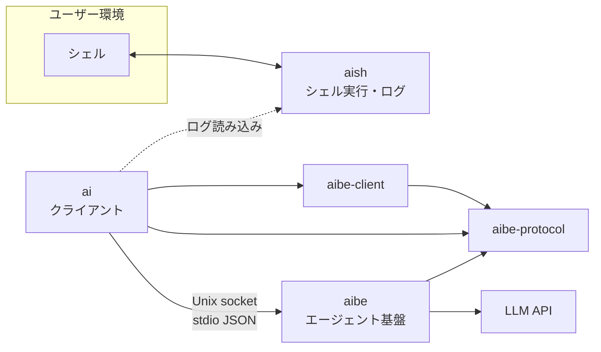

# アーキテクチャ

aish ワークスペースのレイヤー、依存、プロトコル、設定の正本。実装と **同じ PR / コミットで更新** する。

## 概要



| コンポーネント | 役割 | ネットワーク |
|----------------|------|--------------|
| **aish** | PTY/子プロセスでシェルを動かし、I/O をログに追記。PTY stdin は `dup(master)` + shutdown pipe + 親 TTY raw。fork 後セットアップ失敗時は `master` を閉じ子を kill/reap | なし（LLM・aibe へ接続しない） |
| **aibe-protocol** | wire DTO（NDJSON / serde）、`ToolName`、契約定数。leaf クレート | なし |
| **aibe-client** | Unix socket transport（`ping` / `ensure_running` / `agent_turn` + 承認往復）/ 既定 socket パス | なし（`aibe` バイナリ起動のみ） |
| **aibe** | エージェントループ、ツール、プロバイダ呼び出し、Unix socket サーバ | LLM API へ（設定に従う） |
| **ai** | `aibe-client` + `aibe-protocol` 経由で aibe に接続し応答を表示。aish ログをコンテキストに使う | aibe デーモンのみ（LLM 直叩き禁止） |

## 依存ルール

```
ai            →  aibe-protocol, aibe-client のみ（aibe / aish 禁止）
aibe-client   →  aibe-protocol のみ
aibe          →  aibe-protocol, aibe-client（aish 禁止）
aibe-protocol →  （他ワークスペースクレート禁止。serde のみ）
aish          →  （aibe への path 依存禁止）
```

機械チェック:

- `./scripts/check-architecture.sh` — クレート間依存・禁止 HTTP/LLM・キー直書き
- 同スクリプト内で `./scripts/check-hexagonal.sh` を呼び出し、**クレート内レイヤー** を検査

### クレート別の依存方針

| クレート | 許容例 | 禁止例 |
|---------|--------|--------|
| aish | `libc`, PTY/プロセス系 | `aibe`, `reqwest`, `hyper`, LLM SDK |
| aibe-protocol | `serde` | `aibe`, `aibe-client`, `aish`, `ai`, `tokio`, HTTP |
| aibe-client | `aibe-protocol` | `aibe`, `aish`, `ai` |
| aibe | `tokio`, HTTP クライアント、serde、プロバイダ SDK、`aibe-protocol`, `aibe-client` | `aish` |
| ai | `aibe-protocol`, `aibe-client`, `serde` | `aibe`, `aish`, `reqwest` 等の LLM 直叩き |

## aibe デーモン

- **トランスポート**: Unix domain socket（パスは設定で指定。例: `~/.local/share/aibe/run.sock`）
- **ライフサイクル**:
  - 既にソケットが存在し応答すれば **接続のみ**
  - なければ `aibe` がサーバを起動（シングルトン想定）
  - フォアグラウンド: `cargo run -p aibe -- -f`（デバッグ用）
- **メッセージ形式**: 接続後、**1 行 1 JSON**（newline-delimited JSON）でリクエスト/レスポンスをやりとりする（stdio JSON スタイル）

## プロトコル（設計・詳細）

破壊的変更時はこの文書と `aibe` / `ai` のテストを同時に更新する。

### リクエスト（クライアント → aibe）

```json
{
  "type": "agent_turn",
  "id": "550e8400-e29b-41d4-a716-446655440000",
  "messages": [
    { "role": "user", "content": "..." }
  ],
  "tools": ["shell_exec", "read_file"],
  "llm_profile": "fast",
  "context": {
    "shell_log_tail": "...",
    "cwd": "/abs/path/to/ai/cwd"
  }
}
```

| フィールド | 説明 |
|-----------|------|
| `type` | 今後 `ping`, `cancel` 等を追加可能 |
| `id` | 相関 ID |
| `messages` | チャット履歴（プロバイダへ渡す前に aibe で正規化）。wire 上の `role` は `"user"` 等の **JSON 文字列のまま**（0008 以降も不変）。aibe 内部では `MessageRole` enum に変換して保持（未知 role は `invalid_request`）。詳細: `docs/done/0008_chat-message-and-protocol-typing-spec.md` |
| `tools` | 有効にするツール名のリスト |
| `llm_profile` | 任意。使用する LLM プロファイル名（`docs/done/0011_llm-profiles-spec.md`）。省略時は aibe 設定の `default_profile` |
| `context` | aish ログ由来など、クライアントが渡す付加コンテキスト |
| `context.cwd` | クライアントのカレントディレクトリ（絶対パス）。`ai` は起動時の `std::env::current_dir()` を送る。`read_file` の相対パスと `allowed_roots` の `.` は **aibe プロセスの cwd ではなくこの値** を基準にする |

### レスポンス（aibe → クライアント）

```json
{
  "type": "agent_turn_result",
  "id": "550e8400-e29b-41d4-a716-446655440000",
  "status": "ok",
  "assistant_message": { "role": "assistant", "content": "..." },
  "tool_calls": []
}
```

エラー時:

```json
{
  "type": "error",
  "id": "550e8400-e29b-41d4-a716-446655440000",
  "code": "provider_error",
  "message": "..."
}
```

## LLM プロバイダ（aibe 内）

設定 `[llm.<name>]` の `provider`（`parse_provider_kind` の受け入れ値）:

| `provider` | 用途 |
|-----------|------|
| `openai_compatible` | OpenAI 公式 API および OpenAI 互換（LM Studio、vLLM 等）。`base_url` 省略時の既定は `https://api.openai.com/v1` |
| `gemini` | Google AI Studio `generateContent`（`v1beta`）— `adapters/outbound/gemini.rs` |
| `mock` | テスト・開発 |

- `provider = "openai"` は **未対応**（別名ではない）。公式 OpenAI も `openai_compatible` を使う
- 選択とエンドポイントは **aibe 設定ファイル** の LLM 接続 + プロファイルで指定（`docs/done/0011_llm-profiles-spec.md`）
- Gemini の `thoughtSignature` 等は `ToolCall.provider_extras` に **part 単位**で保持し、次ラウンドの `functionCall` part に復元する（クライアント wire には載せない — `docs/done/0010_gemini-provider-spec.md`）
- アダプタは aibe 内に閉じる。`ai` / `aish` にプロバイダ分岐を書かない

## aish ログ

- **用途（当面）**: `ai` が読み込み、aibe リクエストの `context` に載せる
- **形式（実装）**: JSONL。1 行に 1 イベント。`event` フィールドで種別を区別する:

| `event` | 内容 |
|---------|------|
| `command_start` | `command`, `args`（追記前に `sanitize_log_text`） |
| `stdout` | `data`（追記前に `sanitize_log_text`） |
| `stderr` | `data`（追記前に `sanitize_log_text`） |
| `exit` | `code`（任意） |

- **CLI**（`clap` + `clap_complete`。各バイナリに `complete bash|zsh`）:
  - `aish exec [--format tsv|json|env] [--log PATH] -- <program> [args...]`（未指定時は `log_dir/session-<pid>.jsonl`）
  - `aish shell [--format tsv|json|env]` — セッション dir 方式（`docs/done/0019_aish-session-log-integration-spec.md`）。bash / zsh 子シェルでは一時 rcfile で Tab 補完を有効化
  - `aish session [--format tsv|json|env]` — 現在セッション（`AISH_SESSION_DIR` 必須）
  - `ai ask [OPTIONS] <message>` — **オプションはメッセージより前**（`docs/done/0021_tab-completion-spec.md`）
  - `aibe [--foreground|-f]` — デーモン起動
  - 動的補完: `ai ask --profile`（`AIBE_CONFIG` の `[profiles.*]`）、`--session`（`AISH_CONFIG` の `log_dir` 内 session id）。詳細: [manual/tab-completion.md](manual/tab-completion.md)
- **共通 `--format`**（情報表示系サブコマンド向け）:
  - 値: **`tsv`（既定）** | **`json`** | **`env`**
  - **全サブコマンド**で指定可能。composition root が `clap` で解析し、未知の値はエラーにする
  - **情報表示系**サブコマンドのみ stdout の形式に反映する。現状は **`session` のみ**が該当
  - **実行系**（`exec`, `shell` 等）は現状 `--format` を出力に使わないが、将来追加する情報表示系と CLI を揃えるため **受理のみ** 行う（指定しても挙動は変わらない）
  - 形式の意味（情報表示系で共通）:
    - `tsv` — `key\tvalue` 行（人間閲覧・簡易スクリプト向け）
    - `json` — 構造化 JSON オブジェクト（パイプ・ツール連携向け）
    - `env` — `KEY='value'` 行（`eval "$(aish … --format env)"` 向け。値は shell 単一引用符でエスケープ）
  - 新しい情報表示系サブコマンドを追加するときは、同じ `--format` と上記3形式を実装する（domain の `OutputFormat` / `SessionInfo::render` パターンを参照）
- **対話シェル（`aish shell`）の layout**（`0019`）:

```text
<config log_dir>/<session-id>/
  log.jsonl
  current_log -> log.jsonl
```

- **session-id**: `2020-01-01T00:00:00Z` 起点の経過ミリ秒を **12 桁小文字 hex**（ゼロ埋め）
- **起動時**: `stderr` に session id を表示。子シェルへ `AISH_SESSION_DIR`（セッション dir 絶対パス）を export
- **掃除**: `aish shell` 起動時、`create_shell_session` **の後**に `max_sessions`（config、既定 50）超過分をディレクトリ名の辞書順で削除（新規セッションは残す）
- **`ai ask` 連携**（`ai` は `aish` クレート非依存）:
  - 既定はログを載せない
  - `AI_ASK_LOG=session` かつ `AISH_SESSION_DIR` → `current_log` を解決し、symlink 先が session dir 内の通常ファイルとして **open 可能**なことを検証してから tail
  - `--session <id>` → 同上（`id` は `basename(AISH_SESSION_DIR)` と一致）
  - `--log PATH` / `--no-log` の優先順は `0019` 参照

## 設定ファイル

| 対象 | 例のパス | 内容 |
|------|----------|------|
| aibe | `~/.config/aibe/config.toml` | LLM 接続 `[llm.<name>]`、プロファイル `[profiles.<name>]`、`default_profile`、socket、tools |
| aish | `~/.config/aish/config.toml` | `log_dir`、`max_sessions`（既定 50）、シェル起動 |
| ai | `~/.config/ai/config.toml` | aibe socket、`[ask].default_profile`、`[ask].tools` |

- リポジトリに **実キーをコミットしない**
- 例示用は `docs/` または `*.example.toml` のみ

## Hexagonal（Ports & Adapters）

各クレートは **独立した六角形**。クレート間は path 依存ではなく **プロトコル（aibe）** と **ログファイル（aish）** で接続する。

共通のソース配置:

```text
<crate>/src/
  domain/           # エンティティ・ルール（I/O なし）
  application/      # ユースケース（domain + ports のみ。adapters 禁止）
  ports/outbound/   # アプリが外に頼る trait
  adapters/         # port の具象（OS / HTTP / ファイル / socket）
```

### レイヤー依存（機械検査: `scripts/check-hexagonal.sh`）

| 層 | 許可する `use` | 禁止 |
|----|----------------|------|
| **domain** | domain 内 | `adapters`, `application` |
| **ports** | domain, ports | `adapters`, `application` |
| **application** | domain, ports, protocol 等 | `adapters`（**例外**は composition root のみ） |
| **adapters** | domain, ports, adapters 内 | `application` |

**composition root**（adapters を組み立てて `Arc<dyn Port>` を注入してよい application ファイル）:

| クレート | ファイル |
|---------|----------|
| aibe | `application/server.rs` のみ |
| aish | （なし — `main.rs` / `lib.rs` で配線） |
| ai | （なし — `main.rs` で配線） |

ユースケースの単体テストで adapters が必要なときは `tests/*.rs` に置く（`src/application` 内の `#[cfg(test)]` で adapters を `use` しない）。

| クレート | 主なユースケース | Outbound ports（例） | Inbound adapters（例） |
|---------|------------------|----------------------|-------------------------|
| **aibe** | `AgentTurn`, リクエストディスパッチ | `LlmProvider`, `ToolRoundTerminator`, `ToolExecutor`, `CommandPolicy`, `ConfigLoader` | Unix NDJSON リスナ、ツール（`read_file`, `list_dir`, `grep`, `git_diff`, `git_status`, `shell_exec`）、終端戦略（`terminator/`） |
| **aish** | `ExecuteAndRecord` | `ShellExecutor`, `SessionLog` | CLI `aish exec` |
| **ai** | `Ask` | `AgentClient`, `ShellLogSource`, `Presenter` | CLI `ai ask`。`[ask].tools` / `--tools` を展開して aibe の `tools` allowlist を構築 |

`ai` は **`aibe-protocol` と `aibe-client` のみ**を path 依存し、`aibe` 本体・`aish` には依存しない（ログはファイルパスで読む）。wire 型の正本は `aibe-protocol` クレート。

## プロトコル（実装済み）

### `ping`

リクエスト:

```json
{ "type": "ping", "id": "..." }
```

レスポンス:

```json
{ "type": "pong", "id": "..." }
```

### `agent_turn`

`architecture.md` 先頭の JSON スキーマどおり。`context.shell_log_tail` は `ai` が aish JSONL の末尾を載せる。`context.cwd` は `ai` が自身のカレントディレクトリを載せる。

- `tools: []` のときは **1 回の LLM 呼び出し**のみ（従来互換）。
- `tools` に名前があるとき、aibe は **エージェントループ**（LLM → ツール実行 → LLM …）を `[tools] max_rounds` まで繰り返す。**このとき `context.cwd`（絶対パス）は必須**。未送信・相対パスは `invalid_request` で拒否する。
- `[tools] max_rounds` は **1 以上**。`config.toml` で `0` は設定読み込みエラー。プログラム上 `ToolsConfig { max_rounds: 0 }` のみ `effective_max_rounds()` で 1 に補正（`docs/done/0007_agent-turn-loop-modularization-spec.md`）。
- 組み込みツール: safe tools は `read_file` / `list_dir` / `grep` / `git_diff` / `git_status`。`shell_exec` は危険操作として `@exec` か literal 指定でのみ許可する（`@full` には含めない）。`shell_exec` は設定 `allowed_commands` のみ実行し、subprocess cwd は `context.cwd`。`[tools.shell_exec] shell_exec_approval = "never" | "ask" | "always"`（既定 `ask`）で実行前 yes/no（同一 Unix 接続上の `shell_exec_approval_prompt` / `shell_exec_approval` 往復）。外部コマンド（`shell_exec` / `git_*`）は timeout 時に子プロセスを kill して明示 reap（共通 `run_subprocess`）。
- `list_dir` / `grep` は `[tools.explore]` の件数・走査上限で timeout 前のメモリ・I/O を抑制する（`docs/aibe.config.example.toml`）。
- ツール出力は `[tools] max_tool_output_bytes` で切り詰め、`tool_calls.output` と LLM 向け tool result の両方に同じ制限をかける（`docs/security.md`）。
- ツール失敗は turn 全体を止めず **tool result として LLM に返し**、同一 turn 内で再推論する。詳細は `docs/done/0001_aibe-tool-agent-loop-spec.md`。
- cwd 必須化・ドメイン型・レイヤー分割は `docs/done/0003_architecture-review-refactor-spec.md`。
- ループ 1 ラウンド（LLM step + tool 実行 + conversation 更新）は `application/tool_round/ToolRoundExecutor`（0007）。`AgentTurnService` は前処理・for-loop・max-round 時の `ToolRoundTerminator` 委譲。composition root は `application/server.rs`。

`tool_calls`（レスポンス）は aibe が **実際に実行した**呼び出しの記録。各要素は `id`, `name`, `arguments`, `status`（`ok` / `error`）と、成功時 `output`、失敗時 `error` / `message` を含む。

#### ツールとカレントディレクトリ（必須方針）

| 項目 | 方針 |
|------|------|
| **基準 cwd** | **クライアント**（`ai ask` 等）のカレントディレクトリ。`agent_turn.context.cwd`（絶対パス）で渡す。ツール有効時は **必須** |
| **aibe の cwd** | 相対パス解決に **使わない**（フォールバックなし） |
| **新規ツール** | [`ToolExecutor::execute`](aibe/src/ports/outbound/tools.rs) の `ToolExecutionContext` を受け取り、相対パスは `base_dir` / `resolve_path` を使う。aibe 内で `std::env::current_dir` を直接参照しない |
| **`ai` の責務** | ツール有効時は起動時の `std::env::current_dir()`（絶対パス）を `context.cwd` に載せる。`AskInput` → `AskRequest` 変換で検証する |
| **既存** | `read_file` / `list_dir` / `grep` / `git_diff` / `git_status` / `shell_exec` は上記に準拠 |

実装の正本: **wire** — `aibe-protocol`（`ClientRequest` / `ClientResponse` / `ToolName` / `ExecutedToolCall` / `KNOWN_TOOLS` / 契約定数）。**server 内部** — `aibe::domain::{ClientCwd, AgentTurnContext, ShellLogTail, ChatMessage, ToolCall}`、`aibe::ports::outbound::ToolExecutionContext`（`tool_context.rs`）。wire JSON の `context` 形は従来どおり。`RequestService` は `aibe_protocol::RequestContext` を `application/protocol_convert` の `TryFrom` で `AgentTurnContext` に変換してから `AgentTurnService` へ渡す。会話メッセージは wire 上 `messages[].role` 文字列のまま受け取り、内部は `MessageRole` enum（0008）。`ai` の allowlist は `aibe_protocol::ToolName` を使用する。

#### エラーコード（`type: error`）

| `code` | 意味 |
|--------|------|
| `invalid_request` | リクエスト不正 |
| `provider_error` | LLM API 失敗 |
| `tool_not_allowed` | クライアントがリクエスト `tools` に未実装名を指定した場合（turn `error`）。モデルが allowlist 外の**既知**ツールを呼んだ場合は tool result でループ継続 |
| `internal_error` | 内部エラー |

`agent_turn_result.status` には `"ok"` のほか、ツール上限到達時は `"max_tool_rounds"`（`type: error` ではない。`tool_calls` と最終 assistant 本文を返す）。

（`tool_error` / `tool_timeout` / `max_tool_rounds` の turn `error` コードは予約または非使用。MVP では個別ツール失敗は `tool_calls` + LLM 向け tool result、上限到達は `status: max_tool_rounds` の `agent_turn_result`。）

#### max-round 終端戦略（0006）

ツールラウンド上限到達時の最終 LLM 呼び出しは `ToolRoundTerminator` port（`ports/outbound/tool_round_terminator.rs`）に委譲する。戦略の具象は `adapters/outbound/terminator/` のみが保持する。

| 項目 | 内容 |
|------|------|
| **既定戦略** | `summary_prompt`（0003 互換 — 実行記録を `ToolExecutionSummary` で要約 user に圧縮） |
| **設定** | `[tools] termination_strategy = "summary_prompt"` または `"conversation_replay"` |
| **Replay 条件** | policy が `conversation_replay` **かつ** `TerminationCapability.plain_complete_accepts_tool_role == true` |
| **capability** | LLM adapter / `llm_factory::termination_capability` が提供（`LlmProvider` trait には載せない） |
| **フォールバック** | Replay の `complete()` が `LlmError::Provider` を返したら SummaryPrompt を 1 回再試行 |
| **wire protocol** | 変更なし（クライアントは `status` + `assistant_message` のみ） |

| プロバイダ（初期値） | `plain_complete_accepts_tool_role` |
|---------------------|-------------------------------------|
| mock / openai_compatible / gemini | `false`（安全側） |

実装の正本: `ToolRoundTerminatorOrchestrator`、`TerminationCapability`、`TerminationStrategy`（`ports/outbound/config.rs`）。

## 実装フェーズ（参考）

1. **aibe**（済）: socket + `ping` + `agent_turn` + ツールループ + `MockLlm` / OpenAI 互換 / Gemini
2. **aish**（済）: `aish exec -- <cmd>` と JSONL 追記
3. **ai**（済）: `ai ask` と aibe 接続 + 任意で `--log`
4. **済**: OpenAI 互換 LLM、Gemini LLM、`config.toml`、aibe シングルトン（ping）、PTY `aish shell`、ログマスク、`shell_exec` / `read_file`、`shell_exec` 実行前承認（0020）
5. **次**: ログ context の構造化（P4-4）、ログマスクの拡張
