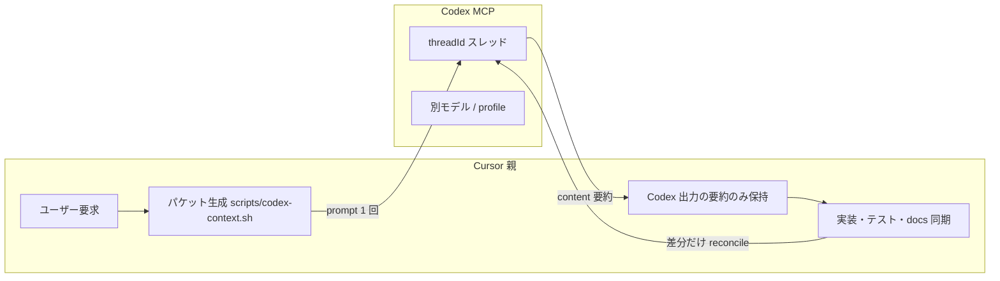

# Codex 委譲（コンテキスト分散・別 LLM 監査）

Cursor 親（実装・統合）と Codex MCP（仕様・監査・調査）の役割分担。  
**目的**:

1. **Cursor のコンテキスト消費を分散** — 重い読取・diff・ドキュメント照合は Codex 側のスレッドに閉じる。
2. **別 LLM による監査能力** — 実装と同じモデルに検証を任せず、Codex で仕様・レビュー・横断監査を行う。

実装・`cargo test`・コミットは **Cursor 親のみ**。Codex はコードを直さない（指摘とドラフト文書のみ）。

## アーキテクチャ



### コンテキストの原則

| 層 | 保持するもの | 保持しないもの |
|----|--------------|----------------|
| **Cursor** | ユーザー意図、受け入れ条件一覧、Codex の **要約**（各 5〜15 行）、`threadId` | Codex の全文ログ、リポジトリ全体の再読取 |
| **Codex** | パケット全文、スレッド内の追加 Q&A | — |

親は Codex 返答を **そのまま次の Cursor ターンに貼り直さない**。要点だけ抽出し、必要なら `codex-reply` で Codex 側に追質問する。

## タスク種別

| `CODEX_TASK` | いつ使う | Codex の役割 | `profile` | `sandbox` |
|--------------|----------|--------------|-----------|-----------|
| `spec` | 機能着手前 | 仕様・受け入れ条件・テスト方針のドラフト | `spec` | `read-only`（推奨）または `workspace-write`（docs 直書きを任せる場合のみ） |
| `review` | 実装・テスト後 | 差分に対する実装監査 | `review` | `read-only` |
| `audit` | リリース前・大きな変更 | 境界・セキュリティ・docs 整合の横断監査 | `audit` | `read-only` |
| `spike` | 設計比較・影響調査 | 限定範囲の調査・選択肢提示 | `audit` または `spec` | `read-only` |

レビュー深度: `CODEX_REVIEW_MODE=fast|standard|deep`（`review` / `audit` で diff があるとき）。詳細は [codex-review.md](./codex-review.md)。

## 手順（親エージェント）

1. タスクを決める（`spec` / `review` / `audit` / `spike`）。
2. パケット生成:

```bash
CODEX_TASK=spec ./scripts/codex-context.sh
CODEX_TASK=review ./scripts/codex-context.sh
CODEX_TASK=audit CODEX_FOCUS_PATHS=aibe/src/,docs/ ./scripts/codex-context.sh
CODEX_TASK=spike CODEX_FOCUS_PATHS=docs/architecture.md ./scripts/codex-context.sh
```

3. 出力の **下に** 親だけが知る短い **ブリーフ** を付ける（ユーザー要求、受け入れ条件、検証コマンド結果）。
4. MCP `codex` を呼ぶ（下記テンプレ）。`threadId` を記録。
5. 返答を **要約** して Cursor 側に残す。深掘りは `codex-reply` + 同じ `threadId`。
6. 指摘対応後の再監査は **新規 `codex` ではなく** `codex-reply` に **差分パケットだけ** 渡す（`CODEX_REVIEW_MODE=fast` 推奨）。

## MCP 共通（全タスク）

| 引数 | 値 |
|------|-----|
| `cwd` | リポジトリルート |
| `approval-policy` | `never` |
| `config` | `{"approval_policy":"never"}`（タスク別に `model_reasoning_effort` は profile で） |

`.cursor/mcp.json` で `mcp-server` に `approval_policy="never"` を既定化済み。

## タスク別 `profile` / `developer-instructions`

`~/.codex/config.toml` のプロファイル（リポジトリ外。未設定なら `config` で上書き可）:

```toml
[profiles.spec]
model_reasoning_effort = "medium"
approval_policy = "never"

[profiles.review]
model_reasoning_effort = "low"
approval_policy = "never"

[profiles.audit]
model_reasoning_effort = "medium"
approval_policy = "never"
```

`developer-instructions` の骨子は `.cursor/rules/50-codex-subagent.mdc` に記載。プロンプト先頭に次の一行を付けるとよい:

```text
Role: <spec|review|audit|spike> for aish workspace. Separate LLM auditor — do not implement code.
```

## シェルと速度

無差別探索（`rg --files`, `find`, 全体 `cargo`）は遅延の主因。対策は **パケットで先に渡す** ことと、**許可パス・回数上限**（review モード別）。全面禁止はしない。

| 手段 | 用途 |
|------|------|
| パケット（`codex-context.sh`） | 仕様・監査・レビュー共通のコンテキスト分散 |
| 限定シェル（`standard` / `deep`） | パケット不足分だけ Codex が読取 |
| 親の `Read` → `codex-reply` | 特定ファイル全文が必要なとき |
| `codex review` CLI | MCP 外の手元差分レビュー |

## Codex に任せないこと

- Rust 実装・テスト追加・`docs/` の実装同期（親の責務）
- 1 行修正の説明だけ
- MCP 障害時（親が仕様・監査を担い、未実施と明記）

## 関連

- ルール: `.cursor/rules/50-codex-subagent.mdc`
- レビュー深度: [codex-review.md](./codex-review.md)
- 入口: `AGENTS.md`
