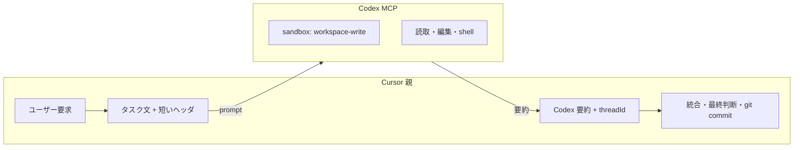

# Codex 委譲（サブエージェント・別 LLM）

Cursor 親と **Codex MCP サブエージェント**の役割分担。

## 目的

1. **別 LLM・別スレッド** — 調査・仕様・実装・横断確認を Codex に任せ、Cursor のコンテキストを節約する。
2. **自律調査** — 親が載せ忘れたファイルも、**リポジトリ内なら Codex が自分で読める**（パケット必須ではない）。
3. **パス境界** — **cwd（リポジトリ）内の読書き**（`sandbox_mode = workspace-write`）。リポジトリ外は原則不可（将来 `workspace_roots` で明示）。

## モデル



| 層 | 保持するもの |
|----|--------------|
| **Cursor** | ユーザー意図、Codex **要約**、`threadId` |
| **Codex** | スレッド内の調査・編集・会話全文 |

親は Codex 全文を履歴に貼らない。追い込みは `codex-reply` + 同じ `threadId`。

## 権限（`.codex/config.toml`）

リポジトリ直下の [`.codex/config.toml`](../.codex/config.toml):

| 設定 | 意味 |
|------|------|
| `sandbox_mode = "workspace-write"` | cwd（リポジトリ）内の読取・編集・コマンド実行 |
| `[sandbox_workspace_write] network_access = false` | シェルからのネットワーク既定オフ |

**Linux**: `[features] use_legacy_landlock = true` で bwrap の `loopback: Operation not permitted` を回避（本リポジトリ設定済み）。

**将来**: Codex の `[permissions.aish-subagent]`（beta）例は [codex.config.example.toml](./codex.config.example.toml)。

MCP の `codex` 呼び出しでは **`sandbox: danger-full-access` を必ず渡す**（省略すると Ubuntu で bwrap EPERM）。`workspace-write` は使わない。

## MCP 呼び出し（親エージェント）

### 1. prompt を組み立てる（既定）

```bash
{
  ./scripts/codex-mcp-prompt.sh
  echo
  cat <<'EOF'
  （ここにタスク。例: aibe の agent_turn と hexagonal チェックを横断確認し、
  問題があれば修正して cargo test まで通して。）
  EOF
} 
# → 連結した全文を MCP codex の prompt に渡す
```

**やらないこと**: prompt に「`target/xxx.txt` を読め」だけ書く（ファイルパス参照だけにしない。タスク文を必ず含める）。

### 2. オプション: 親がコンテキストを絞る（パケット）

```bash
CODEX_USE_PACKET=1 CODEX_TASK=review ./scripts/codex-mcp-prompt.sh
```

`codex-context.sh` の diff・抜粋を同梱。レビュー深度は [codex-review.md](./codex-review.md)。

### 3. 追加許可パス（そのターンだけ）

```bash
CODEX_EXTRA_ROOTS="$HOME/.config/aibe,$HOME/.local/share/aish" ./scripts/codex-mcp-prompt.sh
```

恒久に許可するなら `.codex/config.toml` の `workspace_roots` に追記。

### 4. MCP 引数

| 引数 | 値 |
|------|-----|
| `cwd` | リポジトリルート |
| `profile` | `subagent`（既定）/ `spec` / `review` / `audit`（推論の深さ） |
| `approval-policy` | `never` |
| `config` | `{"approval_policy":"never"}` |
| `sandbox` | `workspace-write`（省略時は `.codex/config.toml` の `sandbox_mode`） |
| `developer-instructions` | `.cursor/rules/50-codex-subagent.mdc` 参照 |

### 5. 続き

- `codex-reply` + `threadId`
- 再開時もタスク文を短く添える。大きな差分だけ `CODEX_USE_PACKET=1` でよい。

## タスク種別（`CODEX_TASK`）

| 値 | 用途 |
|----|------|
| `subagent` | 既定。調査・実装・修正・検証など自由記述 |
| `spec` | **設計書**を `docs/spec/` に出力。実装指示は `docs/tasks/` |
| `review` | 変更の監査（パケット任意） |
| `audit` | 境界・セキュリティ横断 |
| `spike` | 設計比較・調査のみ |

`CODEX_TASK` は `codex-mcp-prompt.sh` の Role 行に反映されるだけ。実際の作業内容は **prompt 本文**で伝える。

## Codex に任せてよいこと

- リポジトリ内の読取・編集・`cargo fmt` / `clippy` / `test` / `./scripts/check-architecture.sh`
- 設計書（`docs/spec/`）・実装指示書（`docs/tasks/`）
- 横断調査・指摘・修正案の実装（サブエージェントとして）

## 親（Cursor）が担うこと

- ユーザー意図の最終判断
- Codex 要約の保持と統合
- **`git commit` / `push` はユーザー明示時のみ**（Codex に任せない運用を推奨）
- feature ブランチ運用時の **commit 整理（soft reset → 意味単位で commit し直し）** は Codex 完了後に親が行う（`.cursor/rules/05-git-workflow.mdc`）
- MCP 障害時のフォールバック
- **完了監査**: Codex の「完了」報告後、設計書の受け入れ条件と [`scripts/spec-acceptance.toml`](../scripts/spec-acceptance.toml) を照合。`pending` が残る spec では `docs/done/` 移動・index の「実装済み」更新をしない（`.cursor/rules/45-spec-completion-gates.mdc`）

## 完了ゲート（実装タスク共通）

| 段階 | 条件 |
|------|------|
| 着手 | 実装指示書が `docs/tasks/` にある |
| Phase 完了 | 当該 Phase の `spec-acceptance.toml` エントリが `pending = false` かつテスト緑 |
| 全体完了 | 全 Phase の `pending = false` + `./scripts/verify.sh` + 実装指示書を `docs/done/` へ |

`verify.sh` だけ緑でも、受け入れレジストリに `pending = true` が残っていれば **仕様未完了** とする。

## Linux: `bwrap: loopback: Operation not permitted`

Ubuntu 24.04 などで AppArmor が unprivileged user namespace を制限していると、Codex の **bwrap** サンドボックスが失敗し、MCP からの `cat` / `rg` も同じエラーになる。

**CLI（手元）**

```bash
./scripts/codex-cli.sh …   # Ubuntu: Landlock 有効
```

`workspace-write` を明示すると permission profiles と Landlock が競合するため、プロジェクト [`.codex/config.toml`](../.codex/config.toml) には `sandbox_mode` を書かない。

**Cursor MCP**

- [`.cursor/mcp.json`](../.cursor/mcp.json) → `scripts/codex-mcp-wrapper.sh`（認証は `~/.codex`、`danger-full-access`）
- 事前に `codex login`（ChatGPT または API キー）
- **設定変更後は MCP 再接続が必須**（古い `mcp-server` プロセスは Landlock を保持したまま）

診断: `./scripts/codex-fix-linux-sandbox.sh`

Landlock 有効時も失敗する場合:

```bash
sudo apt install -y apparmor-profiles apparmor-utils bubblewrap
# プロファイルがパッケージに含まれる場合のみ:
sudo install -m 0644 /usr/share/apparmor/extra-profiles/bwrap-userns-restrict /etc/apparmor.d/bwrap-userns-restrict
sudo apparmor_parser -r /etc/apparmor.d/bwrap-userns-restrict
```

## MCP がそれでも動かないとき

1. Cursor の **Codex MCP** にシェル実行権限（Settings → MCP）
2. 手元で `codex` CLI（MCP 外）
3. 親が代替し **Codex 未実施**を明記

## 関連

- ルール: `.cursor/rules/50-codex-subagent.mdc`
- オプションの厚いパケット: [codex-review.md](./codex-review.md)
- 入口: `AGENTS.md`
