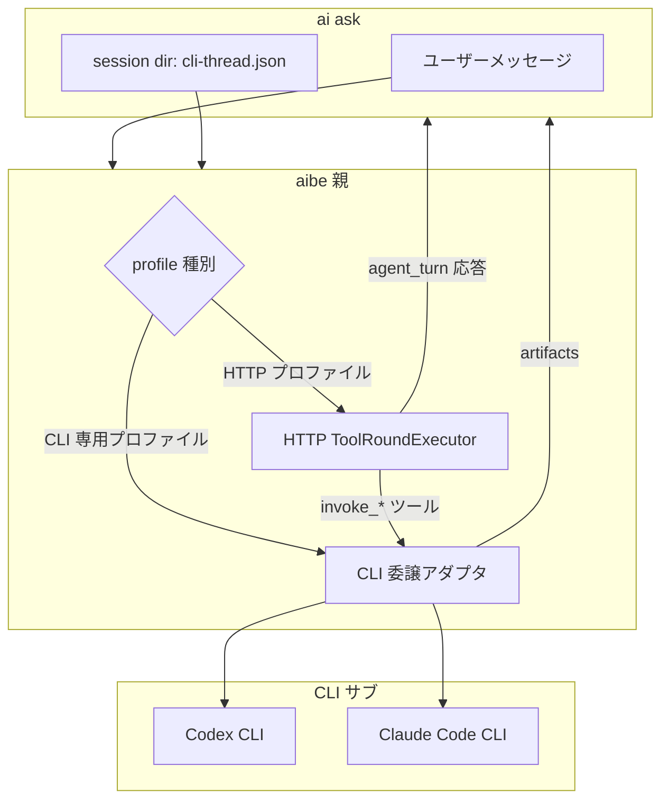

# 0024 — CLI サブエージェント（Codex CLI / Claude Code CLI）— 仕様

> **状態**: 仕様確定（製品調査反映済み。Claude Code 実機検証は未実施）  
> **注記**: 本書の first-class CLI サブエージェント統合案は **非採用**。代替設計は [0026_external-commands-spec.md](../spec/0026_external-commands-spec.md)。
> **起票**: 2026-06-03  
> **製品調査**: [manual/cli-subagent-products.md](manual/cli-subagent-products.md)  
> **前提メモ**: [todo/aibe-cli-llm-provider.md](todo/aibe-cli-llm-provider.md)

## 目的

HTTP LLM API キーに依存せず、**Codex CLI** および **Claude Code CLI** の契約（ログイン・サブスク等）を aish 体験から利用する。

aibe を **親エージェント**（既存のツールポリシー・`agent_turn` 契約）とし、CLI を **サブエージェント**（CLI 固有のツール・サンドボックス）としてオーケストレーションする。

## 背景（現行との関係）

| 経路 | 役割 |
|------|------|
| 現行 HTTP `LlmProvider` | 親が `complete_with_tools` → aibe が `shell_exec` / `read_file` を実行 |
| 本仕様の CLI サブ | サブプロセスで CLI エージェントを起動。ツール実行は **CLI 側設定に委ねる** |
| [codex-delegation.md](codex-delegation.md) の Codex MCP | **Cursor 親専用**。aibe 常駐とは別物。thread 共有しない |

親子の **ハイブリッド tool loop**（CLI が aibe の `ToolDefinition` で1ステップ返す／パターン3）は **非目標**。

## スコープ

### 対象（MVP）

- aibe から Codex CLI / Claude Code CLI を subprocess 起動するアダプタ
- **2 つの利用形態**（後述）
- 応答の **structured artifacts**（要約・終了コード・変更ファイル・thread_id）
- `thread_id` の **aish セッション dir** への永続化と **自動 resume**
- 0011 系設定の **`[llm.<name>]` 拡張** + トップレベル `max_concurrent_cli`
- タイムアウト時の子プロセス kill（`shell_exec` と同様）
- CI: **フェイク CLI** のみ。実 CLI 手動は任意（[cli-subagent-products.md](manual/cli-subagent-products.md)）

### 対象外（明示的非目標）

- CLI が aibe の function-calling スキーマで逐次 tool_calls を返す統合（パターン3）
- aibe 常駐から **Codex MCP** を呼ぶ
- **aish** から CLI を直接起動する入口
- **リポジトリ外 cwd** での委譲（`context.cwd` 外はエラー）
- 設定ホットリロード（0011 同様、aibe 再起動が必要）
- Codex MCP と thread / スレッド状態の共有
- `changed_files` の **git status フォールバック**

## 利用形態（確定）

### 形態 A — サブエージェント専用プロファイル（専用 `LlmProvider`）

- `[profiles.*]` が参照する backend の `provider` が `codex_cli` / `claude_code_cli`
- `ai ask` の **`default_profile`**（または `AI_LLM_PROFILE`）でこのプロファイルを選ぶと、**常に CLI 1 本に委譲**
- 親の `ToolRoundExecutor` ループ（aibe ツール）は **走らない**（`tools` allowlist は無視または空扱い）
- ユーザー向け UX: **追加フラグなし**（config の既定プロファイルで経路決定）

### 形態 B — HTTP 親 + サブ呼び出しツール

- 親の LLM が通常の HTTP `LlmProvider` のとき、**プロファイルごと**にサブエージェント呼び出しツールを expose
- ツール名は **動的**（`invoke_<backend_table_key>`。例: backend `[llm.codex-sub]` → `invoke_codex_sub` — 命名規則は実装で 1 関数に固定し `KNOWN_TOOLS` / docs に同期）
- 親は既存どおり aibe ツール・ポリシー・max-round を維持

## 親子モデル



## aish 連携

| 要素 | 現行 HTTP 経路 | CLI サブ経路 |
|------|----------------|--------------|
| `shell_log_tail` | aish JSONL tail | **初版は渡さない** |
| `context.cwd` | aibe ツール基準 | CLI の `-C` / 作業ディレクトリに **`context.cwd` を渡す** |
| セキュリティ | aibe ポリシー | **分離**（親＝aibe、サブ＝CLI）— [security.md](security.md) に追記 |
| 体験 | `ai ask` 単一入口 | 同左 |

## 入出力契約

### サブへの入力

| タイミング | 内容 |
|------------|------|
| 初回（保存 thread なし） | ユーザーメッセージ + 形態 B 時は親会話要約 |
| 2 回目以降 | **自動 resume**（下記） |

### thread 永続化と自動 resume（確定）

- **保存場所**: `AISH_SESSION_DIR/cli-thread.json`（`aish shell` 内の `ai ask` で有効。別ペイン `--session` 時も同一 dir）
- **JSON 形**（案）:

```json
{
  "llm_profile": "delegate-codex",
  "thread_id": "0199a213-81c0-7800-8aa1-bbab2a035a53",
  "provider": "codex_cli"
}
```

- **自動 resume 条件**: `cli-thread.json` が存在し、かつ今回の `llm_profile`（wire 上のプロファイル名）が一致 → サブは resume コマンド。不一致またはファイルなし → 初回起動。
- **明示上書き**（任意・後続可）: `--new-cli-thread` で保存を無視して新規（初版は未実装でも可、docs に TODO）

Codex は CLI 上 `thread_id`、Claude は `session_id` — aibe artifacts / 保存ファイルでは **`thread_id` に統一**。

### サブからの出力（structured artifacts）

`ClientResponse` 成功時に **`artifacts`** を追加（**`ClientRequest` は変更なし**）。

| フィールド | 必須 | 説明 |
|------------|------|------|
| `summary_text` | yes | ユーザー向け assistant 本文の元 |
| `exit_status` | yes | 子プロセス終了コード（CLI エラーイベントがあればログに記録） |
| `changed_files` | yes | CLI 出力のパース（Codex: `file_change` item。Claude: stream-json から抽出、取れなければ `[]`） |
| `thread_id` | yes | 次回 resume 用。`cli-thread.json` に保存 |

## 設定（0011 拡張・確定）

### `[llm.<name>]` 拡張

```toml
# ~/.config/aibe/config.toml

max_concurrent_cli = 4   # 既定 4。並列 CLI サブのセマフォ上限

[llm.codex-sub]
provider = "codex_cli"
command = "codex"
args = ["--enable", "use_legacy_landlock"]
codex_profile = "subagent"   # 任意: Codex -p
cwd = "."                    # 相対は context.cwd 基準
timeout_secs = 1800
sandbox = "workspace-write"  # exec -s にマップ
approval = "never"           # 非対話: --ask-for-approval never

[llm.claude-sub]
provider = "claude_code_cli"
command = "claude"
args = []
timeout_secs = 1800
permission_mode = "acceptEdits"
allowed_tools = "Read,Edit,Bash"

[profiles.delegate-codex]
llm = "codex-sub"

[profiles.delegate-claude]
llm = "claude-sub"

[profiles.default]
llm = "gemini-studio"
model = "..."
```

- 形態 B: トップレベル `[[cli_subagent_tools]]` または `[tools.cli_subagents]` で `parent_profile` → `llm_backend` の対応を宣言（正確な TOML キーは実装時に 0011 と整合。意味は「どの HTTP 親がどの `invoke_*` を持つか」）

### 起動時検証（確定）

- 設定で参照する `command` が実行不可 → **aibe 起動失敗**
- **Claude Code 未インストール環境**では `claude_code_cli` の `[llm.*]` を設定しない（開発者向け docs に明記）

## 並行性（確定）

- 複数クライアントから **並列**起動可
- トップレベル **`max_concurrent_cli`**（**既定 4**）でセマフォ。超過分はリクエストをブロックまたはエラー（実装時にどちらかを選び docs に固定 — **推奨: ブロック待ち with 上限待ち時間は timeout に含めない**）

## タイムアウト・キャンセル

- `timeout_secs` 超過で子プロセス **kill + reap**
- クライアント切断キャンセルは **後続**

## CLI 呼び出しマッピング（調査確定）

正本: [manual/cli-subagent-products.md](manual/cli-subagent-products.md)

| 項目 | Codex CLI ≥ 0.133.0 | Claude Code CLI |
|------|---------------------|-----------------|
| 初回 | `codex exec --json -C <cwd> -s … "prompt"` | `claude -p "…" --output-format json` |
| resume | `codex exec resume <thread_id> --json "…"` | `claude -p "…" --resume <session_id> --output-format json` |
| thread 取得 | JSONL `thread.started` | JSON `.session_id` |
| summary | `assistant_message` item または `-o` ファイル | `.result` |
| changed_files | `file_change` items | stream-json パース（単発 json のみでは不足しうる） |

## プロトコル変更

| 項目 | 方針 |
|------|------|
| `ClientRequest` | 変更なし |
| `ClientResponse` | `artifacts` 追加 |
| `aibe-protocol` | スキーマ更新 |

## 実装レイヤー

| クレート | 責務 |
|----------|------|
| **aibe** | `CliSubagentRunner`、`codex_cli` / `claude_code_cli` adapter、専用 `LlmProvider`、`invoke_*` ToolExecutor、セマフォ |
| **ai** | `AISH_SESSION_DIR/cli-thread.json` 読み書き、wire `context` に session ヒント（必要なら） |
| **aish** | 変更なし |
| **aibe-protocol** | `SubagentArtifacts` 型 |

## テスト方針

| 層 | 内容 |
|----|------|
| CI | フェイク CLI のみ |
| 手動 | Codex 実機 + Claude インストール環境（本環境は Claude なし） |

## 受け入れ条件（MVP）

1. 形態 A + `cli-thread.json` 自動 resume
2. 形態 B + `invoke_*`
3. Codex で編集を含むタスクがフェイク／実機のいずれかで artifacts 検証可能
4. Claude は **実装と docs が揃っていること**（実機は Claude あり環境で手動）
5. CLI 参照あり & バイナリなし → aibe 起動失敗
6. `./scripts/verify.sh` 成功

## 関連

- [0011_llm-profiles-spec.md](done/0011_llm-profiles-spec.md)
- [0019_aish-session-log-integration-spec.md](done/0019_aish-session-log-integration-spec.md)
- [0002_ai-tools-client-spec.md](done/0002_ai-tools-client-spec.md)
- [architecture.md](architecture.md)
- [security.md](security.md)

## 変更履歴

| 日付 | 内容 |
|------|------|
| 2026-06-03 | インタビュー草案 |
| 2026-06-03 | 未確定3点確定、CLI 製品調査反映（Claude 実機なし） |
