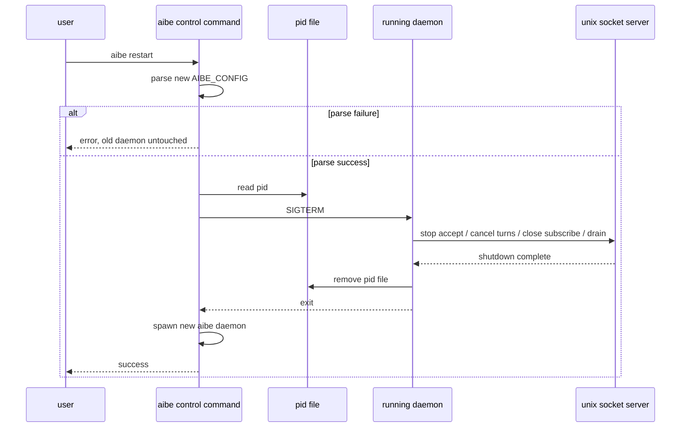

# 0046 — aibe Graceful Restart 設計書

> **種別**: 設計書（`docs/spec/`）  
> **状態**: 設計確定  
> **起票**: 2026-06-21  
> **関連**: [architecture.md](../architecture.md)、[testing.md](../testing.md)、[security.md](../security.md)、[0045_pack-composition-spec.md](0045_pack-composition-spec.md)、[0031_hexagonal-effect-boundary-spec.md](0031_hexagonal-effect-boundary-spec.md)

## 0. 目的

本仕様は、`aibe` デーモンに **graceful restart** を導入し、`~/.config/aibe/config.toml`（`AIBE_CONFIG`）の変更を安全に反映できるようにする。

狙いは次の 4 点である。

1. 設定変更後に `aibe restart` で新しい設定へ切り替えられること
2. restart 前に新設定の parse に失敗した場合、**旧プロセスを一切変えない** こと
3. shutdown 時に accept を止め、進行中 turn を cancel し、`MemorySubscribe` を閉じ、drain timeout 後に終了すること
4. `aibe stop` / `aibe restart` / `aibe status` を使って、daemon の生存管理を CLI から扱えるようにすること

本仕様は **hot reload ではない**。設定反映は「旧プロセスの graceful shutdown + 新プロセス起動」で行う。

## 1. 非目標

- 設定ファイルを live watch して自動再読込すること
- 既存 turn を途中で継続したまま設定だけ差し替えること
- Windows 対応
- `aibe-protocol` の breaking な wire 変更を MVP で入れること
- 外部利用者向けの動的プラグイン/拡張 API を追加すること
- 複数 `aibe` デーモンを同一ユーザーで並立管理すること

## 2. 現状と課題

現状の `aibe` は、起動時に設定を 1 回だけ読み、その後は socket サーバを無限 accept で回し続ける。

調査した既存実装の要点は次のとおりである。

- [`aibe/src/lib.rs`](../../aibe/src/lib.rs) で `TomlConfig::load()` を 1 回呼び、`aibe_client::ping()` が通れば `already running` で終了する
- [`aibe/src/adapters/inbound/unix_socket_server.rs`](../../aibe/src/adapters/inbound/unix_socket_server.rs) は `listener.accept().await?` を永遠に繰り返す
- [`aibe/src/application/request_service.rs`](../../aibe/src/application/request_service.rs) は `active_turns: HashMap<String, Arc<TurnCancellation>>` を持つが、shutdown 時に全体 cancel する入口がない
- [`aibe/src/plugin_memory/memory_subscribe_service.rs`](../../aibe/src/plugin_memory/memory_subscribe_service.rs) の subscribe は長寿命接続で、切断されるまで push を継続する
- [`aibe/src/daemon.rs`](../../aibe/src/daemon.rs) は double-fork の daemonize だけを扱い、pid 管理や signal handling は未実装
- [`aibe/src/clap_cli.rs`](../../aibe/src/clap_cli.rs) は `complete` と `--foreground` しか持たず、stop/restart/status の CLI 契約がない

このため、現状のままでは config 更新後に設定を反映するには手動で旧プロセスを止めてから再起動するしかない。

## 3. 既存ポリシーとの整合

### 3.1 trust boundary

`aibe` は LLM backend / agent runtime / Unix socket server の正本であり、`ai` は `aibe-client` 経由で接続する薄いクライアントである。したがって、daemon の start/stop/restart 管理は `aibe` 側に閉じる。

`aibe-client` は引き続き transport / ping / ensure_running を担うだけでよく、lifecycle control を wire 経由で委ねる必要はない。

### 3.2 hexagonal boundary

`application` 層は process / signal / filesystem の副作用を直接持たないようにする。既存の `daemon.rs` のような Unix process primitive は adapter / platform boundary として扱い、`application/server.rs` は graceful shutdown の orchestrator に留める。

### 3.3 security

PID file は socket と同様に user-private な領域へ置き、0600 相当の権限で作成する。stop/restart は local で自己所有プロセスに対してのみ作用し、remote control は導入しない。

## 4. パック構成の適用

**結論: No**

本機能は optional 機能の脱着ではなく、`aibe` の core process lifecycle そのものに属する。Active Pack / Basic Pack の 2 状態を作る対象ではなく、`RequestService` や `unix_socket_server` の責務を分割するための pack 境界も不要である。

理由は次のとおりである。

- stop/restart/status は全デプロイで必要な core 操作であり、basic runtime として切り離す意味がない
- 既存の pack 構成は optional 機能の static composition を対象にしており、daemon lifecycle はその適用範囲外である
- wire protocol や feature registry の差し替えではなく、process control と socket drain の問題である

## 5. 設計概要

### 5.1 分離する 2 つの経路

graceful restart は次の 2 経路を分けて扱う。

1. **control plane**: `aibe stop` / `aibe restart` / `aibe status`
2. **daemon plane**: 実際に socket を bind し、リクエストを捌く常駐プロセス

control plane は短命プロセスで、daemon plane を停止・起動するだけに責務を限定する。

### 5.2 位置づけ

- `aibe` の daemon 本体は従来どおり socket 正本
- PID file は daemon の生存判定と signal delivery の補助情報
- `aibe restart` は **新設定を先に parse** し、成功した場合のみ旧 daemon に SIGTERM を送る
- `aibe stop` は PID file を使って daemon に SIGTERM を送る
- `aibe status` は PID file と socket ping を組み合わせて状態を報告する

### 5.3 置き場所

PID file は単一インスタンス前提で、既定では `~/.local/share/aibe/run.pid` に置く。socket は既存どおり設定で決まる。`aibe` は singleton daemon として扱うため、PID file を socket ごとに分ける必要はない。

`socket_path` は引き続き config 正本であり、PID file は補助情報にすぎない。

PID file の内容は単なる pid ではなく、少なくとも `pid`、`config_path`、`socket_path`、および起動時刻または `/proc/<pid>` 由来の識別子を含める。`stop` / `restart` / `status` はこれを使って「その pid が本当にこの aibe daemon か」を検証し、識別子不一致や `pid` 再利用が疑われる場合は stale 扱いにして signal を送らない。

## 6. CLI 契約

### 6.1 追加する subcommand

`aibe` に次の subcommand を追加する。

- `aibe stop`
- `aibe restart`
- `aibe status`

既存の `aibe complete` は維持する。

### 6.2 `--foreground`

`--foreground` / `-f` は既存どおり daemon 起動時のみに意味を持つ。

- `aibe` 単体起動: `--foreground` がなければ daemonize する
- `aibe stop` / `aibe restart` / `aibe status`: control command として扱い、`--foreground` の有無で daemonize しない

### 6.3 `aibe stop`

動作:

1. PID file を読む
2. pid が生きていれば、PID file の識別子検証を通したうえで SIGTERM を送る
3. daemon が終了するまで待つ
4. drain timeout を超えてなお終了しない場合は SIGKILL へ切り替える
5. PID file と socket file の残骸を best-effort で掃除する

要件:

- すでに停止している場合は idempotent に成功扱いとする
- pid が stale なら PID file を整理して成功扱いにする
- signal delivery 失敗、権限エラー、drain timeout 後の SIGKILL 失敗はエラーとして報告する

### 6.4 `aibe restart`

動作:

1. まず `AIBE_CONFIG` を parse して新設定を検証する
2. 失敗したら **旧 daemon に何もしない**
3. 成功したら PID file の pid に対し、識別子検証を通したうえで SIGTERM を送る
4. daemon の終了を待つ
5. 新しい `aibe` daemon を起動し、socket ping が通るまで待ってから成功を返す

要件:

- 新 config parse に失敗した場合、停止・終了待ち・再起動を一切行わない
- shutdown 完了後にのみ新 daemon を起動する
- restart 中に旧 daemon が自然終了した場合は、そのまま新 daemon を起動する
- 旧 daemon が起動していない場合は、単に新 daemon を start する
- `aibe restart` は新 daemon の readiness を確認してから終了する。ready 前に成功を返さない

### 6.5 `aibe status`

`status` は運用確認用の informational command とする。

返すべき情報:

- running / not running
- pid file state（present / missing / stale）
- pid file path
- pid
- config path
- socket path
- socket ping の成否

出力形式は機械可読を優先し、少なくとも `json` を持つ。`json` では `state`、`pid_file_state`、`pid_file_path`、`pid`、`config_path`、`socket_path`、`socket_ping` を必須フィールドにする。`state` は socket ping の成否を表し、`pid_file_state` は PID file が control plane に使えるかどうかを表す。`pid_file_state = stale` でも socket ping が成功すれば `state = running` でよい。`tsv` / `env` は既存の他 CLI と同系統の運用が必要になった場合に追加する。

## 7. ライフサイクルフロー

### 7.1 daemon start

1. `TomlConfig::load()` で config を読む
2. socket が応答するなら `already running` で終了する
3. socket が応答しないが pid file が残っていれば、stale とみなして整理する
4. daemonize 後に PID file を書く
5. socket を bind し、accept loop を開始する
6. accept loop は shutdown 通知で停止できるようにする

### 7.2 SIGTERM / SIGINT 受信時

1. accept を止める
2. `active_turns` に登録された `TurnCancellation` を全件 cancel する
3. `MemorySubscribe` の長寿命接続を閉じる
4. drain timeout まで進行中 task の終了を待つ
5. timeout 後は残っている task を best-effort で切り離し、shutdown を完了する
6. socket file と PID file を削除する
7. process を exit する

### 7.3 shutdown の責務分割

- `unix_socket_server.rs`: accept 停止、接続 task の終了待ち、subscribe 接続の切断
- `request_service.rs`: active turn cancel の入口
- `daemon.rs` / process helper: signal 送信、pid wait、pid file の読み書き
- `application/server.rs`: 上記を orchestrate し、終了条件を決める

## 8. 対象ファイルと責務

実装時の責務イメージは次のとおりである。

| ファイル | 責務 |
|---------|------|
| [`aibe/src/main.rs`](../../aibe/src/main.rs) | CLI dispatch。control command なら daemonize せず処理する |
| [`aibe/src/clap_cli.rs`](../../aibe/src/clap_cli.rs) | `stop` / `restart` / `status` の CLI 定義 |
| [`aibe/src/lib.rs`](../../aibe/src/lib.rs) | 既存の start path を維持しつつ、lifecycle entry をつなぐ |
| [`aibe/src/application/server.rs`](../../aibe/src/application/server.rs) | graceful shutdown の orchestrator |
| [`aibe/src/adapters/inbound/unix_socket_server.rs`](../../aibe/src/adapters/inbound/unix_socket_server.rs) | accept / connection task / subscribe 接続の終了処理 |
| [`aibe/src/daemon.rs`](../../aibe/src/daemon.rs) | daemonize と Unix process primitive |
| [`aibe/src/application/request_service.rs`](../../aibe/src/application/request_service.rs) | active turn cancel の集約 |
| [`aibe/src/plugin_memory/memory_subscribe_service.rs`](../../aibe/src/plugin_memory/memory_subscribe_service.rs) | subscribe 側の切断協調 |

`aibe-client` は現行の `ping` / `ensure_running` / `route_turn` を維持し、MVP では lifecycle control の正本にしない。

## 9. wire protocol 拡張の扱い

本仕様の MVP では、`aibe-protocol` の wire 拡張を **必須にしない**。

つまり、graceful restart は out-of-band の PID / signal / socket だけで成立させる。

Phase 2 として、もし将来的に in-band の lifecycle coordination が必要になった場合は、別フェーズで次のどちらかを検討できる。

- admin RPC を追加して status / drain の協調を取る
- shutdown 準備フェーズだけを protocol に載せる

ただし、Phase 2 は MVP の受け入れ条件ではない。

## 10. 受け入れ条件

実装完了とみなす条件は次のとおりである。

1. `AIBE_CONFIG` を更新した後、`aibe restart` で新設定が反映される
2. restart 前の config parse 失敗では、旧 daemon に SIGTERM を送らない
3. `SIGTERM` / `aibe stop` で accept が止まり、active turns が cancel され、`MemorySubscribe` が切断される
4. drain timeout 後に shutdown が完了し、socket file と PID file が best-effort で掃除される
5. `aibe status` が running / not running を判定できる
6. `aibe` の既存 `ping` / `already running` 挙動と `aibe-client` の transport 契約が壊れない
7. `docs/architecture.md` と `docs/testing.md` に必要な記述が追加される
8. 受け入れテストを追加し、`./scripts/verify.sh` が通る
9. `./scripts/smoke-mock.sh` もしくは同等の mock 正常系で `status` / `stop` / `restart` の一巡を検証できる
10. `status --format json` の必須フィールドと stale pid 判定を unit / integration で固定する

### 10.1 追加すべきテストの方向性

- unit: PID file の read/write、識別子検証、stale 判定、restart 前 parse failure で旧 daemon 非変更
- integration: mock config の `aibe` を起動し、`status --format json` が必須フィールドを返し、stale pid file と live socket の組み合わせも含めて `stop` / `restart` が socket と pid に対して正しく働くこと
- integration: `MemorySubscribe` を張った状態で shutdown すると接続が閉じること
- integration: active turn 実行中に SIGTERM を送り、cancel が配線されること

## 11. 未確定事項・残リスク

- PID file を単一インスタンス前提の固定位置に置くため、将来 multiple daemon を扱うなら再設計が必要になる
- `MemorySubscribe` の完全切断は connection task の終了に依存するため、長時間ブロックする外部要因があると drain が遅れる
- stale socket / stale pid の掃除は best-effort であり、クラッシュや電源断の後は手動介入が必要な場合がある
- `status` の出力形式について、`json` 以外の形式をどこまで揃えるかは実装段階で最終調整が必要である

## 12. まとめ

本仕様では、`aibe` の設定反映を hot reload ではなく graceful restart として定義し、stop/restart/status を daemon lifecycle の正規導線にする。  
`aibe-client` と `aibe-protocol` の contract は維持し、shutdown / restart は local process control と socket drain だけで完結させる。
